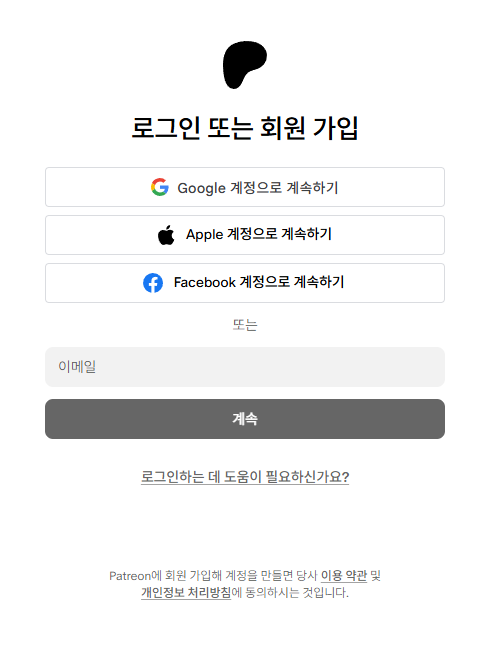

# 🔗 Program Integration Guide

## 1. Overview
VoiceScriptPlayer provides an integrated server connection feature through **Patreon authentication**, allowing users to use AI services without the hassle of issuing individual API keys.

Once authenticated, you can immediately use premium features like **Hailuo (TTS)** and **DeepL (Translation)** within your allocated monthly quota.

---

## 2. Patreon Integration

Follow these steps to link your account and activate supporter-exclusive features:

### **Step 1: Start Connection**
In the **[Supporter Integration]** section of the Settings window, click the **"Connect via Patreon"** button. If you prefer using your own API key, you can manually enter it in the input field below.

### **Step 2: Login & Authorization**
1. When your web browser opens, click the **"Login with Patreon"** button.
2. Review the permissions requested by VoiceScriptPlayer (Account info & Membership status) and click **"Allow"**.

| 1. Login Page | 2. Patreon Login | 3. Authorization |
| :---: | :---: | :---: |
|  |  |  |

### **Step 3: Confirm Completion**
Upon successful integration, the button will change to **"Disconnect Patreon"**. Verify that your connected services (Hailuo, DeepL, etc.) and remaining quota information are displayed below.

---

## 3. Server Configuration per Service

After integrating Patreon, you must enable the **integrated server** for each specific feature you wish to use.

### **Enable VoiceScriptServer**
In the settings for each AI service (Hailuo, DeepL, etc.), toggle the **"Use VoiceScriptServer"** switch to **[ON]**.

* **Switch [OFF]**: Uses the individual API Key entered manually at the bottom.
* **Switch [ON]**: Uses the integrated server API provided via Patreon integration. (Recommended)

---

## 4. Subscription Tiers & Benefits

Patreon supporters receive AI credits (usage) for each service. Credits are renewed monthly, and the amount varies by tier.

| Tier | Monthly Sub | DeepL (Translate) | Hailuo (TTS) |
| :--- | :---: | :---: | :---: |
| **🆓 Free Tier** | Free | 10,000 chars | 2,000 chars |
| **🌟 Supporter** | $7 / mo | 100,000 chars | 20,000 chars |
| **🧡 Creator** | $20 / mo | 1,000,000 chars | 100,000 chars |
| **🔥 Pro** | $50 / mo | 3,000,000 chars | 300,000 chars |

### 📋 Key Information
* **Auto-Stop System**: Usage stops automatically once you reach your credit limit. **No extra charges will ever occur.**
* **Credit Renewal**: All credits reset monthly on your subscription renewal date.
* **Policy Changes**: Credit amounts and benefits may change based on the AI service provider's policies.

> 🔗 **View Details & Support** > For the latest benefits and details for each tier, please refer to the [Official Patreon Page](https://www.patreon.com/posts/introducing-143634103).

---

## ⚠️ Important Notice

The Patreon membership is a way to **support the ongoing development and maintenance of VoiceScriptPlayer**. The AI credits provided are a **bonus benefit** as a token of gratitude for your support.

* **Direct Subscription Recommended**: If you use AI services (DeepL, Hailuo, etc.) in large volumes or professionally, **it is much cheaper to subscribe to those services directly and use your own API Key.**
* **Not a Commercial Plan Replacement**: The credits provided here are not intended to replace official commercial plans (e.g., DeepL Pro) of the respective AI services.
* **Cost-Efficiency**: Since these credits include integrated server maintenance costs, the cost per character is higher than buying directly from the service providers.

> 💡 **Usage Tip**: Use **Patreon Integration** for light use or to avoid setup hassle. Use an **Individual API Key** for large-scale translation or voice generation tasks.

---

## 5. Troubleshooting

* **❓ I am a supporter, but my quota shows as 0.**
    * Try clicking "Disconnect Patreon" and then reconnect. It may take a few moments for data to sync.
* **❓ I don't see the "Use VoiceScriptServer" option.**
    * Please ensure VoiceScriptPlayer is updated to the latest version.
* **❓ No response after clicking 'Allow' in the browser.**
    * Check if a firewall or antivirus program is blocking the application's communication.

---

## 6. Related Documents
* [DeepL Configuration Guide](../ai/deepl.md)
* [Hailuo TTS Configuration Guide](../ai/hailuo.md)