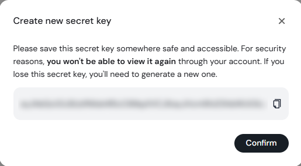

# Hailuo Subscription & Payment Guide

## 1. Overview
[Hailuo](https://www.minimax.io/audio) is a **cloud-based text-to-speech (TTS) service** provided by **Minimax**.  
To use Hailuo with VoiceScriptPlayer, you must subscribe to a **dedicated API plan**.  
Note that the **web plan** and the **API plan** are **separate services**, so make sure you select the correct one.

> ⚠️ **Important:**  
> The Hailuo API is **not free**.  
> The regular web voice synthesis plan cannot be used with VoiceScriptPlayer.  
> You must subscribe to the **Audio API plan** to use the API integration.

---

## 2. Subscription Steps

1. **Create a Minimax Account**  
   Go to the [Minimax signup page](https://www.minimax.io/audio), create an account, and log in.

2. **Access the API Subscription Page**  
   Visit the [Audio Subscription page](https://platform.minimax.io/subscribe/audio-subscription).  
   Here, you can choose an **API subscription plan**.  
   

3. **Select a Plan and Make Payment**  
   - Choose your desired API plan and complete the payment process.  
   - Payment typically requires a **credit card** that supports **international transactions**.

4. **Generate an API Key**  
   Once the payment is complete, go to **Account → API Keys** in the top menu.  
   Click **“Create new secret key”** at the bottom of the page to generate a new API key.  
     
   The key displayed upon creation is your **Hailuo API Key**.  
   For security reasons, this key is **only shown once**, so make sure to copy and store it safely.  
   If you lose it, you will need to generate a new one.  
     
   Enter the key into **VoiceScriptPlayer → AI Settings → Hailuo**, and the connection will be established.

5. **Check Remaining Coins (Usage Balance)**  
   After subscribing, you can check your **remaining coins (usage balance)** in real time on the  
   [Audio Subscription page](https://platform.minimax.io/subscribe/audio-subscription).  
   

---

## 3. Pricing Overview

| Type | Description |
|------|--------------|
| **Web Plan** | Regular web plan that allows voice synthesis on the Hailuo website (not compatible with VoiceScriptPlayer) |
| **API Plan** | Allows external programs (e.g., VoiceScriptPlayer) to synthesize speech via API requests |
| **Billing Cycle** | Monthly subscription (auto-renewal available) |
| **Coin Usage System** | Coins are deducted based on voice length; additional purchase required when depleted |

---

## 4. Notes
- The API plan **does not offer a free trial**.  
- **Unused coins are non-refundable** upon cancellation.  
- Each API request consumes coins; avoid unnecessary test requests.  
- If your network is unstable, failed API requests may still consume coins.  
- Make sure to select **“Audio API Subscription”** when making a payment.

---

## 5. Related Documents
- [AI → Using Hailuo](../ai/hailuo.md)  
- [Hailuo Official Website](https://www.minimax.io/audio)  
- [Audio Subscription Management Page](https://platform.minimax.io/subscribe/audio-subscription)
