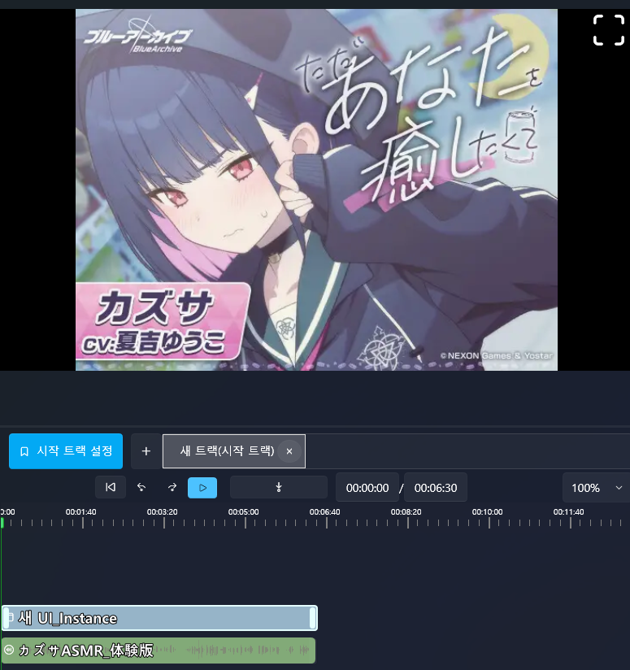
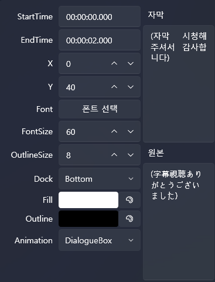

# Turn Audio into a Video-like Clip & Add Subtitles (Thumbnail + Subtitle Workflow)

In this tutorial, you will learn how to **make an audio-only file appear like a video** using a thumbnail UI,  
and how to **automatically generate subtitles** to enhance it into a text-rich piece of content.

This is especially useful when creating ASMR, narration, or dubbing content that consists only of audio,  
but needs to behave like a video track inside a VSP project.

---

## 🎯 What you will learn in this tutorial

- Importing an audio file  
- Creating a thumbnail UI so audio “looks like a video”  
- Generating subtitles automatically using Whisper  
- Placing and editing subtitle blocks  
- Basic principles for mixing audio-only content with video-like UI

---

## 📌 Example Audio (All-Ages Content)

This tutorial references an all-ages audio sample for demonstration.  
The example structure is based on the following DLsite product:

https://www.dlsite.com/home/work/=/product_id/RJ01323001.html

※ The audio itself is **not included** in this document.  
Please only use audio you are legally allowed to use.

---

# 1️⃣ Importing an Audio File

Audio should **not** be placed directly into the project folder manually.  
Instead, it must be imported through the editor interface.

---

## 📥 How to Import Sound

1. Select **Sound** tab from the left panel  
2. Click **Import**  
3. Choose an audio file  
4. The file will be added to the list

Imported audio is automatically stored under `Asset/Sound` inside the project folder.

---

# 2️⃣ Making Audio “Look Like a Video”  
(Using Thumbnail UI)

When audio is placed on the timeline by itself,  
the screen will appear empty during playback.  

To fix this, you can create a **UI screen** and place an **Image control** on it.  
This makes the audio appear like a video track with a visual thumbnail.

This is the most common method for turning audio-based content into a video-like presentation.

---

## 📋 Creating a UI Screen

1. Go to the **UI** tab  
2. Click **New UI**  
3. A new UI screen opens in the UI editor

This UI screen can act as a “video layer” during playback.

---

## 🖼 Placing an Image Control

1. In the UI editor’s **Control Panel**  
   drag an **Image** control  
2. Drop it onto the canvas  
3. Resize it to act as a background or a thumbnail

---

## 📥 Importing an Image (Directly From the Image Control)

Images can be imported **directly from the Image control** inside the UI editor.

1. Select the **Image** control  
2. In the right-side **Property Panel**, click **Import Image**  
3. Choose your PNG/JPG/WebP file  
4. The file will be registered inside the project

※ This step only imports the image —  
it does **not** yet assign the image to the Image control.

---

## 🖼 Applying the Imported Image to the Image Control

After importing, you must choose which image the control will display.

1. Select the Image control  
2. In the **Image Source** dropdown, choose your imported image  
3. The selected image appears immediately on the UI canvas

Important distinction:

- **Import Image** = add file to project  
- **Image Source** = choose which imported image to display  

These are two separate steps.

---

## 🎛 Adjusting Size & Position

To make the audio appear like a video,  
adjust the Image control so it fills the screen or acts as a thumbnail.

You can adjust:

- Size (drag handles)  
- Position (drag the control)  
- Fill mode  
- Opacity  
- Alignment  
- Margin & padding  

For video-like UI, using **Uniform** or **Fill** is recommended.

---

## 🎛 “Behind Subtitle” Option (Important)

To ensure subtitles always appear on top of the background image:

1. Select the Image control  
2. Enable **Behind Subtitle** in the Property Panel  
3. Subtitles will always render above the image

This is essential for audio-video hybrid content.

---

## ✨ Result

The UI screen now displays a **static background image**,  
making the audio behave like a video visually.

But note:

➡ **UI screens do not appear automatically.**  
They must be placed on the timeline.

---

## 📌 Place UI Screen on the Timeline

1. Open the **UI** tab  
2. Find the UI screen you just created  
3. Drag it onto the timeline, aligned with your audio  
4. The UI block will appear above the audio block

While audio plays:

- The UI image is visible  
- Subtitles appear above the UI (thanks to Behind Subtitle)  
- The experience feels like watching a video

---

## 🎬 Switching UI Screens Later

After audio ends, you can:

- Switch to another UI  
- Show an animated UI  
- Replace thumbnail  
- Pop up choice UI  

UI screens are not just background;  
they structure the entire experience visually.

---

## 🧩 Fill Track: Auto-stretching UI to Match Audio Length

When placed on the timeline, the UI block may appear small.  
Use **Fill Track** to expand it to match the entire track length.

---

## 📌 How to Use Fill Track

1. Drag UI onto timeline  
2. Select the UI block  
3. Right-click → **Fill Track**  
4. The UI expands to fit the whole track duration

---

## 🎯 When to Use Fill Track?

It is ideal when:

- The UI must stay visible throughout the entire audio  
- You want a persistent background UI  
- You want to avoid manually resizing blocks  
- You're creating video-like presentation using static images  

This is the standard technique for audio-based content.

---

## ✨ After Applying Fill Track

The UI covers the entire audio duration:

- Always visible  
- Behaves like video background  
- Works perfectly with subtitles and interactions  

This is how audio-only content becomes visually complete.

---

# 3️⃣ Placing Audio on the Timeline

1. Drag the audio file from Sound tab  
2. Drop it onto any timeline track  
3. Adjust its position and duration

Now the audio appears like a video with a thumbnail background.

---

# 4️⃣ Auto-Generating Subtitles Using Whisper

Subtitles are not generated from the timeline.  
They are generated from the **Audio Settings** screen.

---

## 🧠 Whisper Subtitle Workflow

1. Open **Sound** tab  
2. Double-click the audio file  
3. This opens the **Audio Settings** screen  
4. Set **Speech Language** to **Japanese** (if the audio is in Japanese)  
5. Click **Generate Subtitle**  
6. Whisper analyzes the audio and creates subtitle blocks automatically

---

## 🌍 Translating Subtitles to Another Language

Whisper generates subtitles in the original language.  
You can translate them into your preferred language.

1. In Audio Settings, choose a language under **Translate To**  
2. Click **Translate Subtitle**  
3. Translated subtitles will appear in a separate subtitle track

This allows bilingual or multilingual projects.

---

## ⚠️ Whisper & Translation Require AI Setup

To use Whisper or translation engines:

➡ Complete the **AI Setup** first.

See the following guide:

👉 [AI Setup Guide](../ai/ai.md)

(Whisper / DeepL / Hailuo / LibreTranslate supported)

---

## 📌 Summary

- Set **Speech Language** properly for best results  
- Whisper creates **original subtitles automatically**  
- **Translate Subtitle** creates translated subtitle tracks  
- Both require **AI setup beforehand**

Your audio-only content can now fully behave like a complete video scene.

---

# 5️⃣ Adjusting Subtitle Style

Select any subtitle block and adjust:

---

# 6️⃣ Previewing the Result

Press ▶ to preview:

- Audio  
- Thumbnail UI  
- Subtitles  
- Translation  

Everything should appear like a unified video experience.

---

## 📌 Next Step

Now that your audio behaves like video,  
the next tutorial covers using **interactive branching**.

👉 [Simple Choices & Branching](beginner-choice.md)
