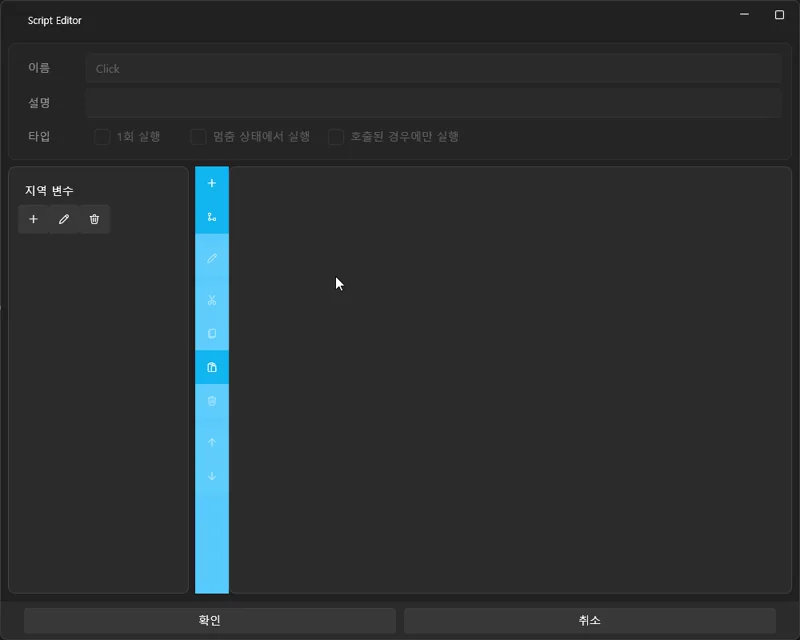

# Simple Choices & Branching

In this tutorial, we will continue using the project created in the **previous chapter (Making Audio Look Like a Video + Subtitles)**.  
During playback, a **choice UI** will appear, and depending on the user’s selection, the flow will branch into:

- Continue  
- Skip  
- Exit  

We will implement a simple branching system.

---

## 🧭 Overview of the Final Flow

You will build a structure like this:

1. Track pauses at a specific timestamp  
2. Choice UI appears on screen  
3. Button click →  
   - Resume  
   - Jump to a specific position  
   - Exit  

---

# 1️⃣ Creating a Branching UI

We will create a dedicated UI screen that shows the three choice buttons.

---

## 📌 Create a New UI Screen

1. Go to the **UI** tab  
2. Click **New UI**  
3. A new UI screen will be created

---

## 📌 Enable “Execute When Paused”

For the UI to remain interactive while the track is paused,  
you **must** enable this option in the UI properties:

- **Execute When Paused** ✔

---

# 1-2️⃣ Creating the Three Choice Buttons

We will place three buttons on the UI:

- Yes, let’s eat ice cream  
- No  
- Exit  

Drag the **Button** control from the left control list three times and place them on the screen.

---

## 💡 TIP: Button Layout & Design

- Change **Alignment** to Center to place the buttons nicely in the middle  
- Edit the display text in the **Content** field  
- Adjust **FontSize**, **Width**, **Height** as needed  

---

# 3️⃣ Placing an Inline Script on the Timeline

This branching system uses an **Inline Script**,  
not a Global Script.

Inline scripts are best used for actions that trigger at specific moments on the timeline.

---

## 📌 Adding an Inline Script

1. In the left Script panel, drag  
   **“Drag to Add Empty Script”**  
2. Drop it onto the Script Track on the timeline

---

## ⏱ Aligning the Script Timing

Move the script block to the exact position:

**01:31.000 (1 minute 31 seconds)**

At this moment in playback:

- The track will pause  
- The choice UI will appear  

---

# 3-1️⃣ Double-click to Edit the Inline Script

Double-click the script block to open the script editor.

Insert the following two actions:

---

## ✨ ShowChoiceUI Script Structure

Inside the script editor, add:

1. **UI Show → Your Choice UI Screen**  
   - Displays the choice UI  
2. **Track Pause**  
   - Pauses the track until a button is pressed  

⚠ IMPORTANT  
To prevent the UI from repeatedly appearing every frame,  
enable **Run Once** for this script.

Example:

---

Once playback reaches **01:31.000**:

- The track will pause  
- The UI will pop up  
- The user can choose an action  

---

# 4️⃣ Connecting Behavior to Each Choice Button

Now we will set what each of the three buttons does when clicked.

To configure a button:

**UI Editor → Select Button → Script → Click Event → Edit**

---

## 📌 Opening the Click Event Editor

1. Go to the **UI** tab  
2. Click the desired button (e.g., Resume)  
3. In the right properties panel, go to **Script**  
4. Under **Click**, press **Edit**  
5. The event script editor opens

---

# ✔ “Resume” Button

This button resumes the paused track.

Add these actions:

- **Close UI**  
- **Resume Track**  

---

# ✔ “Skip to Specific Time” Button (Jump Track)

Moves playback to a specific timestamp.

Example: Jump to **00:01:20.000**.

Add these actions:

1. **Close UI**  
2. **Jump to Time**  
3. **Resume Track**  

---

# ✔ “Exit” Button

Ends the project immediately.

Add:

- **Exit Project**

This action performs a real exit only during playback mode.

---

## ✨ Result

The three buttons now behave as follows:

- **Resume** → Close UI + Resume  
- **Skip** → Close UI + Jump + Resume  
- **Exit** → End Project  

The UI works while the track is paused because we enabled  
**Execute When Paused** in the UI properties.

---

# 6️⃣ Full Flow Summary

- Branch point reached  
- Inline Script triggers → Show UI + Pause  
- User makes a choice  
- Each button triggers a different flow:  
  - Resume → Continue  
  - Skip → Jump  
  - Exit → Stop  

---

# ✨ Completed Example

You now have a working:

- Pausing point  
- Popup choice UI  
- Three branching paths  

This system can be extended into a full menu or interactive sequence.

Next tutorial: **Intermediate Logic — Variables & Conditions**

👉 [Variables & Logic](intermediate-logic.md)
