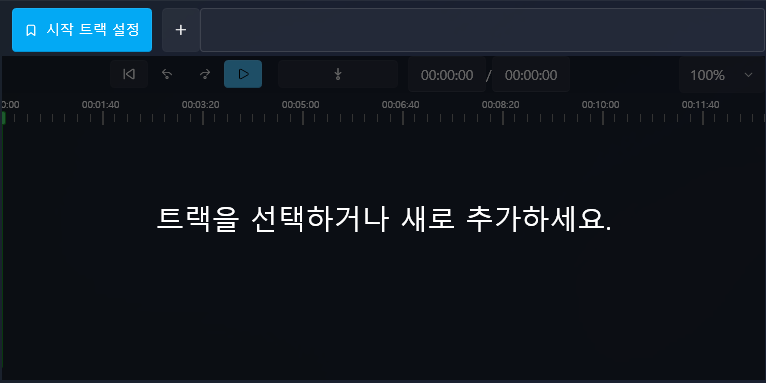

# Basic Script Integration

In this tutorial, you will learn how to **integrate funscript, video, and audio into your project**.  
From project creation to placing items on the track, this guide covers the essential workflow of building a basic VSP project.

## 🎯 Goal
- Create a new project  
- Create tracks  
- Prepare funscript & video  
- Import video  
- Import funscript  
- Place them on the timeline and get ready to play  

---

## 1️⃣ Creating a Project

For instructions on how to create a new project, refer to:  
[Create New Project](../project/create.md)

---

## 2️⃣ Creating a Track

Click the **+ button next to the Start Track button** to create a new track.

After creating a track, select it and press  
the **Set as Start Track** button on the right  
to make it the starting track.

---

## 3️⃣ Preparing funscript & video

Prepare the **video file and funscript file** you plan to use in the project.

---

## 4️⃣ Importing a Video

Select the **Video tab** on the left sidebar and import the video you want to use.

---

## 5️⃣ Importing a funscript

Go to the **Stroke (Motion/Device Action)** tab on the left sidebar  
and import the funscript file.

---

## 6️⃣ Placing Items on the Track

Drag the imported **video file and funscript file onto the timeline**.  
You can drag items from the left asset list and drop them at the desired position.

> 💡 Note  
> When placing items, your video or funscript might not land exactly at **00:00:00**.  
> Make sure to verify the starting time.

---

## 7️⃣ Playback & Verification

Press the **Play button ▶️** at the top to check if your project plays correctly.

If no device is connected yet,  
you can still confirm that the funscript is working  
by checking the **Execution Info tab** on the left.

---

The sample video used in the example is not provided due to copyright protection.  
Please use your own legally obtained video (paired with a compatible funscript).

## 📌 Next Step

In the next tutorial, you will learn how to add text and audio to your content:  
[Make Audio Look Like a Video + Add Subtitles](beginner-audio-to-video.md)
