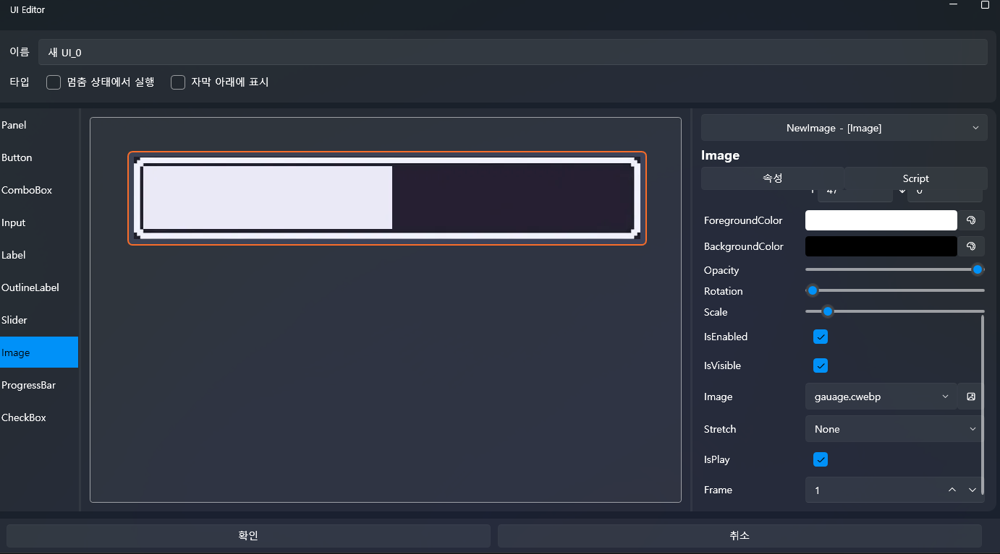
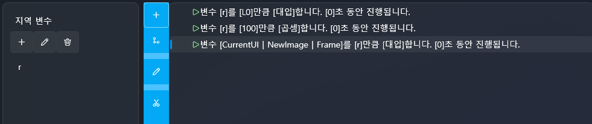

# 📘 Image Integration: Advanced webp Frame Control & Tick Script

In this tutorial, you will learn how to place a webp image inside the UI  
and control specific frames of the webp **in real time based on the X0 input value**.

VSP automatically converts every imported webp into **cwebp**,  
and allows you to control the Image’s **Frame** property directly.

We will also use the **Tick Script** inside the UI’s Main Panel to continuously update  
the webp frame while the UI is visible.

---

# 🧭 What You Will Learn in This Tutorial

- webp → cwebp automatic conversion  
- Placing a webp image in the UI  
- Executing logic every frame via Tick Script  
- Mapping X0 input to webp frame  
- Practical frame control using a local variable  

---

# 1️⃣ Preparing a webp File

We will use the following gauge webp:

This webp contains **101 frames (0–100)**.

👉 Download it and follow along!

---

# 2️⃣ Create a UI Screen

1. Click the **UI tab**  
2. Select **New UI**  
3. A blank UI screen will appear

---

# 3️⃣ Place the webp Image into the UI

1. Drag **Image** from the left Control list  
2. Drop it onto the UI  
3. On the right properties panel → choose **Image Source**  
4. Select the webp file

VSP automatically converts the webp → **cwebp**,  
and enables direct frame control.

Uncheck **IsPlay** → this allows you to control frames via script.

---

# 4️⃣ Using Tick Script

Tick Script is a **special script that executes every frame while the UI is active**.

Since we want to update the webp’s Frame in real time,  
Tick Script is mandatory.

---

## Enter Tick Script

1. In the UI hierarchy, select **Main Panel**  
2. Right panel → Tick → **Edit**

---

# 5️⃣ Map X0 Input Value to webp Frame

Now the core feature.

Since the webp contains frames **0 to 100**,  
we must scale X0 (0.0–1.0) to match this range.

The process takes exactly **3 steps**:

1) r ← X0  
2) r ← r * 100  
3) Frame ← r  

Let’s build this step-by-step.

---

# 📌 5-1) Create a Local Variable for Frame Calculation

1. In the Tick Script editor, right panel → Variables → **+**  
2. Name the variable: **r**

This will store and transform the X0 value.

---

# 📌 5-2) Assign X0 to r

First action:

- Set variable **r** to **Axis X0**  
- Duration: 0 seconds

---

# 📌 5-3) Convert X0 (0–1) into Frame Number (0–100)

Second action:

- Multiply variable **r** by **100**  
- Duration: 0 seconds

Examples:

X0 = 0.00 → r = 0  
X0 = 0.25 → r = 25  
X0 = 0.50 → r = 50  
X0 = 1.00 → r = 100  

---

# 📌 5-4) Apply r to ImageFrame

Third action:

- Set **CurrentUI → NewImage → Frame** to variable **r**  
- Duration: 0 seconds

The webp frame is now updated every Tick.

---

# 📸 Example Tick Script Structure

Summary:

- Set variable r to [X0]  
- Multiply r by [100]  
- Set (CurrentUI | NewImage | Frame) to [r]  

---

# 6️⃣ Full Logic Summary

The whole tutorial reduces to these three lines:

r ← X0  
r ← r * 100  
Frame ← r  

Place these inside a Tick Script  
and the webp will instantly respond to X0 input.

---

# ✨ Completed Result

You can now create:

- X0-based gauge UI
- Expression changes based on input intensity
- Real-time reactive UI graphics
- Lightweight animation without Spine

---

# ➡️ Next Tutorial

Now that you understand image/webp control,  
move on to advanced sound control:

👉 [Advanced Sound Control](intermediate-sound.md)
