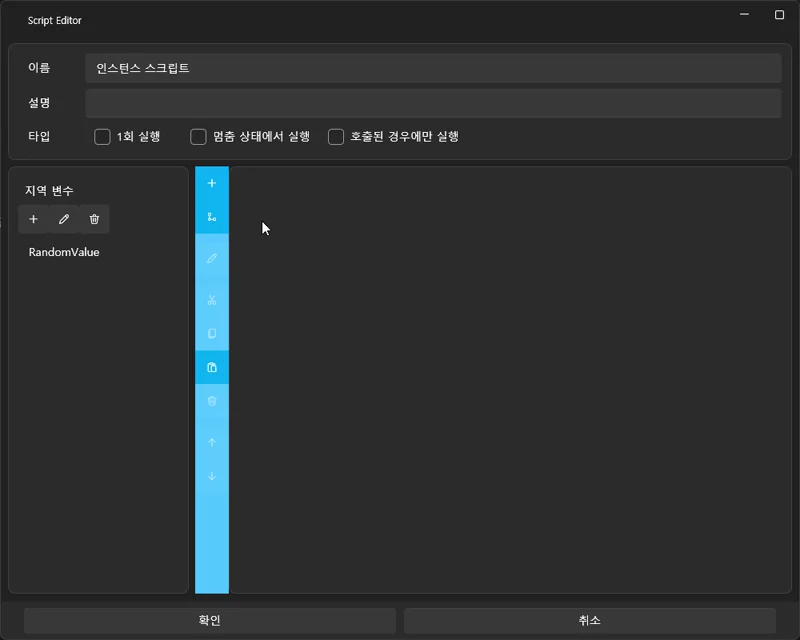

# Understanding Variables and Conditional Logic

In this tutorial, you will learn the concepts of **Variables** and **Conditional Logic**,  
and how to use them to control the flow of your project.

VSP’s variable system is similar to that of general programming languages,  
but its most powerful feature is that it is **extended to interact with all elements of the project**.

---

## 📌 1. What Is a Variable?

A variable is a small container that stores numbers, text, or state values.

Examples:

- Stroke count  
- Choice selection  
- Scene progression state  
- Accumulated score  
- Timer value  

In traditional programming, variables store simple values.  
In VSP, however, variables can **interact with and control project-wide systems**.

---

## 📌 2. VSP’s Powerful Variable System

Variables in VSP are not merely used to store data.  
They act as a **unified interface to access and manipulate components throughout your project**.

Below are the major categories of values that variables can interact with.

---

### 🔷 Basic Variables (Programming-like)

- Numeric variables  
- Text variables  
- Increment / decrement  
- Conditional branching (If / Else)

---

### 🔷 ✔ Extended Variable Sources (VSP-specific)

When setting a variable, you can directly read values from:

#### 🟦 **1) Random**
- Generate random values (e.g., 0–100)  
- Useful for probability-based events

#### 🟪 **2) Constant**
- A fixed value  
- Helpful for formulas and comparisons

#### 🟥 **3) Axis Values**
- Stroke device input (X0/X1, etc.)  
- UI sliders / joysticks  
- Live2D parameter values

This allows device movements to trigger logic.

#### 🟧 **4) Project Settings**
- Play count  
- Clear count  
- Fail count, etc.

You can dynamically branch based on project progress.

#### 🟩 **5) Track / Media Information**
- Track name  
- Current playback time  
- Media file path/name  
- Audio playback state  

Branch logic depending on specific media.

#### 🟨 **6) UI Element State**
- Button text  
- Checkbox value  
- Slider value  
- UI visibility / opacity  

Enables real-time UI changes based on variable values.

#### 🟫 **7) Live2D Parameters**
- Expression or motion parameters  
- Trigger motion changes based on conditions

---

In short, VSP variables serve as the **central control system** of your project—  
similar to a “global system API” in programming.

---

## 📌 3. What Is Conditional Logic?

Conditional logic chooses different actions based on variable values.

Examples:

- `StrokeCount >= 5` → play breathing sound  
- `Choice == 2` → jump to a different track  
- `Random(0–100) < 30` → trigger a special scene with 30% probability  

---

## 📌 4. Where Can Conditional Logic Be Used?

- If / Else inside scripts  
- Button click actions  
- UI show/hide behavior  
- Track jumping  
- Live2D expression control  
- Stroke device input conditions  
- Height/position detection logic  

---

## 📌 5. Script Action Details

You can find all available script actions here:

👉 **Full Script Action Reference:**  
[Script System](../editor/script.md)

---

In the next section, we will build a practical system using these features:  
a **randomized automatic branching system**.

---

# Variables & Conditional Logic: Automatic Branching with Random Values

In this tutorial, we will use **Random values**, **Conditional Logic**,  
and **Local Variables** to create a system where the project automatically branches  
to different scenes without user input.

Unlike the previous tutorial (choice-based branching),  
this one performs **automatic branching** based on probability.

---

# 1️⃣ Understanding Local Variables

A local variable is a variable that is **only valid within the script that executes it**.

### ✔ Characteristics

- Created when the script runs, destroyed when it ends  
- Never conflicts with other scripts  
- Perfect for random value storage or calculations  

---

# 2️⃣ Add an Inline Script to the Timeline

1. Drag **“Add Empty Script”** from the Script panel  
2. Drop it onto the timeline at your desired time (e.g., 00:10.000)  
3. Double-click it to open the script editor

---

# 3️⃣ Create a Local Variable

1. Inside the script editor, open the **Variables** panel on the right  
2. Click **+**  
3. Enter a name (e.g., `RandomValue`)

---

# 4️⃣ What Is Random-Based Automatic Branching?

When the script triggers:

1. It generates a random number (0–100)  
2. It chooses a scene depending on that number  

Example:

- 30% chance → Special Scene  
- 70% chance → Normal Scene  

---

# 5️⃣ Script Structure for Random Branching

### 📌 Step 1: Generate a Random Value  
Set **RandomValue** to a random number between **0 and 100**.

---

### 📌 Step 2: Add Conditional Logic

Condition:  
`RandomValue < 30`

- If true → Jump to special scene  
- If false → Jump to normal scene  

---

# 6️⃣ Summary of the Whole Flow

1. Script triggers at a specific time  
2. Local variable created  
3. Random value generated  
4. If condition checks  
5. Jump to the selected scene  

This allows **fully automatic branching** without user input.

---

# ✨ Completed System

You have now learned:

- Creating local variables  
- Using Random values  
- Creating If / Else logic  
- Using Jump Track  
- Building an automatic branching flow  

This is extremely useful for game-like events, random encounters, or dynamic storytelling.

---

# ➡️ Next Tutorial

After completing random-based branching,  
proceed to the next tutorial on **Image Integration**:

👉 [Image Integration](intermediate-image.md)
