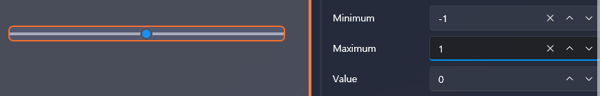

# 🎧 Advanced Sound Control (Left/Right Audio Panning)

In this tutorial, you will learn how to create a natural **Left → Right → Center**  
audio movement effect — commonly known as *panning*.

VSP allows precise audio positioning by controlling the **Balance** value of a sound.
This makes complex sound motion easy to configure using scripts.

A very important concept covered in this tutorial:

- **“Duration” does *not* block script execution**  
- To create sequential motion, you must explicitly use  
  **"Wait for N seconds"**

---

# 1️⃣ Importing Sound

1. Open the **Sound** tab in the left sidebar  
2. Click **Import**  
3. Select your mp3 file  
4. Once imported, it will appear in the sound list

---

# 2️⃣ Adding Sound to the Timeline

1. Drag your mp3 into an **Audio Track**  
2. Drop it at the desired position on the timeline

You can now control the sound through scripts.

---

# 3️⃣ Understanding Balance (Left/Right Position)

Balance controls the horizontal pan of a sound:

- **-1.0 → Hard Left**  
- ** 0.0 → Center**  
- **+1.0 → Hard Right**

When double-clicking a sound on the timeline,  
you can adjust left/right volume individually,  
but **Balance can *only* be controlled through scripts**.

---

# ⚠ Very Important  
## “Duration” does NOT block execution

Example:

Balance = 1 (Duration: 3 seconds)

What actually happens?

- Balance smoothly transitions over 3 seconds ✔  
- The script immediately continues to the next action ✘  
  (it does **not** wait 3 seconds)

So to ensure proper ordering you must add:

Wait for [3 seconds]

This is the *only* way to delay the next action.

---

# 4️⃣ Creating a Panning Script  
Left → Right → Center

Target movement:

1) Instantly move sound to the left  
2) Move to the right over 2 seconds  
3) Move back to center over 1 second

---

## 📌 Correct Script Structure (Sequential)

### 1. Move instantly to the left  
Balance = -1 (Duration: 0s)

### 2. Move to the right over 2 seconds  
Balance = 1 (Duration: 2s)

### 3. Wait 2 seconds  
Wait = 2s

### 4. Move to center over 1 second  
Balance = 0 (Duration: 1s)

### 5. Wait 1 second  
Wait = 1s

This ensures motion happens **in the correct order**.

---

## 📌 Why is this necessary?

Because:

- “Duration” only performs *lerp interpolation*  
- It does **not** pause script execution

Therefore, to create proper timing:

1) Set Balance with Duration  
2) Wait for the same duration

**These two must always be paired.**

---

# 5️⃣ Script Example Preview

---

# 6️⃣ Variable-Based Sound Movement (Optional)

Using variables allows smoother and reusable sound transitions.

Example:

1) Lerp = 0  
2) Lerp = 1 (over 3 seconds)  
3) Balance = Lerp  
4) Wait 3 seconds

Benefits:

- Reusable in many scenes  
- Easily combined with UI sliders  
- Works with device axes such as X0  
- Useful for mini-games or reactive sound design

---

# 7️⃣ Real-Time Balance Control with a UI Slider

This feature is frequently used for:

- ASMR channel testing  
- Audio option menus  
- VR sound direction calibration  
- Debug panels (device axis testing)  
- Mini-games involving audio control

We will now create an **interactive slider UI**  
where moving the slider immediately updates the sound position.

---

## 7-1️⃣ Adding the Slider UI

1. Go to the **UI** tab → Create a new UI  
2. Drag **Slider** from the control list onto the canvas  
3. Set these properties:

- Minimum = -1  
- Maximum = 1  
- Value = 0

---

## 7-2️⃣ Creating a Script for Slider Value Change

1. Select the Slider  
2. Right panel → **Script → ValueChanged → Edit**  
3. A new inline script editor appears

---

## 7-3️⃣ Script Structure

Bind the slider value directly to Balance:

Balance ← UI → Slider → Value

This one action is enough.  
No Tick Script required.  
Balance updates instantly as the slider moves.

---

## 7-4️⃣ Result

- Slide to the left → Sound pans to the left  
- Slide to the right → Sound pans to the right  
- Slider in center → Balanced center  

You now have a **fully interactive real-time audio direction controller**.

---

# 8️⃣ Summary

In this tutorial you learned:

✔ How to control audio Balance (left/right panning)  
✔ Why “Duration” is not blocking  
✔ How to use waits to create proper timing  
✔ Left → Right → Center movement  
✔ Variable-based movement  
✔ Real-time UI slider control  

---

# ✨ Next Tutorial

Next topic: **Subtitle Detection**

👉 [Subtitle Detection](intermediate-subtitle-detect.md)
