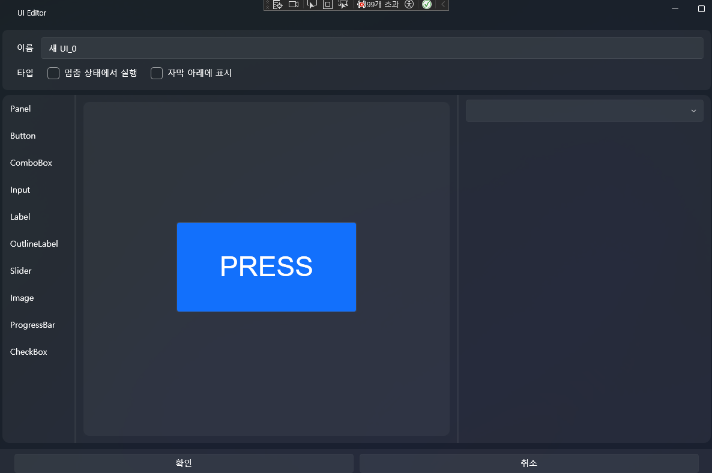
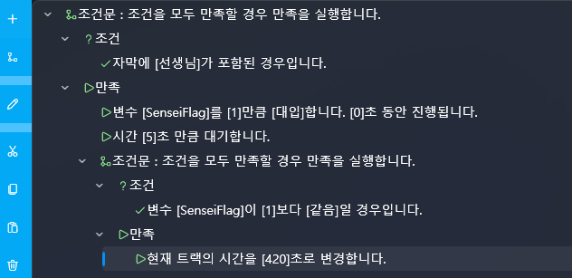

# 🎮 Creating a Mini Game Using Subtitle Detection  
## “Press the button within 5 seconds when the subtitle says **Sensei**!”

In this tutorial, we will continue from the previous chapter:  
**[Making Audio Look Like Video + Subtitle Generation](beginner-audio-to-video.md)**

In that chapter, we already prepared:

- UI background image  
- Loaded audio  
- Auto-generated subtitles using Whisper  
- Optional translated subtitles  

Now you will learn how to extend those subtitles into a **game mechanic**:

**When a specific word appears → start a timer → player must react → success or failure branch**

This chapter implements a small mini-game system using subtitle detection.

Example work used:  
https://www.dlsite.com/home/work/=/product_id/RJ01323001.html  
(Blue Archive — Kazusa / Trial Version)

In Blue Archive, the protagonist is called **“Sensei”**,  
making it the perfect example for subtitle keyword detection.

---

# 🧭 Overall Gameplay Structure

When the subtitle contains “Sensei”:

1. Global variable `SenseiFlag ← 1`  
2. Show a UI button  
3. Wait 5 seconds  
4. If the player presses the button → Success  
5. If not pressed → Track jumps to the end (Failure)

---

# 1️⃣ Change Subtitle Type First (Important!)

The mini-game relies on detecting the **exact moment** when  
the word “Sensei” appears in subtitles.

However, subtitles generated in the previous chapter may be:

- full-sentence display  
- appearing instantly  
- allowing us to know future words too early  

This makes detection inaccurate.

So we must switch subtitles to **TypeWriter mode**,  
which reveals text one character at a time.

---

## ✔ Why TypeWriter Mode?

TypeWriter subtitles:

- Reveal text **character-by-character**  
- Unrevealed text cannot trigger detection  
- The appearance order matches actual audio timing  
- Perfect for:  
  - Keyword detection  
  - Mini-games  
  - Timing-based reactions  
  - Breathing/lip-sync animations  

---

## 📌 How to Change All Subtitles to TypeWriter

1. Double-click the audio in the timeline → Open **Audio Editing**  
2. Open the subtitle list  
3. Press **Ctrl + A** to select all subtitles  
4. Bottom-right corner → **Animation → TypeWriter**

Now all subtitles will appear progressively,  
making keyword detection precise.

---

# 2️⃣ Create the UI (Reaction Button)

1. Go to the **UI** tab → **New UI**  
2. Drag a **Button** into the center  
3. Set Button Text = “Sensei!” or “PRESS!”

Same UI creation method as previous chapters.

**TIP:**  
Center-aligned buttons feel natural for mini-game prompts.

---

# 3️⃣ Create a Global Variable

1. Open **Resource Manager → Variables**  
2. Click the **+** button  
3. Name: `SenseiFlag`  
4. Initial value: `0`

Meaning:

- 0 → Not waiting for input  
- 1 → Keyword detected, waiting for player press

---

# 4️⃣ Create the Subtitle Detection Script

This script will:

1. Detect if the current subtitle contains the word **“Sensei”**  
2. Set the global variable  
3. Start a 5-second timer  
4. If no button is pressed → Failure branch

---

## 📌 How to Create It

1. Go to **Script** tab → **New Script**  
2. Script Name: **SenseiTrigger**  
3. Build it as shown below

---

## ✔ Step 1 — Detect the word “Sensei”

Add a condition block:

**Condition:**  
Subtitle **contains** “Sensei”

**When True:**  
- Set variable `SenseiFlag ← 1` (Duration: 0s)  
- Wait **5 seconds**

This starts the reaction timer.

---

## ✔ Step 2 — After 5 seconds, check if the player pressed the button

Add another condition block:

**Condition:**  
`SenseiFlag == 1`

**When True:**  
- Jump Track → End (e.g., set track time to 420 seconds)

If the player does not press the button within 5 seconds,  
the variable remains 1 → counted as failure → skip to end.

---

## 📌 Full Script Example

This setup achieves exactly:

- Subtitle shows "Sensei"  
- Reaction time starts  
- If no action → Failure  

---

# 5️⃣ Create the Button Click Script

In the UI:

Select the button → Right Panel → Script → **Click → Edit**

Then set up the following:

---

## ✔ Case 1 — Player pressed in time (Success)

**Condition:** `SenseiFlag == 1`

Actions:

- `SenseiFlag ← 0`  
- Play Sound (Success SFX)

This resets the waiting state.

---

## ✔ Case 2 — Player pressed too late (Failure)

**Condition:** `SenseiFlag == 0`

Actions:

- Jump Track → End (Failure branch)

---

# 🧪 Final System Overview (Summary)

---

## 🔷 Subtitle Detection Script (SenseiTrigger)

SenseiFlag ← 1  
UI Show (button)  
Wait 5 seconds  
If SenseiFlag == 1:  
 Jump Track (end)

---

## 🔷 Button Click Script

If SenseiFlag == 1:  
 SenseiFlag ← 0  
 Play Sound (success)  
Else:  
 Jump Track (end)

---

# 🎉 Final Result

Your project now behaves like this:

- Subtitle displays “Sensei”  
- A button pops up  
- Player has 5 seconds to press  
- Press = Success  
- No press = Failure  
- Perfectly integrated into the project created in  
  **beginner-audio-to-video**

This forms the foundation for  
**a fully interactive mini-game system inside VSP**  
using subtitles, UI, variables, and timing logic.

---
