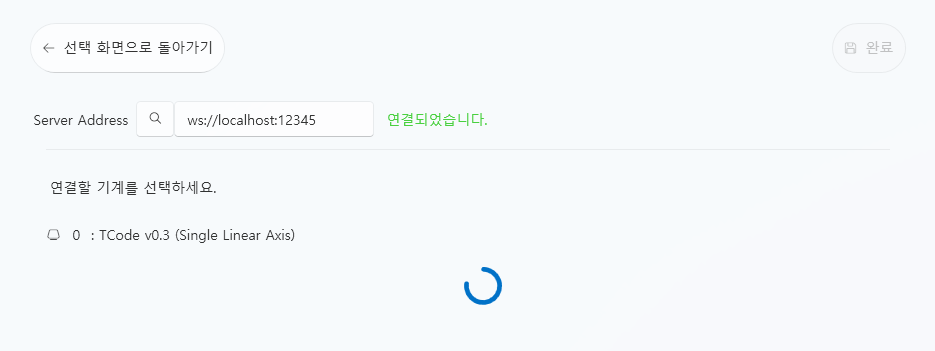

# Intiface Central Connection (Device Bridge Setup)

## 1. Overview
**Intiface Central** is a **device bridge program** used to control various devices.  
**VoiceScriptPlayer** integrates with Intiface to send **TCode signals**  
to devices connected via Bluetooth or USB.

> 💡 Intiface is the official device hub based on **Buttplug.io**,  
> allowing multiple brands of devices to be managed through a single server.

---

## 2. Preparation (Before You Begin)
Intiface Central is a separate program from VoiceScriptPlayer.  
You must install and start the Intiface server before connecting.

### 🔧 Installation Steps
1. Download the latest version from the [official Intiface Central website](https://intiface.com/central)  
2. Install and launch the program  
3. Click the **“Start Server”** button at the top to activate the server  
4. When the status bar shows **“Server Running”**, you’re ready to connect

---

## 3. Connection Steps

### 🖱️ Step 1 — Choose Connection Method
Launch VoiceScriptPlayer and click **Device Connection** from the left menu.  
On the “Choose how to connect” screen, select **Intiface Central**.

> From left to right, the options are: “No Connection,” “Direct Connection,” and “Intiface Central.”  
> Select the third option: **Intiface Central**.

---

### 🌐 Step 2 — Verify Server Connection
By default, VoiceScriptPlayer communicates with Intiface via:

    ws://127.0.0.1:12345

If Intiface is running, you’ll see “Connecting...” followed by  
a message confirming the connection after a few seconds.

> ✅ When connected successfully, a message saying “Connected” will appear.

---

### ⚙️ Step 3 — Device Detection and Testing
Intiface will automatically begin scanning for devices.  
If your device is connected properly, it will appear in the **Devices** tab of Intiface.

> If your device doesn’t appear in the list, additional setup may be required within Intiface.  
> For example:  
> - **TCode devices** require manual port assignment  
> - **The Handy** requires an API key to be entered  
>  
> ⚙️ See the [Intiface Advanced Configuration Guide](intiface_advanced.md) for details.

Click **Done** to save your connection configuration.

> 💡 After setup, VoiceScriptPlayer will automatically reconnect to Intiface  
> the next time it is launched.

---

## 4. Connection Structure

VoiceScriptPlayer → Intiface Server → Device (Bluetooth / USB)

- VoiceScriptPlayer sends **TCode commands** to the Intiface server  
- Intiface transmits signals to the connected devices  
- Multiple devices can be connected and used simultaneously

---

## 5. ⚙️ Intiface Internal Configuration Reference
Some devices may require additional configuration within Intiface.  
Refer to the table below for details:

| Device Type | Required Setting | Description |
|--------------|------------------|-------------|
| **TCode Devices (OSR2, SR6, etc.)** | Specify port number | Manually enter the TCode server port in Intiface’s configuration file |
| **The Handy** | API Key | Register your API Key in Intiface’s Handy settings menu |
| **Other BLE Devices** | Pairing | Must be paired in Windows Bluetooth settings before being detected |

> 🔍 For more detailed instructions, refer to:  
> - [Intiface Advanced Configuration Guide](intiface_advanced.md)  
> - [Intiface Central GitHub Repository](https://github.com/intiface/intiface-central)  
> - [Buttplug.io Project](https://buttplug.io/)

---

## 6. Troubleshooting

| Problem | Cause | Solution |
|----------|--------|----------|
| VoiceScriptPlayer cannot connect to Intiface | Intiface not running | Start Intiface and click “Start Server” |
| “Port already in use” error | Port 12345 is occupied by another program | Change the port in Intiface settings and update the same port in VoiceScriptPlayer |
| Device not showing in Intiface | Bluetooth pairing incomplete | Remove and re-pair the device in Windows Bluetooth settings |
| No response during test | Device is paused | Click “Resume” in Intiface’s Device tab |
| Device frequently disconnects | Power-saving or insufficient USB power | Disable device power-saving or use a wired connection |

---

## 7. Notes
- Intiface operates as a **local WebSocket server**, with port `12345` as the default.  
- You can connect multiple devices simultaneously, but some may not support parallel commands.  
- Intiface runs on Windows, macOS, and Linux,  
  while **VoiceScriptPlayer currently supports Windows only**.

---

## 8. References
- **Intiface Central Official Website:** [https://intiface.com/central](https://intiface.com/central)  
- **Buttplug.io Project:** [https://buttplug.io](https://buttplug.io)  
- **VoiceScriptPlayer Documentation:** [https://voicescriptplayer.github.io/vsp-docs/](https://voicescriptplayer.github.io/vsp-docs/)  
- **TCode Connection Guide:** [tcode.md](tcode.md)
