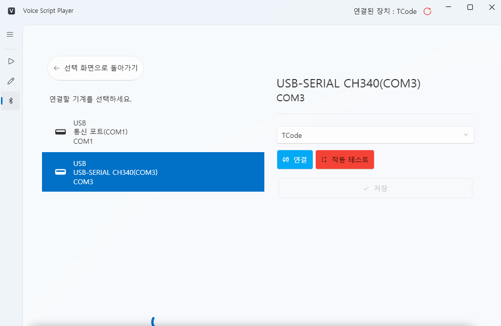

# TCode Device Connection (Serial Device Setup)

## 1. Overview
**VoiceScriptPlayer** supports the **TCode protocol**,  
allowing direct communication with USB or Serial (COM) devices.  
This means the program communicates **directly with the device** — no Intiface required.

TCode connections are primarily used for:
- **USB-Serial based DIY devices** (e.g., OSR2, SR6)  
- **Arduino / ESP32-based TCode controllers**  
- **Common USB-Serial chipsets** such as CH340, CP210x, FTDI, etc.

---

## 2. Connection Steps

### 🖱️ Step 1 — Choose Connection Type
Launch VoiceScriptPlayer and click **Device Connection** from the left menu.  
On the screen that says “Choose how to connect,” select **Direct Connection**.

> 💡 From left to right:  
> `No Connection`, `Direct Connection`, `Intiface Central`  
> For TCode devices, always select the **Direct Connection** option.

---

### 🔌 Step 2 — Select the Device to Connect
The next screen will display the list of available **COM ports**.

For USB devices, the port usually appears immediately after plugging in.  
🔵 **For Bluetooth connections**, it may take about **5–10 seconds** for the device name to appear.  
Initially, it may show as a generic name like “Standard Bluetooth Serial Link (COMx).”

📷 **Initial Display Example:**  

After a short delay, the Bluetooth device name will update to something like `FUNSR1-15877`.

📷 **After Recognition:**  

> ⏳ Bluetooth connections may take extra time due to port initialization.  
> If the name doesn’t update, make sure the device is paired,  
> or reopen the list to refresh it.

---

### ⚙️ Step 3 — Configure Connection Settings
In the right panel, set **Protocol Type** to `TCode`,  
then click the **[Connect]** button to open the port.

If the connection is successful, the **Test Connection** button will become available.

---

### 🔁 Step 4 — Test the Connection
Click the **[Test Connection]** button to make the device respond briefly and confirm communication.  
If the test completes successfully, the **[Save]** button becomes enabled.  
Make sure the device moves up and down about 3–4 times to confirm correct linkage.  
Be aware that **[Save]** may still activate even if the wrong port is selected.

> ✅ Clicking **Save** will set the current connection as the default device.  
> The connection settings will be stored and automatically reloaded next time.

---

### 🟢 Step 5 — Verify Connection Status
Once setup is complete,  
the top-right corner of the window will show `Connected Device: TCode`,  
and the selected connection icon will have a **green outline**.

> 💡 A green outline indicates an active connection.  
> TCode commands from scripts and events will be transmitted instantly.

---

## 3. After Connection
- While connected, all **TCode events** and **Stroke patterns** are sent in real time.  
- If the connection drops, the status indicator turns gray.  
- The saved port will automatically reconnect on the next launch.

---

## 4. Troubleshooting

| Problem | Cause | Solution |
|----------|--------|----------|
| Device not listed | Driver not installed | Install the proper serial driver via Device Manager |
| Connection fails | Port already in use | Check if another program (e.g., Intiface) is occupying the same port |
| No response to test | Baud rate mismatch or unsupported firmware | Verify the device’s firmware and communication settings |
| Disconnects immediately after connecting | Faulty cable or insufficient USB power | Try another USB port or use a powered USB hub |

---

## 5. Notes
- If you also use the same device with **Intiface Central**,  
  make sure **only one application is running** at a time to avoid port conflicts.
