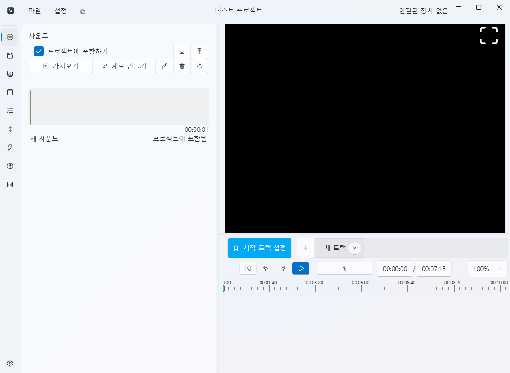

# Editor Overview

The **VoiceScriptPlayer Editor** is the core tool for building projects and editing resources.  
This page introduces the overall interface layout and the role of each editing tab.

---

## 1. Getting Started

When you create or open a project, the editor will automatically launch.  
The editor is composed of multiple editing tabs,  
each managing different types of resources such as sound, video, and Live2D.

> 💡 **Note:**  
> VoiceScriptPlayer can open only **one project at a time.**  
> To open a new project, close the current editor and return to the home screen.

---

## 2. Interface Layout

The VoiceScriptPlayer editor consists of three main areas:  
**the left resource list**, **the central player (preview)**, and **the bottom timeline/control area**.

| Area | Description |
|------|--------------|
| **Top Menu Bar** | Contains basic menus such as **File** and **Settings**, allowing project saving, publishing, and environment configuration. |
| **Left Panel (Resource List)** | Displays resources of the current tab (e.g., sound, video, Live2D). New resources can be added or removed. |
| **Center Area (Player)** | Shows a **real-time preview** of the selected sound, video, or Live2D model. The preview size can be adjusted or switched to full screen. |
| **Bottom Area (Track / Timeline)** | Displays the timeline for sound and events. You can **set playback regions and define starting tracks**, with playback and loop control buttons available. |
| **Project Info Bar** | Displays the current project title and imported DLsite work name. |
| **Status Bar (Top Right)** | Shows connected device status (e.g., TCode, Intiface), including “No device connected.” |

---

### 🎮 Main Components

- **Player Area**  
  Displays video, Live2D, and UI elements, providing a **synchronized preview** just like in actual gameplay.  
  Video playback, Live2D animation, and UI interaction are reflected in real time.

- **Track Settings**  
  The timeline at the bottom allows you to add tracks or set a starting point.  
  Clicking the “Set as Start Track” button designates that track as the project’s entry point.

- **Resource List**  
  The left panel displays all resources relevant to the current editing tab.

> 💡 **Tip:**  
> The **Sound** and **Video** tabs share the same layout structure.  
> Once you understand the workflow — **Resource List → Preview → Track Setup** —  
> you can edit efficiently across other tabs as well.

---

## 3. Editor Tab Structure

The VoiceScriptPlayer editor is organized into the following tabs:

| Tab | Description |
|------|-------------|
| 🎵 [**Sound**](../editor/sound.md) | Import audio files (`.mp3`, `.wav`) to perform **subtitle generation/editing**, **translation**, and **speech synthesis (TTS)**. |
| 🎬 [**Video**](../editor/video.md) | Add video files (`.mp4`, `.mov`) and perform **subtitle generation**, **translation**, and **timing synchronization**. |
| 🧍 [**Live2D**](../editor/live2d.md) | Load and arrange character models (`.model3.json`) and motion files. |
| 🧩 [**UI**](../editor/ui.md) | Place and edit **user interface components** such as buttons, text, and images. |
| 💬 [**Script**](../editor/script.md) | Define and control interactions using **variables, triggers, and conditions**. |
| ✏️ [**Stroke**](../editor/stroke.md) | Edit **timeline-based motion patterns (strokes)**. |
| ✨ [**Special Events**](../editor/special-event.md) | Manage **predefined special events** such as key scenes or transitions. |
| 📦 [**Resource Manager**](../editor/resources.md) | Centrally manage **shared resources** such as variables, images, Live2D assets, and translation dictionaries. |
| 🧰 [**Runtime Helper**](../editor/runtime-helper.md) | Displays debugging and runtime information during project testing. |

---

## 4. Basic Editing Workflow

The VoiceScriptPlayer editing process is designed around **synchronizing all elements through the sound track**.  
Following the steps below provides the most natural and efficient editing flow.

---

<ol>
  <li>🎵 <b>Set Up Tracks in the Sound Tab</b> 
  Import voice or background music files (<code>.wav</code>, <code>.mp3</code>). 
  Use the <b>Subtitle Generation (STT)</b> feature to convert speech to text if needed. 
  Split segments or trim unnecessary parts for better timeline organization.</li>

  <li>🎬 <b>Link Scenes in the Video or Live2D Tab</b> 
  Import video or Live2D models and <b>synchronize them with the sound track</b>. 
  Adjust Live2D motion, expressions, and animations according to timing. 
  For videos, you can add or auto-translate subtitles.</li>

  <li>🧩 <b>Build the Interface in the UI Tab</b> 
  Arrange interactive elements such as buttons, text, and images. 
  Each UI element can trigger <b>script events</b> — for example: 
  “On button click → move to next track” or “Show choice options.”</li>

  <li>💬 <b>Define Logic in the Script Tab</b> 
  Use variables, triggers, and conditional statements to define the <b>project’s behavior flow</b>. 
  Example: After a specific segment ends, trigger a Live2D animation or switch audio. 
  Control UI, stroke, and sound interactions in a unified way.</li>

  <li>✏️ <b>Synchronize Physical Effects in the Stroke / Special Events Tab</b> 
  Use the Stroke Editor to configure <b>motion patterns and timing</b>. 
  In the Special Events tab, create climax sequences or scripted effects. 
  Since all use the same timeline, perfect synchronization is possible.</li>

  <li>▶️ <b>Preview and Debug</b> 
  Click the ▶ **Play button** to preview the full sequence. 
  During playback, monitor variable states and event triggers via the <b>Runtime Helper</b>.</li>
</ol>

---

> 💡 **Tip:**  
> Only timeline modifications require manual saving.  
> Resource additions and edits are automatically applied without pressing “Save.”

---

## 5. Keyboard Shortcuts

| Shortcut | Action |
|-----------|---------|
| **Ctrl + S** | Save the current project |

---

## 6. Editor Settings & Initialization

- **Program Settings**  
  Go to **Settings → Program Settings** in the top menu to configure:  
  UI theme, language, microphone input, AI settings, and keyboard shortcuts.

---

## 7. Next Steps

All editing in VoiceScriptPlayer is based around the **timeline (track)**.  
Sound, video, Live2D, UI, scripts, and special events are  
synchronized along the same time axis.

Next, learn about the **structure of the timeline and tracks**,  
and how to place and edit resources on them.

---

### 🎞️ Timeline & Track Structure
- [Timeline Overview](timeline.md)

---

### 🎵 Resource Editing Guides
After understanding the timeline, proceed to each resource tab for detailed editing:

- [Sound Editing](sound.md) – Audio files, subtitle generation (STT), track setup  
- [Video Editing](video.md) – Video playback, subtitle sync, translation  
- [Live2D Editing](live2d.md) – Character models, motion, facial control  
- [UI Editing](ui.md) – Buttons, text, interface layout  
- [Script Editing](script.md) – Triggers and variable control  
- [Special Event Editing](special-event.md) – Climax effects, transitions, timing setup  
