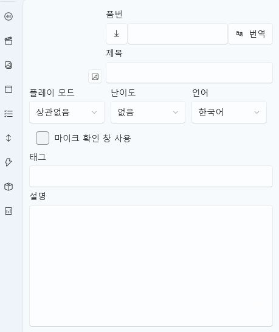

# Project Information Settings

When you **create a new project** or **load an existing one**, the right panel allows you to configure the **basic project information**.  
This section manages the project’s name, DLsite integration, language settings, tags, translations, and other **metadata**.

> ⚙️ Click the **Settings button (gear icon)** at the bottom left  
> to open this configuration window directly.

---

## 1. Interface Overview

| Component | Description |
|------------|-------------|
| **Project Title / Product Code** | Field to enter the project’s name and DLsite product ID |
| **Auto Translation & DLsite Integration** | Automatically fetch or translate project info |
| **Play Mode / Difficulty / Language** | Set default play mode and speech recognition language |
| **Tags / Description** | Define keywords and detailed project description |
| **Microphone Check Window** | Choose whether to display a mic test window on startup |

---

## 2. Project Information Settings

The right panel lets you configure the basic information of a new project.  
These are key options that should be reviewed during project setup:

| Field | Description |
|-------|-------------|
| **Project Title** | Enter the project name. This will also be used for file and folder names. |
| **Product Code (DLsite Code)** | Enter the DLsite product ID (e.g., `RJ01430276`). Click the **📥 (Download) button** on the left to automatically fetch and fill in the work details (title, description, tags, etc.). |
| **Auto Translation (Translate)** | Automatically translate the fetched DLsite data (title, description, tags) into your preferred language. The translation language is determined by the **STT Engine Language Setting** below. |
| **Template Selection** | Define the basic project structure. Options: **Empty Project**, **Mini Game**, or **Multi-Track Project**. |
| **Play Mode** | Choose the default play style for the project: ① **No Preference** ② **Hands Only** ③ **Device Recommended** ④ **Device Only** |
| **Difficulty** | Set the scenario or rhythm difficulty (None / Easy / Normal / Hard). |
| **Language Setting (STT Engine)** | Define the base language for speech recognition (STT). Examples: Japanese (`ja`), English (`en`), Korean (`ko`), etc. |
| **Microphone Check Window** | If enabled, a **Microphone Check Window** will appear on startup to ensure the input device is functioning properly. |
| **Tags and Description** | Add classification tags or a detailed explanation of the project. These fields are auto-filled if data is imported from DLsite. |

---

## 3. DLsite Integration (Auto-Fetch by Product Code)

When you enter a DLsite product ID (RJ code), the corresponding project metadata is fetched automatically.  
This feature fills in the title, description, and tags automatically,  
and the **Translate** button can instantly convert them into your target language.

> 💡 Example:  
> Enter `RJ01430276` → Title, description, and tags are auto-filled  
> Click **Translate** → Converts content into the selected language (`ko`, `en`, or `ja`)

> ⚠️ Some project information may be missing due to DLsite API limitations,  
> and manual input may be required in such cases.

---

## 4. Language & Translation Settings

| Field | Description |
|-------|-------------|
| **Language Selection** | Define the base language of the project. |
| **Auto Translation Option** | Automatically translate imported DLsite data into the selected language. |
| **STT Language Sync** | Keeps the speech recognition (STT) and translation settings synchronized. |

> 💡 Example:  
> - If the STT engine is set to `ja` (Japanese), DLsite data is translated into Japanese.  
> - Switching to English re-translates the title, description, and tags into English.

---

## 5. Tag & Description Writing Guide

| Field | Description |
|-------|-------------|
| **Tags** | Main keywords for search and classification. Example: `Moe, Healing, ASMR, Multiple Endings` |
| **Description** | Provide a detailed introduction, story outline, or mood of the project. DLsite content can be freely edited. |

> 💡 Tags and descriptions are also used for **project preview and publishing information**.

---

## 7. Related Documents

- [Runtime Helper Tab](runtime-helper.md)  
- [Stroke Tab](stroke.md)  
- [Special Event Tab](special-event.md)  
