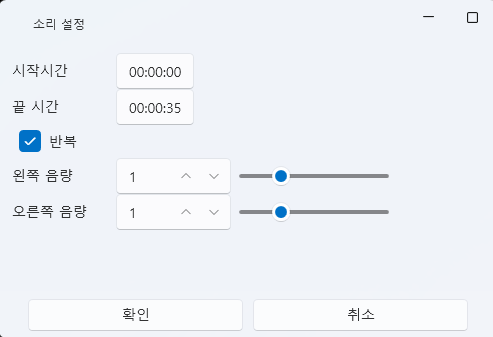

# Sound Tab

The **Sound Tab** in VoiceScriptPlayer is where you manage the core audio of your project.  
It provides tools for **subtitle generation (STT)**, **translation**, and **speech synthesis (TTS)**.  
All tracks and events in the project synchronize based on sound.

---

## 1. Basic Interface

The Sound Tab manages all audio files used in your project.  
This includes importing files, generating TTS voices, configuring subtitles, and more.

| Element | Description |
|----------|-------------|
| **① Include in Project** | When checked, imported sounds are **copied into the project folder**. When unchecked, they are only **referenced externally** without being copied. |
| **② Import** | Import `.wav` or `.mp3` files from your local drive. Depending on “Include in Project,” files are either copied or referenced. |
| **③ New** | Generate new TTS voices. Opens the **TTS Creation Window**, where your input text is synthesized using a selected voice engine (e.g., COEIROINK). |
| **④ Edit ✏️** | Opens the detail editor for the selected sound. Imported sounds open the **Subtitle Editor**, while generated TTS sounds open the **TTS Editor**. |
| **⑤ Delete 🗑️** | Removes the selected sound from the list. |
| **⑥ Export ↗ / Reimport ↙** | Export a sound from the project to an external folder or reimport it back into the project. |
| **⑦ Open Sound Folder 📂** | Opens the folder where the project’s sound files are stored. |
| **⑧ Waveform Preview Area** | Displays the waveform and duration of the selected sound. Shows filename, duration, and inclusion status below. |

---

### ⚙️ Operation Summary

| Action | Result |
|--------|--------|
| Import with “Include in Project” checked | File is **copied** into the project folder (`Asset/Sound/`). |
| Import with it unchecked | File is **referenced externally** without being moved. |
| Export to external folder | Copies the selected sound to the target folder. |
| Reimport to project | Restores an external file back into the project. |

---

> 💡 **Tip:**  
> Unchecking “Include in Project” offers several advantages:
>
> - ✅ **Smaller project size:** Large sound files are not duplicated.  
> - ⚡ **Faster import:** Skips the copy process.  
> - 🛠️ **Easy external editing:** Changes made externally (e.g., noise removal) update instantly.  
> - 🧾 **Copyright safety:** Commercial or licensed audio files can remain external.  
>
> However, note that externally referenced sounds are **excluded during export**,  
> so other users will not receive the sound files when the project is shared.

---

## 2. Subtitle Editing (Medio Editor)

Select a sound file and click the **✏️ Edit** button to open the  
`Medio Editor`, where you can generate subtitles (STT), translate them, and adjust timing.

---

### 🎛️ Basic Layout

| Field | Description |
|--------|-------------|
| **Name** | The name of the sound file currently being edited. |
| **Length** | Displays the playback range and total duration. |
| **AI Settings** | Opens settings for STT/translation engines (Whisper, DeepL, etc.) without closing the window. |
| **Speech Language** | The input language for STT (e.g., Japanese, Korean, English). |
| **Translation Language** | The target language for translation. |
| **Video Preview Window** | Displays a live subtitle preview. |
| **Subtitle List (Right)** | Allows fine-tuning of time ranges and positions for each subtitle. |

---

### 🗣️ Converting Speech to Subtitles (STT)

1. Set the **Speech Language**.  
2. Click **[Convert Speech to Subtitles]**.  
3. The registered **STT Engine** (e.g., Whisper) will transcribe the audio.  
4. The result will appear as a **timestamped subtitle list**.

| Field | Description |
|--------|-------------|
| **StartTime / EndTime** | Adjust the start and end times of each subtitle. |
| **Subtitle Text** | The recognized text, editable directly. |
| **X / Y** | Screen position of the subtitle. |
| **FontSize / OutlineSize** | Adjust font size and outline thickness. |
| **Dock** | Choose anchor position (Top / Center / Bottom). |
| **Fill / Outline** | Set the text and outline colors. |

> 💡 **Note:**  
> Subtitles generated from STT are automatically saved to the `Asset/Sound/` folder  
> and can be reused for other audio or video files.

---

### 🌐 Subtitle Translation

1. After generating subtitles, click **[Translate Subtitles]**.  
2. The selected **Translation Engine** (DeepL, LibreTranslate, etc.)  
   automatically translates from `Speech Language → Translation Language`.  
3. Translated subtitles appear alongside the original and can be edited individually.

| Option | Description |
|--------|-------------|
| **Auto Translation Engine** | Uses the translation API configured in settings. |
| **Preview Results** | Instantly preview translation output. |
| **Apply Edits** | Modify translated text directly in the side panel. |

> 💡 **Tips:**  
> - To translate Japanese audio into Korean, set **Speech Language = Japanese**, **Translation Language = Korean**.  
> - Translated subtitles are **saved with the original** and displayed automatically during playback.

---

### ▶️ Preview and Verification

- Use the **▶ Play** button to check subtitle timing.  
- The slider lets you inspect specific time segments.  

> ⚙️ **Related AI Settings:**  
> - [AI → Whisper](../ai/whisper.md)  
> - [AI → DeepL](../ai/deepl.md)  
> - [AI → LibreTranslate](../ai/libretranslate.md)

---

### 📦 Output Location

| Type | Path |
|------|------|
| STT Subtitle File | `Asset/Sound/<original_filename>.srt` |

---

## 3. Speech Synthesis (TTS)

Click **[New]** to open the `Audio Editor`,  
where you can input multiple sentences and assign different synthesis settings per sentence.  
Engines such as COEIROINK and Hailuo allow natural voice generation for each dialogue unit.

---

### 🧩 Key Improvements

| Feature | Description |
|----------|-------------|
| **Multi-Sentence Input** | Enter multiple lines and synthesize each independently. |
| **Per-Sentence Settings** | Customize voice, pitch, speed, and volume for each line. |
| **Dedicated Timeline** | A new TTS timeline functions just like video or event tracks. |
| **Improved Preview** | Play individual sentences or preview the entire sequence. |

---

### 🎛️ Basic Components

| Field | Description |
|--------|-------------|
| **Name** | The name of the output audio file. |
| **Length** | Total playback time of all sentences. |
| **AI Settings** | Opens the configuration window for the selected TTS engine. |
| **Text-to-Speech Engine** | Choose which engine to use (`COEIROINK`, `Hailuo`, etc.). |
| **Timeline** | Displays sentences as segments on a timeline; duration and position can be adjusted. |

---

### 🗣️ Per-Sentence Editing

Each sentence is managed as an independent block.  
You can modify **text, voice settings, and subtitle styles** individually.

| Field | Description |
|--------|-------------|
| **Text Input** | Enter the text to be synthesized. Each line represents a separate sentence. |
| **Character Selection** | Choose the voice character (e.g., Lirin, Noel, etc.). |
| **Speed / Pitch / Intensity / Volume** | Adjustable independently per sentence. |
| **Subtitle Preview** | Displays subtitles for quick sync checking. |
| **Subtitle Settings** | Set X/Y position, font size, colors, and outline. |

---

### 📜 Timeline Controls

The new **TTS Timeline** behaves like other tracks (video, events, etc.).

| Field | Description |
|--------|-------------|
| **Sentence Nodes** | Each sentence appears as a node; drag to reposition. |
| **Segment Length** | Adjust node length by dragging edges. |
| **Order Change** | Reordering sentences automatically updates the timeline. |
| **Playback Controls** | Supports segment play, full play, and pause. |

> 💡 **Tip:**  
> Synchronize audio, subtitles, and events perfectly via the TTS timeline.  
> The same shortcuts and editing behaviors apply as other tracks.

---

### 🎧 Engine Characteristics

#### 🪶 COEIROINK
- Japanese open-source speech synthesis engine  
- Strong at emotional expression and intonation control  
- Local synthesis and instant preview support  
- Output format: WAV  
- Main parameters: `Speed`, `Pitch`, `Volume`

#### 🌊 Hailuo
- Cloud-based AI speech engine  
- Natural pronunciation and smooth transitions  
- Multilingual support (Japanese, Korean, English, etc.)  
- High-quality synthesis via cloud API  
- Main parameters: `Pitch`, `Intensity`, `Timbre`, `Emotion`

🎧 **Try Online**  
Visit the [Hailuo Demo Page](https://www.minimax.io/audio/text-to-speech)  
to preview different voice profiles and select styles (female, male, emotional, etc.).  
You can then use the same configurations in VoiceScriptPlayer.

> - [AI → COEIROINK](../ai/coeiroink.md)  
> - [AI → Hailuo](../ai/hailuo.md)

---

### ▶️ Preview and Synthesis

- Click **▶** to instantly play the selected sentence.  
- You can play all sentences or preview specific sections.  
- Editing text automatically re-synthesizes the result.  

---

### 📦 Output Location

| Item | Path |
|------|------|
| **Generated Audio File** | Automatically saved in `Asset/Sound/`. |
| **Subtitle Data** | Saved as `.srt` or in project metadata in the same folder. |

---

### 💡 Tips

- To create emotional or character changes mid-dialogue,  
  split sentences and apply different settings per line.  
- You can mix COEIROINK and Hailuo —  
  for example, use COEIROINK for Japanese lines and Hailuo for Korean narration.

---

## 4. Adding to the Timeline

Generated or imported sounds can be **dragged directly onto the timeline**.

- Drag a sound from the left list onto a track to create a node automatically.  
- Adjust duration and position in real time.  
- Combine multiple sounds for **complex layered effects**.

> 💡 **Tip:**  
> Sound nodes can be perfectly synchronized with other timeline elements  
> such as Live2D, UI, and event triggers.

---

### 🎚️ Sound Node Settings

Sounds added to the timeline can be fine-tuned through the **Sound Settings Window**.  
Right-click a sound node and select “Edit,” or double-click it to open the settings.

| Field | Description |
|--------|-------------|
| **Start Time / End Time** | Define playback start and end points. |
| **Loop** | When enabled, repeats the selected section. |
| **Left / Right Volume** | Adjust stereo balance independently. |

These options allow you to create **spatial or looping effects** for advanced audio design.

---

## 5. Related Documents

- [Timeline Editing](timeline.md)  
- [Video Tab](video.md)  
- [Script Editing](script.md)  
- [AI → Speech Recognition](../ai/speechRecognition.md)  
- [AI → COEIROINK](../ai/coeiroink.md)
