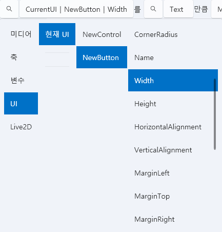

# UI Tab

The **UI Tab** is used to **design and control the user interface within a project**.  
You can place various UI elements such as buttons, images, and text,  
and link them to scripts to **create interactive behavior**.

---

## 1. Basic Interface

| Component | Description |
|------------|-------------|
| **① Drag to Add Empty UI** | Creates a new **UI instance**. |
| **② UI Templates** | Manages reusable **UI layout templates**. |
| **③ Import** | Loads an existing saved UI template. |
| **④ Create New** | Creates a new UI template. |
| **⑤ Edit ✏️** | Opens the selected UI in the editor. |
| **⑥ Delete 🗑️** | Removes the selected UI from the list. |
| **⑦ Open Folder 📂** | Opens the `Asset/UI/` folder directly. |

> 💡 **Tip:**  
> UI instances operate independently,  
> while UI templates apply global changes to all instances that reference them.

---

## 2. UI Templates and Instances

UI elements are divided into **Templates** and **Instances**,  
which differ in their scope and edit behavior.

| Type | Description | Features |
|------|--------------|-----------|
| **UI Template** | A reusable layout shared across multiple screens. | Changes apply globally to all linked instances. |
| **UI Instance** | A unique, standalone UI for a single scene. | Independent; unaffected by template changes. |

> 💡 **Example:**  
> Menus like “Choice UI,” “Pause Menu,” or “Start Screen” are ideal as templates.  
> Event-specific popups are better as instances.

---

## 3. UI Editor

The UI Editor consists of a **Control List** on the left, a **Canvas** in the center,  
and a **Properties Panel** on the right.  
You can drag elements from the list to the canvas and adjust their properties on the right.

---

### 🎛️ Top Options

| Item | Description |
|------|--------------|
| **Name** | Specifies the UI’s name. |
| **Active During Pause** | Keeps the UI visible and functional even when the project is paused. |
| **Show Behind Subtitles** | Places the UI layer behind subtitles (useful for HUDs or background UIs). |

---

## 4. Control List

| Control | Description |
|----------|-------------|
| **Panel** | A container that can hold other controls. |
| **Button** | Handles click events. |
| **ComboBox** | Allows selection from dropdown items. |
| **Input** | A text input field. |
| **Label / OutlineLabel** | Displays text; OutlineLabel includes a border outline. |
| **Slider / ProgressBar** | Adjusts a value or displays progress. |
| **Image** | Displays an image file. |
| **CheckBox** | A toggleable ON/OFF control. |

> ⚙️ **Note:**  
> Only `Panel` controls can contain child elements.  
> All other controls function as single, standalone elements.

---

## 5. Property Editing

While each control type has its own properties,  
the following **common properties** are shared by most controls:

| Property | Description |
|-----------|-------------|
| **Name** | Unique identifier for referencing in scripts or triggers. |
| **Width / Height** | Defines the size of the control. |
| **Horizontal / Vertical Alignment** | Sets the position relative to the parent container. |
| **Margin** | Specifies spacing from the parent container. |
| **Foreground / Background Color** | Defines colors for text and background. |
| **Opacity / Rotation / Scale** | Adjusts transparency, rotation angle, and scaling. |
| **IsEnabled / IsVisible** | Toggles activation and visibility. |

> 💡 **Note:**  
> Some controls have additional properties such as  
> `Text`, `FontSize`, `ImageSource`, `MaxValue`, etc.

---

## 6. Script Events

Each UI control can **trigger events** based on user interaction.  
Events can be connected to scripts through the `Script` tab on the right.

---

### 🧩 Common Events (All Controls)

| Event | Description |
|--------|--------------|
| **MouseDown / MouseUp** | Fires when the mouse is pressed or released. |
| **MouseEnter / MouseLeave** | Fires when the mouse enters or leaves the control area. |

> 💡 **Special Event:**  
> The main `Panel` supports a **Tick** event —  
> executed every frame while the UI is open,  
> useful for real-time updates or animations.

---

### 🎛️ Control-Specific Events

| Control | Event | Description |
|----------|--------|-------------|
| **Panel** | `Loaded` | Triggered when the panel appears. |
| **Panel** | `Unloaded` | Triggered when the panel is closed. |
| **Button** | `Click` | Fired when clicked. |
| **Input** | `TextChanged` | Fired when text changes. |
| **Slider / ComboBox / CheckBox** | `ValueChanged` | Fired when the value changes. |

> 💡 **Note:**  
> Each event can have an independent script assigned,  
> which executes automatically at runtime.

---

### 💡 UI Script Control

UI elements can be directly accessed and manipulated through scripts.  
A built-in variable **`CurrentUI`** is automatically provided,  
allowing direct access to the current UI and its controls.

> 💡 **Example:**  
> When a button is clicked, change  
> `CurrentUI | NewButton | FontSize`  
> to dynamically adjust the button’s text size.  
> This enables **real-time UI reactions** like text updates, color changes, and state transitions.

You can also **open or close UI templates dynamically** through scripts.

> 💡 **Example:**  
> `Open UI "New UI" with identifier "TEST"`  
> dynamically displays a specified UI template.  
> This allows switching or triggering popups automatically  
> based on events or conditions.

---

## 7. Control Management

Right-click a control to open its context menu:

| Menu | Description |
|-------|-------------|
| **Cut / Copy / Paste** | Move or duplicate controls. |
| **Bring to Front / Send to Back** | Adjust the z-order of overlapping elements. |
| **Delete (Del)** | Removes the selected control. |

The top-right **dropdown list** lets you easily select elements  
that are hard to click directly on the canvas.

---

## 8. Panel and Layout System

The `Panel` is the **root container** of the UI  
and serves as the **layout reference** for all child elements.

---

### 🧱 WPF Layout System

The UI layout is based on the **WPF layout system**,  
which uses **relative positioning and margins** instead of fixed coordinates.  
This ensures consistent positioning and scaling across different resolutions.

| Concept | Description |
|----------|--------------|
| **Alignment** | Aligns elements (Left, Right, Center) relative to their parent. |
| **Margin** | Defines spacing between the element and its parent container. |
| **Z-Order** | Controls rendering priority (front/back). |
| **Relative Layout** | Automatically scales according to screen resolution. |

> 💡 **Reference:**  
> - [Microsoft Docs: WPF Layout Overview](https://learn.microsoft.com/en-us/dotnet/desktop/wpf/advanced/layout?view=netframeworkdesktop-4.8)  
> - [Introduction to WPF Panels (Grid, StackPanel, Canvas, etc.)](https://learn.microsoft.com/en-us/dotnet/desktop/wpf/controls/panels-overview?view=netframeworkdesktop-4.8)

> ⚙️ **Tip:**  
> For beginners, set `HorizontalAlignment` and `VerticalAlignment`  
> to “Left/Top” and use `Margin` for positioning — it’s simpler to learn.

---

## 9. File Structure

| Item | Path |
|------|------|
| **UI Template Data** | `Asset/UI/` |
| **Resources (Images, etc.)** | `Asset/Image/` |

---

## 10. Related Documents

- [Live2D Tab](live2d.md)  
- [Script Tab](script.md)  
- [Timeline Editing](timeline.md)  
