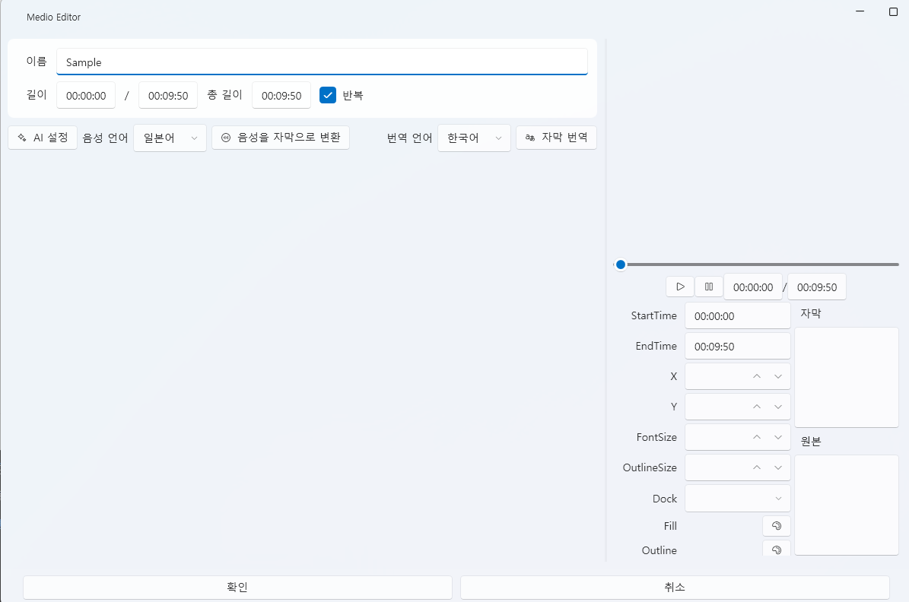

# Video Tab

The **Video Tab** is used to **manage video files** included in your project and to **generate, translate, and edit subtitles**.  
Its structure is **identical to the Sound Tab**, except it does not include the TTS (Text-to-Speech) feature.  
Videos serve as the **visual reference** for the project and are primarily used to check subtitle and audio synchronization.

---

## 1. Basic Interface

| Component | Description |
|------------|-------------|
| **① Include in Project** | When checked, the video file is copied into the project folder (`Asset/Video/`). If unchecked, the file is only referenced externally. |
| **② Import** | Loads video files such as `.mp4` or `.mov`. |
| **③ Edit ✏️** | Opens the subtitle editor for the selected video (same interface as the Sound Tab). |
| **④ Delete 🗑️** | Removes the selected video from the list (the actual file is not deleted). |
| **⑤ Export ↗ / Reimport ↙** | Exports the video to an external folder or reimports it into the project. |
| **⑥ Open Folder 📂** | Opens the `Asset/Video/` folder directly. |

---

### ⚙️ Operation Summary

| Action | Result |
|--------|---------|
| Import with “Include in Project” checked | The video file is **copied** to `Asset/Video/`. |
| Import with checkbox off | The video is **referenced externally** and does not increase project size. |
| Use “Export” button | Copies the selected video to the specified directory. |
| Use “Reimport” button | Restores the video file back into the project folder. |

> 💡 **Tips:**  
> - Not including videos reduces project size and speeds up loading.  
> - External videos automatically reflect any changes made to them.  
> - However, externally referenced videos are **not packaged** when exporting the project.

---

## 2. Video Editing (Video Editor)

Select a video and click **✏️ Edit** to open the  
`Video Editor` window.  
This editor has the **same interface as the Sound Tab’s subtitle editor (Medio Editor)**.

---

### 🎛️ Main Features

| Item | Description |
|------|--------------|
| **Name / Length / Loop** | Defines playback duration and loop behavior. |
| **AI Settings** | Configure AI engines such as Whisper or DeepL directly. |
| **Speech Language** | Specifies the language used for STT (speech-to-text). |
| **Translation Language** | Selects the target language for subtitle translation. |
| **Convert Speech to Subtitle** | Converts audio within the video into subtitles using an STT engine (e.g., Whisper). |
| **Translate Subtitle** | Automatically translates the generated subtitles into another language. |
| **Edit Subtitle** | Adjusts subtitle timing, position, font, and color. |

---

### 🗣️ Subtitle Generation and Translation

Subtitle-related features function the same as in the Sound Tab.

1. Select the **speech language** of the video.  
2. Click **[Convert Speech to Subtitle]** to run STT processing.  
3. The converted subtitles appear in the right-hand list and can be manually edited.  
4. Click **[Translate Subtitle]** to automatically translate them into the selected language.

| Item | Description |
|------|--------------|
| **StartTime / EndTime** | Adjusts subtitle timing. |
| **Dock / X / Y** | Sets the subtitle position on screen. |
| **FontSize / OutlineSize** | Adjusts font size and outline thickness. |
| **Fill / Outline** | Sets subtitle color and outline color. |

> ⚙️ **AI Engine Configuration:**  
> - [AI → Whisper](../ai/whisper.md)  
> - [AI → DeepL](../ai/deepl.md)  
> - [AI → LibreTranslate](../ai/libretranslate.md)

---

### ▶️ Preview

- Press the ▶ button to preview the video and subtitle sync in real time.  
- A progress bar automatically appears based on the video length.

---

## 3. Adding to the Timeline

Videos can be **dragged directly onto the timeline**, just like sounds.

- Drag a video from the left list onto a track to create a new node.  
- Adjust its position and duration directly on the timeline.  
- Videos play in sync with other assets such as sound, Live2D, UI, and events.

> 💡 **Note:**  
> Video nodes share the same time axis as sound tracks,  
> making them ideal for checking subtitle timing and audio synchronization.

---

## 4. File Paths and Management

| Item | Path |
|------|------|
| **Video Files** | `Asset/Video/` |
| **Subtitle Files** | `Asset/Video/` |
| **Thumbnail Cache** | `Asset/Video/` (used for previews) |

---

## 5. Related Documents

- [Sound Tab](sound.md)  
- [Timeline Editing](timeline.md)  
- [AI → Speech Recognition](../ai/speechRecognition.md)  
- [AI → DeepL / LibreTranslate](../ai/deepl.md)  
