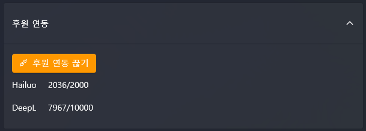
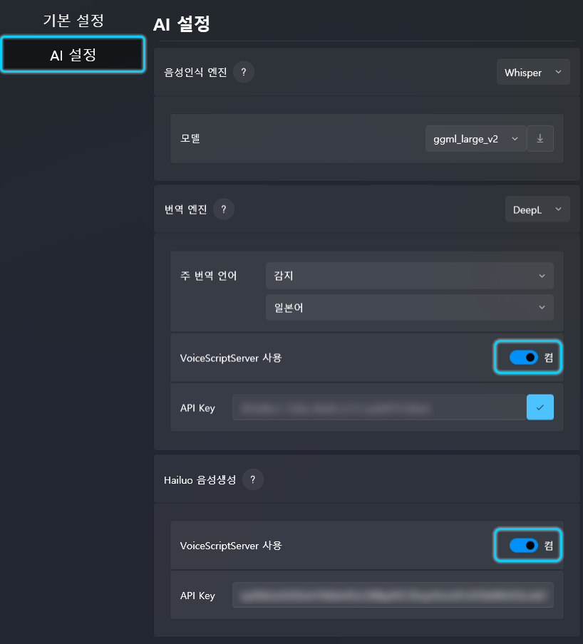

# 🔗 プログラム連携ガイド (Program Integration)

## 1. 概要 (Overview)
VoiceScriptPlayerは、ユーザーが個別にAPIキーを発行する手間を省き、**Patreon後援認証**を通じて統合サーバーを利用できる機能を提供しています。

後援認証を完了すると、**Hailuo(音声生成)**や**DeepL(翻訳)**などの有料機能を、割り当てられた月間クォータ内で即座に使用できます。

---

## 2. Patreon後援連携 (Patreon Integration)

アカウントを連携して後援者限定機能を有効にする手順は以下の通りです。

### **ステップ 1: 連携の開始**
設定画面の**[後援連携]**セクションにある**「Patreonで後援接続」**ボタンをクリックします。個人のAPIキーを直接使用する場合は、下の入力欄に手動で入力することも可能です。

### **ステップ 2: Patreonログインと承認**
1. ウェブブラウザが自動的に開くので、**「Patreonでログイン」**ボタンを押してログインします。
2. VoiceScriptPlayerが要求する権限（アカウント情報および後援状態の確認）を確認し、**「許可(Allow)」**ボタンをクリックします。

| 1. ログインページ | 2. Patreonログイン | 3. 権限承認ページ |
| :---: | :---: | :---: |
|  |  |  |

### **ステップ 3: 連携完了の確認**
正常に連携されると、プログラム内のボタンが**「後援連携を解除」**に変わります。この時、下側に現在連携されているサービス（Hailuo、DeepLなど）と残りのクォータ情報が表示されているか確認してください。

---

## 3. サービス別サーバーの有効化 (Server Configuration)

Patreon連携を終えた後、実際に各機能を使用する際に**「連携されたサーバーを使用する」**設定をオンにする必要があります。

### **VoiceScriptServerの使用設定**
各AIサービス（Hailuo、DeepLなど）の設定項目で、**「VoiceScriptServerを使用」**スイッチを**[オン]**に切り替えてください。

* **スイッチ [オフ]**: 下部の入力欄に直接入力した個人のAPIキーを使用します。
* **スイッチ [オン]**: Patreon連携を通じて提供される統合サーバーAPIを使用します。（推奨）

---

## 4. 後援ランク別特典 (Subscription Tiers & Benefits)

Patreonの後援ランクに応じて、各サービス別のAIクレジット（使用量）が付与されます。クレジットは毎月更新され、ランクによって提供容量が異なります。

| ランク (Tier) | 月額料金 | DeepL (翻訳) | Hailuo (音声生成) |
| :--- | :---: | :---: | :---: |
| **🆓 Free Tier** | 無料 | 10,000 文字 | 2,000 文字 |
| **🌟 Supporter** | $7 / 月 | 100,000 文字 | 20,000 文字 |
| **🧡 Creator** | $20 / 月 | 1,000,000 文字 | 100,000 文字 |
| **🔥 Pro** | $50 / 月 | 3,000,000 文字 | 300,000 文字 |

### 📋 主な注意事項
* **自動停止システム**: 設定された無料/ボーナスクレジットの上限に達すると使用が自動的に停止し、**追加料金が発生することはありません。**
* **クレジットの更新**: すべてのクレジットは、毎月の購読更新時にリセットされます。
* **ポリシー変更の案内**: AIサービス提供元のポリシーにより、提供量や特典が変更される場合があります。

> 🔗 **詳細確認および後援** > 各ランク別の最新特典および詳細は、[公式Patreonページ](https://www.patreon.com/posts/introducing-143634103)を必ずご確認ください。

---

## ⚠️ ご利用前の注意点 (Important Notice)

Patreonメンバーシップは、**VoiceScriptPlayerの継続的な開発と維持管理を支援するための方法**です。提供されるAIクレジットは、支援に対する感謝のしるしとして提供される**ボーナス特典**です。

* **直接購読の推奨**: AIサービス（DeepL、Hailuoなど）を大量またはプロフェッショナルに使用される場合は、**該当サービスを直接購読し、独自のAPIキーを発行して使用する方がコスト効率が大幅に良くなります。**
* **商用プランの代替不可**: ここで提供されるクレジットは、各AIサービスの公式商用プラン（Proなど）を代替するためのものではありません。
* **コストパフォーマンスについて**: 統合サーバーの維持費などが含まれているため、サービス提供元から直接購入するよりも単価が高く設定されています。

> 💡 **効率的な使い方**: 軽い利用や設定の手間を省きたい場合は**Patreon連携**を、大量の翻訳や音声生成が必要な作業には**個別のAPIキー**の使用をお勧めします。

---

## 5. トラブルシューティング (Troubleshooting)

* **❓ 後援中なのにクォータが0と表示されます。**
    * 「後援連携を解除」を押した後、再度連携を行ってください。データの同期に時間がかかる場合があります。
* **❓ 「VoiceScriptServerを使用」オプションが表示されません。**
    * VoiceScriptPlayerが最新バージョンであることを確認してください。
* **❓ ブラウザで「許可」を押しても反応がありません。**
    * ファイアウォールやセキュリティソフトがプログラムの通信を遮断していないか確認してください。

---

## 6. 関連ドキュメント
* [DeepL 詳細設定ガイド](../ai/deepl.md)
* [Hailuo 音声生成設定ガイド](../ai/hailuo.md)