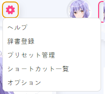

# COEIROINK 音声合成 (Text-to-Speech)

## 1. 概要 (Overview)
COEIROINK は日本語を中心とした **テキスト音声合成（TTS）ソフトウェア** です。  
自然で会話的な音声を生成でき、さまざまなキャラクターボイスを追加ダウンロードして利用できます。  
VoiceScriptPlayer では **台本の音声化** や **キャラクターボイスの合成** に使用することができます。  

---

## 2. インストールと準備 (Installation & Setup)
1. **COEIROINK のダウンロード**  
   [公式ダウンロードページ](https://coeiroink.com/download) から最新版を入手します。  

   - **CPU 版**  
     - すべての PC で動作可能  
     - 速度は遅いが、GPU がない環境でも安定して動作  

   - **GPU 版（CUDA 使用）**  
     - NVIDIA GPU 環境で動作  
     - CPU より 3〜10 倍高速  
     - 実行には **CUDA（推奨 11.8）** のインストールが必要  
     - [CUDA ダウンロードページ](https://developer.nvidia.com/cuda-11-8-0-download-archive)  

   

2. **実行準備**  
   - COEIROINK はインストール不要です。  
   - ダウンロードした zip ファイルを任意の場所に解凍し、  
     中にある **`COEIROINK2.exe`** を直接実行します。  
   - デフォルトのパス変更や管理者権限の実行は不要です。  
   

3. **初回起動時の利用規約**  
   - 初回起動時に **利用規約（利用規約）** 画面が表示されます。  
   - 「利用規約」ボタンをクリックして内容を確認すると、左側の **「同意する」** ボタンが有効になります。  
   - 同意しない場合はプログラムを終了するしかありません。  
   - COEIROINK を使用する際は **クレジット表記** が必須です。（例：`COEIROINK:合成音声名`）  
   

---

## 3. 設定方法 (Configuration)
COEIROINK を起動しておくだけで、VoiceScriptPlayer が自動的に接続します。  
以下はプログラム上部の各メニューの説明です。

---

### 📂 プロジェクトメニュー

- **新規プロジェクトを作成** → 新しいプロジェクトを作成  
- **プロジェクトを開く** → 既存のプロジェクトを開く  
- **プロジェクトを名前をつけて保存** → 名前を付けて保存  
- **プロジェクトを上書き保存** → 上書き保存  
- **選択中の音声の書き出し** → 選択した音声のみを書き出し  
- **全ての音声の書き出し** → 全ての音声を書き出し  
- **全ての音声の繋げて書き出し** → 全ての音声を連結して書き出し  
- **テキストファイルを読み込み** → テキストファイルを読み込む  
- **テキストファイルを書き出し** → テキストファイルとして保存  
- **前回終了時の状態を復元** → 前回終了時の状態を復元  

---

### 👤 キャラクターメニュー

- **キャラクター設定** → キャラクター設定（プロフィール、名前など）  
- **キャラクターダウンロード** → 公式ライブラリからボイスをダウンロード  
- **キャラクター結合** → 複数のキャラクターデータを統合  

---

### ⚙️ 設定メニュー

- **ヘルプ** → ヘルプ  
- **辞書登録** → ユーザー辞書の登録（発音・単語修正）  
- **プリセット管理** → プリセットの保存/読み込み  
- **ショートカット一覧** → ショートカットキー一覧  
- **オプション** → オプション（API ポート、動作設定など）  

---

### 🎛️ 音声調整パネル
- **話速** → 話すスピード（デフォルト値 1.0）  
- **声の高さ** → ピッチ（音の高低）調整  
- **加工手法** → 音声処理方式（例：TD-PSOLA）  
- **強さ** → 発話の強度  
- 各項目には -5 / -1 / +1 / +5 の微調整ボタンあり  

---

### 💬 テキスト入力 & 実行
- 下部の入力欄にテキストを入力し ▶ ボタンをクリック → 音声合成を実行  
- 🔄 ボタン → 再合成  
- 💾 ボタン → 音声をファイルとして保存  

---

## 4. VoiceScriptPlayer での使用方法

COEIROINK は VoiceScriptPlayer の **Audio Editor** 内で直接操作可能です。  
起動しておくだけで API 接続が自動的に行われます。

---

### 🗣️ 基本的な使用手順

1. **TextToSpeech エンジンの選択**  
   ドロップダウンから `COEIROINK` を選択します。  
   正常に接続されていればキャラクターリストが表示されます。  

2. **テキスト入力**  
   タイムラインまたはテキストボックスに複数の文を入力します。  
   各文は個別の TTS ブロックとして扱われ、再生順を調整できます。  

3. **キャラクターとスタイルの選択**  
   左側のキャラクターリストから使用するボイスを選びます。  
   スタイル（例：ノーマル、感情的、ささやき）も指定可能です。  

4. **音声パラメータの調整**

   | 項目 | 説明 |
   |------|------|
   | **速度** | 話す速さ（1.0 = 標準） |
   | **ピッチ** | 声の高さ |
   | **抑揚** | 文のリズムや強弱の調整 |
   | **ボリューム** | 全体の音量 |

5. **合成とプレビュー**  
   ▶ **再生ボタン** を押すと即座に合成音声が再生されます。  
   設定を変更すると、自動的に再合成されてプレビューに反映されます。  

---

### 🗾 ひらがな / アクセント制御
COEIROINK は日本語音声合成に最適化されており、各モーラ（音節）のアクセントを細かく調整できます。  
エディター下部に音節ごとのチェックボックスが表示され、抑揚パターンを手動で設定できます。

| 表示 | 意味 |
|------|------|
| 🔹 チェックあり | 強勢（上昇・下降）位置 |
| ⚪ チェックなし | 平常な抑揚区間 |

> 💡 **ヒント:**  
> この機能は **Prosody Editor** と同様に動作し、モーラ単位でアクセントを指定できます。

---

### 💬 字幕設定
下部の字幕パネルで字幕の位置やスタイルをリアルタイムで確認・調整できます。

| 項目 | 説明 |
|------|------|
| **X / Y** | 画面上の字幕位置 |
| **FontSize / OutlineSize** | フォントサイズとアウトラインの太さ |
| **Dock** | 配置位置（上 / 中央 / 下） |
| **Fill / Outline** | 文字とアウトラインの色設定 |
| **字幕プレビュー** | 合成音声と同期して字幕を表示可能 |

---

### 🧩 タイムライン制御
- 各文はタイムライン上に個別ブロックとして表示されます。  
- ドラッグして位置や長さを変更可能。  
- 動画やスクリプトトラックと同様の操作で使用できます。  
- 複数のセリフを順に並べることで **会話シーン全体を構成** できます。  

---

### 📦 出力場所
| 項目 | パス |
|------|------|
| **生成された音声ファイル** | `Asset/Sound/` フォルダに自動保存 |
| **字幕データ** | `.srt` またはプロジェクトメタデータとして保存 |

---

## 5. 注意事項 (Notes & Limitations)
- COEIROINK は **インストーラー不要の実行ファイル形式** です。  
- Windows 専用（Mac / Linux 非対応）  
- CPU 版は遅いが互換性が高く、GPU 版は高速だが **NVIDIA GPU + CUDA（推奨 11.8）** が必要。  
- 一部のボイスは **商用利用不可** の場合があります。必ず各ボイスのライセンスを確認してください。  
- API ポート（`50032`）が他のプログラムと競合する場合は設定で変更可能。  
- **COEIROINK 使用時はクレジット表記（例：`COEIROINK:合成音声名`）が必須です。VoiceScriptPlayer では自動的に表記されます。**

---

## 6. ライセンスおよび出典 (License & Credits)
- **COEIROINK 本体**：無償配布（商用 / 非商用利用可）  
- **ボイスデータ**：制作者ごとにライセンスが異なります  
- 公式サイト：[https://coeiroink.com/](https://coeiroink.com/)  

---

## 7. トラブルシューティング (Troubleshooting / FAQ)
- ❓ *「VoiceScriptPlayer で COEIROINK が見つかりません」*  
  → `COEIROINK.exe` が実行中か確認してください。  

- ❓ *「API 接続に失敗しました」*  
  → COEIROINK が起動中か、ポート（`50032`）が競合していないか確認してください。  

- ❓ *「ボイスが一覧に表示されません」*  
  → COEIROINK 内でボイスライブラリを追加したか確認してください。  

- ❓ *「処理が遅いです」*  
  → GPU 版を使用するか、短いセリフ単位で分割して合成してください。  
