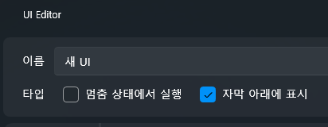

# 🎬 音声を“動画のように”見せて字幕を付ける方法

このチュートリアルでは、**音声ファイルしかない場合でも動画のようにサムネイルを表示し、  
Whisper を使って自動字幕を生成してテキストコンテンツとして拡張する方法**を説明します。

ASMR・ナレーション・ボイスドラマなど、  
音声中心のコンテンツを VSP プロジェクト内で自然に「動画トラックのように」扱うための基本となります。

---

## 🎯 このチュートリアルで学べること

- 音声ファイルの読み込み  
- 音声を“動画風”に見せるためのサムネイル設定  
- Whisper による自動字幕生成  
- 字幕ブロックの配置とスタイル調整  
- 音声コンテンツを映像トラックと組み合わせる基本原理

---

## 📌 使用するサンプル音声（全年齢向け）

このチュートリアルでは、説明のために **全年齢向けの音声作品**を参考としています。  
以下の DLsite 作品の体験版を例として取り上げています：

https://www.dlsite.com/home/work/=/product_id/RJ01323001.html

※サンプル音声そのものは本マニュアルには含まれません。  
ご自身で合法的に利用できる音声ファイルをご用意ください。

---

# 1️⃣ 音声ファイルを読み込む

音声ファイルは、プロジェクトフォルダへ直接コピーするのではなく、  
**エディタから読み込む形で登録**します。

---

## 📥 音声を読み込む手順

1. 左側パネルから **Sound（サウンド）タブ** を選択  
2. **Import（インポート）** ボタンをクリック  
3. 使用する音声ファイルを選択  
4. 一覧に追加されれば準備完了

読み込まれた音声は自動的に  
`Asset/Sound` フォルダへ整理されます。

---

# 2️⃣ 音声を“動画のように”見せる  
（UI を使ったサムネイル設定）

音声だけをトラックに置いても画面には何も表示されません。  
そこで **UI 画面を作り、Image コントロールを配置**することで  
音声を動画のように見せることができます。

これは音声メインの作品を動画風に見せたい場合、  
もっともよく使われる方法です。

---

## 📋 UI 画面を作成する

1. 上部メニューから **UI タブ** を選択  
2. **New UI（新規作成）** をクリック  
3. 新しい UI 画面が生成され、UI エディタが開きます

この UI 画面は、再生時 “動画レイヤー” のように表示させることができます。

---

## 🖼 Image コントロールを配置する

1. UI エディタ左側の **Control Panel** から  
   **Image（画像）** をドラッグ  
2. キャンバス中央へドロップ  
3. サイズを調整し **背景画像／サムネイル** として使える形に整えます

---

## 📥 Image コントロールから画像を直接読み込む

UI 内の Image コントロールから **直接画像を読み込むことができます**。

1. Image コントロールを選択  
2. 右側プロパティパネルの **Import Image** をクリック  
3. PNG / JPG / WebP などを選択  
4. 読み込んだ画像は自動で画像一覧へ追加されます

※ここでは「プロジェクトに画像ファイルを登録しただけ」で、  
　まだ Image コントロールに表示はされていません。

---

## 🖼 Image コントロールに画像を適用する

画像の読み込み後、  
実際に表示する画像を **Image Source** から選択します。

1. Image コントロールを選択  
2. 右側の **Image Source（画像選択）** を開く  
3. 読み込んだ画像一覧が表示される  
4. 使用する画像を選択すると即座に適用されます

重要：  
- 「Import Image」＝ファイルをプロジェクトに登録  
- 「Image Source」＝登録済みファイルから表示する画像を選ぶ  

この2つは別の操作です。

---

## 🎛 画像のサイズ・位置調整

音声作品を動画風に見せる場合、  
画像を画面に合わせて配置することが重要です。

- 角をドラッグしてサイズ変更  
  - 全画面背景として使う  
  - ロゴ・サムネイル用に小さく使う  
- ドラッグして位置を調整  
  - 中央揃え  
  - 上部固定／下部固定  
- 必要に応じてプロパティで調整  
  - Fill / Uniform  
  - 透明度（Opacity）  
  - Margin / Padding

画面全体を埋めるには **Uniform** が自然です。

---

## 🎛 「字幕の下に表示」オプション（重要）

音声＋字幕構成では、  
字幕は常に **画像の上** に表示される必要があります。

設定方法：

1. Image コントロール選択  
2. プロパティ → **Behind Subtitle（字幕の下に表示）** をチェック  
3. これで再生時に字幕が画像の前面に表示されます

チェックしないと字幕が画像の裏に隠れてしまうことがあります。

---

## ✨ 結果

UI 画面に**固定背景のように画像が表示**され、  
音声再生中は動画のような見た目になります。

ただし UI は作るだけでは表示されません。  
**必ずトラックに配置する必要があります。**

---

## 📌 UI 画面をトラックへ配置する

1. 左側の **UI タブ** を開く  
2. 先ほど作成した UI を確認  
3. それを音声と同じ位置へドラッグ  
4. UI ブロックは音声ブロックより上のレイヤーに配置されます  
   - 音声再生中ずっと UI が表示  
   - 字幕は UI の上に表示  
   - Behind Subtitle 設定により字幕が隠れない

この結果、  
**音声＋画像 UI がひとつの“動画”のように見えます。**

---

## 🎬 音声終了後の画面切り替え

音声が終わった後は：

- 別の UI 画面に切り替え  
- アニメーション UI に変更  
- 画像・動画を差し替え  
- 選択肢 UI を表示  

など、動画編集のような演出が可能です。

---

## 🧩 Fill Track（トラックを埋める）機能

UI ブロックは初期状態だと短いサイズで配置されるため、  
音声の長さに自動で合わせるために **Fill Track** を使います。

---

## 📌 Fill Track の使い方

1. UI ブロックをトラックへ置く  
2. ブロックを右クリック  
3. **Fill Track（トラックを埋める）** を選択  
4. 音声トラック全体の長さに UI が自動で伸びる

---

## 🎯 どんなときに使う？

- 音声が再生されている間ずっと画面を固定表示したい  
- トラック全体を背景として使いたい  
- UI を細かく分割したくない  

音声中心の作品ではほぼ必須です。

---

## ✨ 適用後の見た目

UI ブロックがトラック全体を覆い、  
音声＋字幕＋UI が組み合わさった“完成された動画”ができます。

---

## 3️⃣ 音声をトラックに配置する

1. 左パネルの音声一覧からドラッグ  
2. 目的のトラックへドロップ  
3. 位置や長さを調整

サムネイル UI を設定しておくと、  
まるで動画編集のように扱えます。

---

## 4️⃣ Whisper で自動字幕を生成する

字幕生成は **タイムラインではなく**  
左側の **Sound タブ** から音声を **ダブルクリック**して開く  
**Audio Settings** 画面で行います。

---

## 🧠 Whisper 字幕生成手順

1. Sound（サウンド）タブを開く  
2. 字幕を作りたい音声をダブルクリック  
3. **Audio Settings** 画面が開く  
4. **Speech Language** を **Japanese** に設定  
5. **Generate Subtitle（字幕生成）** をクリック  
6. Whisper が解析し、字幕トラックに自動追加されます

---

## 🌍 字幕を翻訳する

Whisper は原語で字幕を生成します。  
必要であれば **翻訳字幕** も作成できます。

設定手順：

1. **Translate To** を選ぶ  
   - Korean  
   - English  
   - Japanese  
2. **Translate Subtitle** を押す  
3. 翻訳済み字幕が別トラックに追加されます

---

## ⚠ Whisper と翻訳機能には AI 設定が必要

Whisper・DeepL・Hailuo・LibreTranslate などを使用する前に  
AI 設定が必要です。

👉 [AI 設定ガイド](../ai/ai.md)

---

## 📌 まとめ

- 日本語音声 → Speech Language = Japanese  
- Whisper → 自動字幕  
- 翻訳設定 → Translate Subtitle  
- どちらも AI 設定が必要

これで、音声中心コンテンツでも  
**音声＋サムネイル UI＋自動字幕＋翻訳字幕**  
という動画級の構成が作れます。

---

## 5️⃣ 字幕スタイルを調整する

1. 字幕ブロックを選択  
2. 右側パネルから  
   - フォント  
   - サイズ  
   - 色  
   - 背景  
   などを調整可能

---

## 6️⃣ 再生して確認する

- ▶（再生）を押す  
- 音声＋UI＋字幕が正しく表示されるか確認  
- タイミングが合わない字幕はドラッグして調整

---

## 📌 次のステップ

音声コンテンツを動画のように扱えるようになったら、  
次は **選択肢による分岐** を学びましょう。

👉 [簡単な選択肢と分岐](beginner-choice.md)
