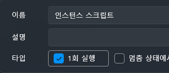
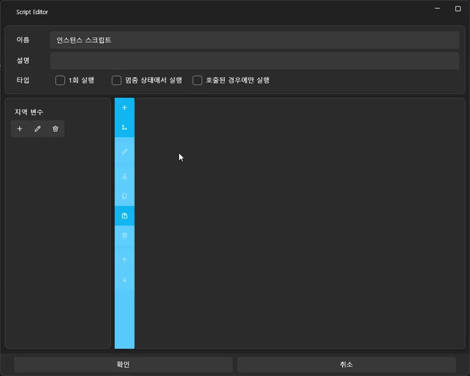
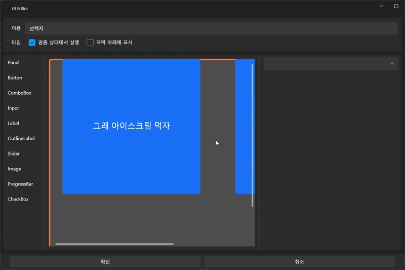
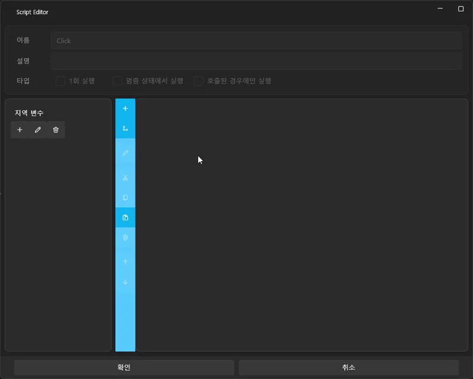

# 🎮 シンプルな選択肢と分岐を作成する

このチュートリアルでは **前章（音声を動画のように見せて字幕を付ける）** で作成したプロジェクトをそのまま使用します。  
そのプロジェクトの続きとして、再生中に **選択肢 UI が表示され**、  
選択に応じて **進行 / スキップ / 終了** の流れを制御する  
シンプルな分岐システムを実装します。

---

## 🧭 全体の流れ（プレビュー）

次のような構造を作ります：

1. トラックが特定位置で停止  
2. 画面に選択肢 UI を表示  
3. ボタンクリック →  
   - 続行  
   - 特定区間へジャンプ  
   - 終了  

---

# 1️⃣ 分岐用 UI を作成する

まずは選択肢 UI を表示するための専用 UI 画面を作ります。

---

## 📌 UI 画面を新規作成

1. 上部メニューの **UI タブ** を選択  
2. **New UI（新規作成）** をクリック  
3. 新しい UI 画面が生成されます

---

## 📌 「一時停止中も実行」オプションを有効化

トラックが停止している間も UI が操作できるよう、  
UI プロパティの次の設定を **必ず有効化**します：

- **Execute When Paused（一時停止中も実行）** ✔

---

# 1-2️⃣ 選択肢ボタンを3つ作成する

UI 画面に次の3つの選択肢ボタンを配置します：

- アイス食べよう  
- 嫌だ  
- 終了  

左側の Control Panel から **Button** を3回ドラッグして UI に配置します。

---

## 💡 ボタン配置のコツ

- ボタンの **Alignment（整列）** を中央揃えにすると綺麗に並びます  
- テキストは **Content**（右側プロパティ）で変更  
- サイズやフォントは再生しながら微調整するのが最適

---

# 3️⃣ タイムラインにインラインスクリプトを配置する

この分岐システムでは  
**グローバルスクリプトではなく、特定位置で発動するインラインスクリプト** を使います。

インラインスクリプトは、  
タイムライン上の到達タイミングでのみ発動するスクリプトで、  
選択肢 UI を表示するのに最適です。

---

## 📌 インラインスクリプトの追加

1. 左側スクリプトパネルで  
   **「ドラッグして空のスクリプトを追加」** をドラッグ  
2. タイムラインの Script Track にドロップ

---

## ⏱ スクリプトの実行位置を合わせる

スクリプトブロックをドラッグし、  
**01:31.000（1分31秒）** に正確に合わせます。

この地点で：

- トラックが停止  
- UI が表示される  

という動作になります。

---

# 3-1️⃣ スクリプトをダブルクリックして編集

配置したインラインスクリプトをダブルクリックすると  
編集画面が開きます。

ここで次の2つのアクションを追加します：

---

## ✨ ShowChoiceUI スクリプトを構築する

1. **UI Show → 分岐 UI**  
   - 選択肢 UI を表示  
2. **Track Pause**  
   - トラックを一時停止してボタンクリックを待つ  

⚠ 注意  
UI を閉じても何度も開かないように、  
**「一度だけ実行」** を必ず ON にしてください。

構成例：

---

再生が **01:31.000** に到達すると：

- トラックが自動停止  
- 選択肢 UI がポップアップ  
- ユーザーが選択可能  

となります。

---

# 4️⃣ 選択肢ボタンに動作を設定する

UI の 3 つのボタンそれぞれに  
クリックしたときの動作を割り当てます。

設定手順：

`UI Editor → Button → Script → Click 編集`

---

## 📌 Click イベント編集画面へ入る

1. 上部メニュー → **UI タブ**  
2. 対象ボタンをクリック  
3. 右側 → **Script セクション**  
4. **Click → Edit**  
5. スクリプト編集画面へ

---

# ✔ 「続行」ボタン（Resume）

トラックを再生再開するボタンです。

追加するアクション：

- **UI を閉じる**  
- **トラックを再生**  

---

# ✔ 「スキップ」ボタン（Jump Track）

指定した時間へジャンプして再生します。

例：**00:01:20.000** に移動

追加アクション：

- UI を閉じる  
- 時間を移動する（Jump Track）  
- トラックを再生  

---

# ✔ 「終了」ボタン（Exit/Stop）

プロジェクトを終了します。

追加アクション：

- **終了する**  

※ 編集モードでは終了しませんが、再生時はアプリが終了します。

---

## ✨ 結果

3つのボタンは次のように動作します：

- **続行** → UI を閉じて再生再開  
- **スキップ** → UI を閉じて指定時間へジャンプ  
- **終了** → プロジェクト終了  

トラック停止中でも UI が操作できるのは、  
UI の **Execute When Paused** を有効化しているためです。

---

# 6️⃣ 全体の動作まとめ

- 分岐ポイントに到達  
- ShowChoiceUI → UI 表示 ＋ 一時停止  
- ユーザーが選択  
- ボタンごとに処理  
  - 続行 → Resume  
  - スキップ → Jump Track  
  - 終了 → Stop  

---

# ✨ 完成

このチュートリアルで実現したこと：

- 指定タイミングでトラックを停止  
- 選択肢 UI を表示  
- 選択に応じて異なる処理を実行  
- 簡易メニューとしても応用可能  

次のチュートリアルでは  
**中級レベルの変数 & 条件ロジック** を学びます。

👉 [変数と条件ロジック](intermediate-logic.md)
