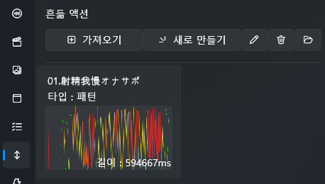
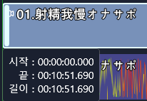

# 基本的なスクリプト連動

このチュートリアルでは、**基本的な funscript・動画・音声をプロジェクトに連動させる手順**を学びます。  
プロジェクト作成からトラックへの配置まで、制作の最も基本的なワークフローを理解できます。

## 🎯 目標
- プロジェクトを作成する  
- トラックを作成する  
- funscript と動画を準備する  
- 動画を読み込む  
- funscript を読み込む  
- トラックに配置して再生準備を完了する  

---

## 1️⃣ プロジェクト作成

プロジェクトの作成方法については以下のドキュメントを参照してください：  
[Create New Project](../project/create.md)

---

## 2️⃣ トラック作成

「スタートトラック作成ボタン」の横にある **+ ボタンを押して新しいトラックを作成**します。

トラックを作成したら、作成したトラックを選択し  
右側の **開始トラックに設定** ボタンを押すと、そのトラックを開始トラックとして指定できます。

---

## 3️⃣ funscript と動画の準備

プロジェクトで使用する **動画ファイルと funscript ファイルを事前に準備**します。

---

## 4️⃣ 動画を読み込む

左側サイドバーの **Video（動画）タブ** を選択し、使用したい動画を読み込みます。

---

## 5️⃣ funscript を読み込む

左側サイドバーの **Stroke（ストローク）タブ** を選択して funscript ファイルを読み込みます。

---

## 6️⃣ トラックに配置する

読み込んだ **動画ファイルと funscript ファイルをトラックにドラッグ＆ドロップ**します。  
左側のリストから項目を掴んで、トラックの任意の位置に置くと追加できます。

> 💡 注意  
> 配置時に動画や funscript が **00:00:00** 位置に正確に配置されない場合があります。  
> 必ず開始位置を確認してください。

---

## 7️⃣ 再生して確認

上部の **再生ボタン ▶️** を押して、プロジェクトが正常に動作するか確認します。

まだデバイスを接続していない場合でも、  
左側の **実行情報タブ** から funscript が正しく動作しているかを確認できます。

---

※ このチュートリアルで使用している動画は著作権保護のため公開できません。  
利用者は、自身が合法的に所持している動画（funscript と連動可能な動画）を使用してください。

---

## 📌 次のステップ

次のドキュメントでは、コンテンツにテキストや音声を追加する方法を学びます：  
[音声を動画のように見せて字幕を付ける](beginner-audio-to-video.md)
