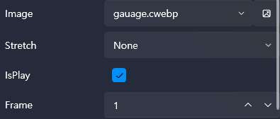
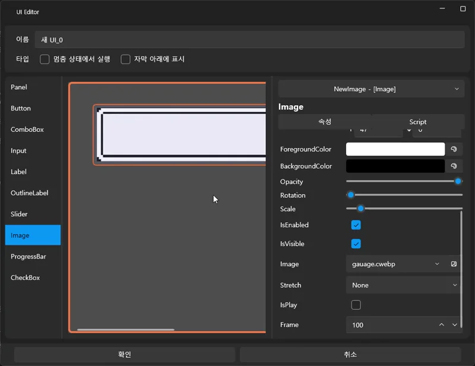

# 📘 画像連動：webp フレーム制御 & Tick スクリプト応用

このチュートリアルでは、UI に webp 画像を配置し、  
X0 入力値に応じて webp の特定フレームをリアルタイムで切り替える方法を学びます。

VSP では webp ファイルを読み込むと、自動的に **cwebp に変換**され、  
UI Image の **Frame** プロパティを使って特定フレームを直接制御できます。

また、UI の **Main パネル(Main Panel)** にある **Tick Script** を使用することで、  
UI が表示されている間、webp をリアルタイムで更新できます。

---

# 🧭 このチュートリアルで学べること

- webp → cwebp 自動変換の仕組み  
- UI に webp を配置する方法  
- Tick Script による毎フレーム処理  
- X0 入力を webp フレームにマッピングする方法  
- ローカル変数を利用した実践的なフレーム制御  

---

# 1️⃣ webp ファイルの準備

この例では次のゲージ webp を使用します：

この webp は **0〜100 フレーム**で構成されています。

👉 実際にダウンロードして試してください！

---

# 2️⃣ UI 画面を作成する

1. 上部メニューの **UI タブ** をクリック  
2. **新規作成（New UI）** を選択  
3. 空の UI 画面が作成されます  

---

# 3️⃣ UI に webp 画像を配置

1. 左側のコントロールリストから **Image** をドラッグ  
2. UI に配置  
3. 右側プロパティパネル → **画像選択（Source）**  
4. webp ファイルを選択

VSP は webp を自動で cwebp に変換し、  
フレーム番号で制御できるようにします。

※ **IsPlay のチェックを外すと**、スクリプトで Frame を制御できます。

---

# 4️⃣ Tick Script を使用する

Tick Script は **UI が表示されている間、毎フレーム実行される特殊なスクリプト**です。

webp の Frame を毎フレーム更新して  
リアルタイムアニメーションを実装する際に必要です。

---

## Tick Script を開く

1. UI 構造から **Main パネル** を選択  
2. 右側プロパティ → **Tick → 編集(Edit)**

---

# 5️⃣ X0 を webp フレームに連動させる

ここからが本題です。

ゲージ画像は **0〜100 フレーム**なので、  
X0（0.0〜1.0）をそのまま使用せず、フレーム数に変換する必要があります。

必要な処理は次の 3 ステップです：

1) r ← X0  
2) r ← r * 100  
3) Frame ← r  

以下で順番に作成します。

---

# 📌 5-1) フレーム用ローカル変数を作成

1. Tick Script 右側の **Variables → +**  
2. 名前：`r`

この変数に X0 を保存し、変換に使用します。

---

# 📌 5-2) X0 の値を r に代入

Tick Script の最初のアクション：

- 変数 r に Axis X0 を代入  
- Duration: 0秒  

---

# 📌 5-3) X0(0〜1) をフレーム番号(0〜100)へ変換

2つ目のアクション：

- 変数 r を **100 倍する**  
- Duration: 0秒  

変換結果：

| X0 | r |
|----|----|
| 0.00 | 0 |
| 0.25 | 25 |
| 0.50 | 50 |
| 1.00 | 100 |

---

# 📌 5-4) r を ImageFrame に設定する

3つ目のアクション：

- 変数(CurrentUI | NewImage | Frame) に r を代入  
- Duration: 0秒  

---

# 📸 Tick Script 完成例

流れは以下の通り：

変数 r を [X0] に代入  
変数 r を [100] だけ乗算  
Image の Frame に r を代入

---

# 6️⃣ 全体の処理まとめ

このチュートリアルの処理は次の 3 行に要約できます：

r ← X0  
r ← r * 100  
Frame ← r  

これを Tick Script に入れるだけで、  
webp が X0 入力に合わせてリアルタイムに反応します。

---

# ✨ 完成

これで以下のような UI を簡単に作れます：

- X0 ベースのゲージ表示  
- 入力強度に応じた表情変化  
- リアルタイム反応 UI  
- Spine を使わず軽量アニメーションを実現  

---

# ➡️ 次のチュートリアル

画像・webp 制御を学んだら、次は **高度なサウンド制御**です。

👉 [高度なサウンド制御](intermediate-sound.md)
