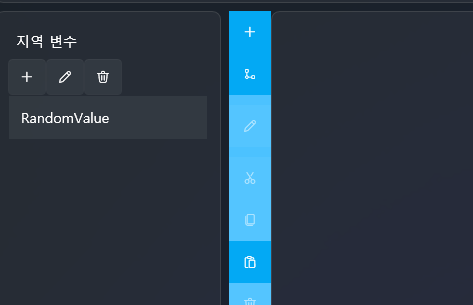

# 変数と条件ロジックを理解する

このチュートリアルでは **変数（Variable）** と  
**条件ロジック（Condition Logic）** の概念を学び、  
それらを使ってプロジェクト内部の流れを制御する方法を説明します。

VSP の変数システムは一般的なプログラミング言語と似ていますが、  
**プロジェクト全体の要素を制御できるほど強力に拡張されている** 点が最大の特徴です。

---

## 📌 1. 変数とは？

変数とは、数値・テキスト・状態などを保存しておく小さな箱のようなものです。

例：

- ストローク回数  
- 選択肢の結果  
- シーン進行状態  
- 累積スコア  
- タイマー値  

一般的なプログラミングでは単に値を保存するだけですが、  
VSP では変数を使って **プロジェクト全体を制御する多様な機能** を扱うことができます。

---

## 📌 2. VSP 独自の強力な変数システム

VSP の変数はデータ保存を超えて、  
**プロジェクト内部のさまざまな要素に直接アクセスし操作できる統合インターフェース** です。

以下は VSP で変数から参照できる主な種類です。

---

### 🔷 基本的な変数（一般的なプログラミングと同じ）

- 数値・テキスト変数  
- 変数の増減  
- 条件分岐（If / Else）

---

### 🔷 ✔ 拡張された変数入力源（VSP 専用機能）

変数へ値を代入する際、以下の項目を直接参照できます：

#### 🟦 **1) ランダム（Random）**
- 0〜100 などの範囲でランダム値生成  
- 確率ベースのイベントに便利

#### 🟪 **2) 定数（Constant）**
- 常に同じ値  
- 計算式・条件比較に使用

#### 🟥 **3) 軸（Axis）値**
- ストロークデバイス入力（X0 / X1）  
- UI のスライダー・スティック値  
- Live2D パラメータ値

デバイス動作を変数で読み取り、条件発動が可能になります。

#### 🟧 **4) プロジェクト設定（Project Settings）**
- プレイ回数  
- クリア回数  
- 失敗回数 など

進行度によって自動分岐が可能。

#### 🟩 **5) トラック / メディア情報**
- トラック名  
- 現在の再生時間  
- メディアファイルのパス・名前  
- オーディオ再生状態  

特定のメディア状況で分岐できます。

#### 🟨 **6) UI 要素の状態**
- ボタンテキスト  
- チェックボックスの ON/OFF  
- スライダー値  
- UI の表示 / 非表示  

変数値に応じた UI 更新が可能になります。

#### 🟫 **7) Live2D パラメータ**
- 表情や動きの値取得  
- 条件に応じたモーション切り替え  

---

つまり VSP の変数は、  
**プロジェクト全体の状態を読み取り・制御する中心機能** です。  
プログラミング経験があるなら、"グローバルシステム API" に近いものと考えると理解しやすいです。

---

## 📌 3. 条件ロジックとは？

条件ロジックとは、変数の値に応じて異なる動作を選択する仕組みです。

例：

- `StrokeCount >= 5` → 呼吸 SE 再生  
- `Choice == 2` → 別のトラックへ移動  
- `Random(0~100) < 30` → 30% でレアシーンへ  

---

## 📌 4. 条件ロジックを使用できる場所

- スクリプト内の If / Else  
- ボタンクリックイベント  
- UI の表示 / 非表示  
- トラック移動（Jump Track）  
- Live2D 表情制御  
- ストロークデバイスの条件検出  
- 特定の軸値維持検出 など

---

## 📌 5. スクリプトアクション一覧

使用可能なスクリプトアクションは以下の文書で確認できます：

👉 **スクリプトアクション詳細:**  
[スクリプト](../editor/script.md)

---

次のセクションでは、この変数システムを使って  
**ランダムによる自動分岐** を作成します。

---

# 変数と条件ロジック：ランダムを使った自動分岐を作る

このチュートリアルでは **ランダム(Random)**、**条件文(Condition Logic)**、  
そして **ローカル変数(Local Variable)** を用いて、  
特定時刻に自動でシーンがランダム選択される仕組みを作ります。

前章の「選択肢を押して分岐させる方式」と異なり、  
今回は **ユーザー入力なしで自動的に分岐** します。

---

# 1️⃣ ローカル変数（Local Variable）とは？

ローカル変数は、**そのスクリプト内でのみ有効な変数** です。

### ✔ 特徴

- スクリプト実行時に生成され、終了時に消える  
- 他スクリプトと衝突しない  
- ランダム値の保存や計算に最適  

---

# 2️⃣ タイムラインにインラインスクリプトを配置する

1. 左側スクリプトパネルで  
   **「空のスクリプトを追加」** をドラッグ  
2. タイムラインの任意位置（例: 00:10.000）に配置  
3. スクリプトをダブルクリックして編集画面を開く

---

# 3️⃣ ローカル変数を作成する

1. スクリプト編集画面右側 → **Variables**  
2. **+ ボタン**  
3. 名前：`RandomValue`

---

# 4️⃣ ランダムによる自動分岐の仕組み

スクリプト実行時に：

1. 0〜100 のランダム値を生成  
2. 値に応じて異なるシーンへジャンプ

例：

- 30% → 特別シーン  
- 70% → 通常シーン  

---

# 5️⃣ ランダムを使った条件分岐スクリプト

### 📌 1段階：ランダム生成 → 変数へ保存

変数 **RandomValue** に **0〜100 のランダム値** を代入します。

---

### 📌 2段階：条件文を追加

条件：  
`RandomValue < 30`

- 真 → 特別シーンへ Jump  
- 偽 → 通常シーンへ Jump

---

# 6️⃣ 全体の流れまとめ

1. 特定時刻でスクリプト実行  
2. ローカル変数作成  
3. ランダム生成  
4. If 判定  
5. 選ばれたシーンへ Jump  

ユーザー操作なしで  
**自然な自動分岐フロー** を作れます。

---

# ✨ 完成

次の機能を習得しました：

- ローカル変数生成  
- ランダムの使用  
- 条件文 (If / Else)  
- Jump Track  
- 自動分岐構築  

この仕組みはミニゲーム演出・ランダムイベント・変化ある進行に非常に便利です。

---

# ➡️ 次のチュートリアル

ランダム分岐が完成したら、次は **画像連動（Images Integration）** を学びましょう。

👉 [画像連動](intermediate-image.md)
