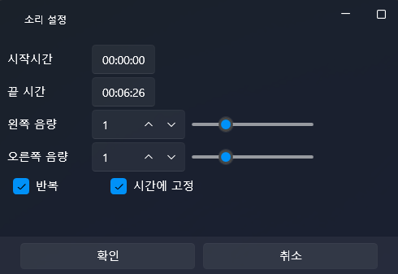

# 🎧 高度なサウンド制御（左右オーディオの移動）

このチュートリアルでは、音が  
**左 → 右 → 中央** へと自然に移動する  
“空間オーディオ移動効果（Panning Effect）” の作り方を学びます。

VSP では、オーディオの **Balance（左右位置）** を制御することで  
この効果を非常に簡単に実現できます。

ここでは特に重要な概念として：

- **「〜秒間かけて実行」はブロッキングではない**  
- 正しい順番で動かすには **「指定時間だけ待機します」** が必須

この2点を明確に説明します。

---

# 1️⃣ サウンドの読み込み

1. 左側パネル → **サウンド（Sound）タブ**
2. **インポート（Import）** をクリック
3. mp3 ファイルを選択
4. リストにサウンドが追加されます。

---

# 2️⃣ タイムラインにサウンドを配置

1. mp3 をドラッグ  
2. **オーディオトラック（Audio Track）** に配置

配置した時点でスクリプトから制御できるようになります。

---

# 3️⃣ Balance（左右位置）とは？

Balance の値は次の意味を持ちます：

- **-1.0 → 完全に左（Left）**
- ** 0.0 → 中央（Center）**
- **+1.0 → 完全に右（Right）**

タイムライン上のオーディオブロックを **ダブルクリックすると L/R 個別ボリュームは調整できますが**  
**Balance（左右位置）はスクリプトでしか制御できません。**

---

# ⚠ 非常に重要  
## 「〜秒間かけて実行」はブロッキングではない

例：

Balance を [1] に設定します（3秒間かけて）。

→ 値は 0 → 1 に 3秒かけて変化しますが  
→ **スクリプト自体は止まらず、次のアクションを即座に実行します。**

そのため次のように書くと意図通りに動きません：

（誤った例）  
Balance を 1 に（3秒）  
Balance を 0 に（1秒）  
→ 2つの処理が競合し、正しく動かない

---

## ✔ 正しい順序制御のためには

- Balance の変化  
- 同じ時間だけの待機  

この2つを **必ずセット** にする必要があります。

---

# 4️⃣ サウンド移動スクリプトを作る  
左 → 右 → 中央 の流れ

目標：

1) 左へ即座に移動（-1）  
2) 2秒かけて右（+1）へ移動  
3) 1秒かけて中央（0）へ戻る  

---

## 📌 正しいスクリプト構成

### ✔ 1. 左へ即座に移動  
Balance を [-1] に設定（0秒）

### ✔ 2. 右へ 2秒かけて移動  
Balance を [1] に設定（2秒）

### ✔ 3. 2秒待機  
指定時間 [2秒] 待機

### ✔ 4. 中央へ 1秒かけて移動  
Balance を [0] に設定（1秒）

### ✔ 5. 1秒待機  
指定時間 [1秒] 待機

これで正しい順序が保証されます。

---

## 📌 なぜこの構成が必要？

Balance の「X秒かけて実行」は **Lerp（補間）機能**であり、  
**スクリプトの進行を止めません。**

そのため：

1) Balance の変化  
2) 同じ秒数の待機  

この2つが **1対1で対応**している必要があります。

---

# 5️⃣ スクリプト例

---

# 6️⃣ 変数を使ったサウンド移動（応用）

変数を使えば、より柔軟な制御が可能です。

例）

1) Lerp ← 0  
2) Lerp ← 1（3秒）  
3) Balance ← Lerp  
4) 3秒待機

メリット：

- 複数の場所で再利用可能  
- デバイス軸（X0）との連携が容易  
- UI スライダーとの組み合わせも簡単  
- ミニゲーム / 演出にも便利

---

# 7️⃣ UI スライダーで Balance をリアルタイム制御

制作現場でもよく使われます：

- ASMR 左右音テスト  
- VRでのサウンド方向補正  
- 効果音テスト画面  
- X0 デバイスデバッグ  
- サウンド操作系ミニゲーム

今回は **スライダー操作だけで音がリアルタイムに動く UI** を作ります。

---

## 7-1️⃣ スライダー UI の配置

1. UI タブ → **新規 UI**
2. 左のコントロールから **Slider** をドラッグ
3. プロパティで数値範囲を設定

- Minimum = -1  
- Maximum = 1  
- Value = 0（中央）

---

## 7-2️⃣ スライダー変更時のスクリプト作成

1. Slider を選択  
2. 右パネル → Script → ValueChanged → 編集  
3. 新しいスクリプトが開きます

---

## 7-3️⃣ スクリプト内容

スライダーの Value を、そのまま Balance に反映させます。

### ✔ アクション  
Balance ← UI → Slider → Value

これだけで完了です。  
Tick Script も不要で、即時反映されます。

---

## 7-4️⃣ 結果

- スライダー左 → 左音  
- スライダー右 → 右音  
- 中央 → 中央音  

**リアルタイムのサウンド方向制御 UI** が完成します。

---

# 8️⃣ 全体まとめ

✔ Balance（左右位置）制御  
✔ 「〜秒間かけて実行」はブロッキングではない  
✔ 正しい順序には「待機」が必須  
✔ 左→右→中央の音移動  
✔ 変数を使った拡張的サウンド制御  
✔ UI スライダーでリアルタイム操作  

---

# ✨ 次のチュートリアル

次は **字幕検出（Subtitle Detection）** です。

👉 [字幕検出](intermediate-subtitle-detect.md)
