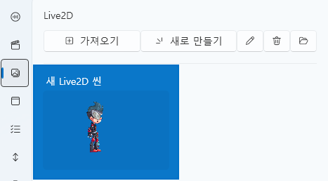

# Live2D タブ

Live2D タブは、**キャラクターシーン (Scene)** を構築し、  
Spine モデルを配置してアニメーションを設定するための編集タブです。  
すべての Live2D リソースは **プロジェクト内 (`Asset/Live2D/`) に自動保存** され、  
外部参照オプションは提供されていません。

---

## 1. 基本インターフェース

| コンポーネント | 説明 |
|----------------|------|
| **① インポート** | Live2D シーン (`.live2d`) ファイルを読み込みます。 |
| **② 新規作成** | 新しい Live2D シーンを作成します。 |
| **③ 編集 ✏️** | 選択したシーンの詳細編集画面を開きます。 |
| **④ 削除 🗑️** | プロジェクトから選択したシーンを削除します。 |
| **⑤ フォルダを開く 📂** | `Asset/Live2D/` フォルダを直接開きます。 |

> 💡 **ヒント：**  
> Live2D シーンはプロジェクト内でのみ管理され、  
> 外部参照やエクスポート機能はサポートされていません。

---

## 2. Live2D シーンエディター

Live2D エディターは、複数の Spine オブジェクトを 1 つの画面上に配置して  
キャラクター演出を構成するための独立したエディタです。

---

### 🎛️ 上部パネル

| 項目 | 説明 |
|------|------|
| **名前** | 現在編集中のシーン名を設定します。 |
| **幅 / 高さ** | シーンの解像度を設定します（例：1920x1080）。 |
| **シーンプレビュー領域** | 背景と共に Spine オブジェクトを視覚的に配置します。 |
| **オブジェクトリスト (右パネル)** | 現在のシーンに含まれる Spine オブジェクトの一覧を表示します。 |

---

### 🧩 Spine オブジェクト管理

Live2D シーン内には複数の Spine オブジェクトを追加できます。  
各オブジェクトは、位置・サイズ・アニメーション・スキンを個別に持ちます。

| 項目 | 説明 |
|------|------|
| **名前** | Spine オブジェクト名です。 |
| **StartX / StartY** | シーン内の座標を設定します（ピクセル単位）。 |
| **Scale** | キャラクターの大きさを調整します。 |
| **StartAnimation** | 初期再生するアニメーションを設定します（例：`idle`, `walk`, `attack`）。 |
| **Skin** | Spine モデルの外観スキンを選択します。 |
| **Loop** | アニメーションをループ再生します。 |
| **AutoPlay** | シーン読み込み時に自動でアニメーションを再生します。 |

> 💡 **ヒント：**  
> プレビュー画面上で **ドラッグ操作** によりオブジェクトの位置を直接変更できます。  
> 複数キャラクターを配置してシーン全体を演出可能です。

---

### ➕ オブジェクトの追加と削除

| 操作 | 説明 |
|------|------|
| **追加 (+)** | 新しい Spine オブジェクトをシーンに追加します。 |
| **削除 (🗑️)** | 選択中の Spine オブジェクトをシーンから削除します。 |

---

## 3. トラックおよびスクリプト連携

Live2D シーンはタイムラインだけでなく **スクリプトとも直接連携** できます。  
これにより、特定のイベントや条件に応じて  
**モーション、位置、スケール、進行度** などをリアルタイムに制御できます。

---

### 🎞️ トラック連携

Live2D シーンはタイムライントラック上に配置して、  
音声・イベント・UI などと時間軸ベースで同期させることができます。

| 機能 | 説明 |
|------|------|
| **ドラッグ追加** | Live2D シーンをタイムライン上にドラッグして配置します。 |
| **条件編集** | 特定条件を満たす場合のみシーンを表示する設定が可能です。 |
| **時間調整** | シーンの表示区間（開始/終了時間）を直接指定できます。 |

> 💡 **例：**  
> - 特定の音声区間でキャラクターモーションを表示  
> - UI 選択後に表情切り替えをトリガー  
> - クライマックスイベント時に自動再生  

---

### ⚙️ スクリプト連携

Live2D オブジェクトはスクリプトから **変数として直接制御** できます。  
変数設定ウィンドウを開くと、以下のような構造が表示されます。

| コンポーネント | 説明 |
|----------------|------|
| **Live2D シーン選択** | 制御対象のシーンを指定します。 |
| **Spine オブジェクト選択** | シーン内の個別オブジェクトを選択します。 |
| **プロパティ選択** | 操作する変数を指定します。 |

---

### 📊 制御可能な主な変数

| 変数 | 説明 |
|------|------|
| **AnimationProgress** | 現在のアニメーション進行度 (0.0〜1.0)。時間制御に使用します。 |
| **X / Y** | オブジェクトの座標を変更します。 |
| **Scale** | キャラクターの大きさを調整します。 |

> 💡 **ヒント：**  
> スクリプト内で Live2D 変数をリアルタイム変更することで、  
> アニメーション中にキャラクターの位置・サイズ・表情を自然に変化させることができます。

---

### 🧩 スクリプト例

> 🎯 **結果：**  
> 上記スクリプトを実行すると、キャラクターの位置・スケール・アニメーション進行度が  
> リアルタイムに変化し、タイムラインと完全に同期します。

---

### 🔗 トリガー連携の例

| 状況 | トリガー動作 |
|------|--------------|
| ボタンをクリックしたとき | 指定 Spine の `AnimationProgress` を 1 に設定して即座に完了させる。 |
| イベント発生時 | `Scale` 値を 1.0 → 1.5 に変更して拡大演出を行う。 |
| タイマーによる動作 | `Y` 値を徐々に変更してキャラクターを上に移動させる。 |

---

> 💡 **補足：**  
> Live2D 変数は UI、サウンド、ストロークイベントと同様にアクセスでき、  
> **PlayData スクリプトシステム** により全イベントから統合制御が可能です。

---

### 🎬 Spine 制御スクリプト

Live2D シーン内の Spine オブジェクトは、  
スクリプトで **アニメーション再生** および **スキン変更** を直接制御できます。

---

#### 🕹️ Spine アニメーション再生

このスクリプトを使用すると、任意の Spine オブジェクトのアニメーションを  
希望のタイミングで再生することができます。

| 項目 | 説明 |
|------|------|
| **Live2D シーン選択** | 制御するシーンを指定します。 |
| **Spine オブジェクト選択** | 再生対象の Spine モデルを選択します。 |
| **アニメーション名** | 実行するアニメーション (`idle`, `attack`, `death` など)。 |
| **状態** | 終了時の動作を設定（例：「停止」「ループ」「次のアニメーションへ」など）。 |
| **ブレンド再生モード** | 他のアニメーション上に重ねて再生するかを指定。 |
| **有効/無効** | アニメーションを有効または停止状態に設定します。 |

> 💡 **利用例：**  
> - 台詞区間で `talk` モーションを再生  
> - イベント完了時に `happy` モーションへ切り替え  
> - クライマックスシーンで `death` アニメーションを再生  

---

#### 🎨 Spine スキン変更

Spine キャラクターのスキンを切り替え、  
衣装・表情・装備などを変更できます。

| 項目 | 説明 |
|------|------|
| **Live2D シーン選択** | 制御するシーンを指定します。 |
| **Spine オブジェクト選択** | スキンを変更する Spine モデルを選択します。 |
| **スキン名** | 適用するスキン (`default`, `costume1`, `damaged` など) を選択します。 |

> 💡 **利用例：**  
> - ストーリー進行に合わせて衣装を切り替え (`default` → `battle`)  
> - 特定トリガーで損傷状態 (`damaged`) に変更  
> - 選択肢の結果に応じて別キャラクター外観を表示  

---

> ⚙️ **追加ヒント：**  
> Spine アニメーション制御スクリプトと Live2D 変数制御スクリプトを組み合わせることで、  
> 「モーション + 位置移動 + 拡大/縮小」などの複合演出を簡単に構成できます。

---

## 4. ファイル構造

| 項目 | パス |
|------|------|
| **シーンデータ** | `Asset/Live2D/SceneName.live2D` |
| **Live2D モデルファイル** | `Asset/Live2DModel/` |
| **Spine モデルファイル** | `Asset/SpineModel/` |
| **テクスチャ / アニメーションデータ** | Spine モデルのフォルダ構造を維持 |
| **プレビューキャッシュ** | `Asset/Live2D/` |

> ⚙️ **注意：**  
> Live2D シーンはプロジェクト専用で管理され、  
> パスを変更したり外部に移動すると正常に読み込まれない場合があります。

---

## 5. 関連ドキュメント

- [サウンドタブ](sound.md)  
- [ビデオタブ](video.md)  
- [UIタブ](ui.md)  
- [タイムライン編集](timeline.md)
