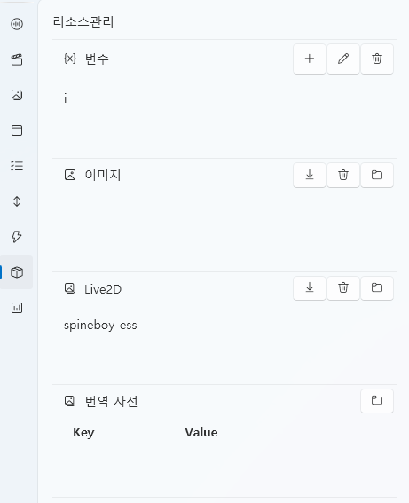

# リソース管理タブ

「リソース管理」タブは、**プロジェクト全体で使用されるデータリソースを一括管理**するための場所です。  
他のタブ（UI、スクリプト、Live2D など）で作成・参照されたリソースがここに集約され、  
インポート、編集、削除などの管理操作を行うことができます。

> 💡 **概要:**  
> 各エディットタブで生成されたリソースを保存・接続するための**共通データハブ**です。

---

## 1. インターフェース概要

| 構成要素 | 説明 |
|------------|------|
| **① 変数** | プロジェクト全体で参照される **グローバル変数（Global Variable）** の一覧。 |
| **② 画像** | UI 要素や背景などに使用される **画像リソース** の一覧。 |
| **③ Live2D / Spine** | Live2D モデルや Spine アニメーションモデルの管理。 |
| **④ 翻訳辞書** | 自動翻訳結果を保存し、Key → Value のマッピングルールで修正を適用します。 |

各項目はリソース単位で **追加(➕)**、**編集(✏️)**、**削除(🗑️)** が可能です。  
また、**インポート(➕)** ボタンでローカルファイルをプロジェクトに取り込むこともできます。

---

## 2. 変数（Variable）

| 項目 | 説明 |
|------|------|
| **用途** | プロジェクト全体で参照可能な **グローバル変数** を管理します。 |
| **追加/編集** | 変数名と初期値を指定して、新規追加または編集が可能です。 |
| **使用例** | スクリプト内の条件文、UI バインディング、テキスト置換などに使用します。 |

> 💡 **例:**  
> 変数 `i` を定義し、スクリプト内で `[i]` のように参照できます。

---

## 3. 画像（Image）

| 項目 | 説明 |
|------|------|
| **用途** | UI タブで使用するボタン、アイコン、背景などの **画像リソース** を管理します。 |
| **対応形式** | PNG、JPG などの一般的な画像フォーマットをサポート。 |
| **機能** | インポートボタン(➕)で新しい画像を追加、削除(🗑️)で削除可能。 |

> 💡 **ヒント:**  
> インポートした画像はプロジェクト内にコピーされ、  
> 他の UI 要素にリンクすると自動的に更新されます。

---

## 4. Live2D / Spine

| 項目 | 説明 |
|------|------|
| **用途** | Live2D または Spine モデルを管理し、プレビューで状態を確認可能です。 |
| **対応形式** | `.model3.json`（Live2D）、`.skel` または `.json`（Spine） |
| **機能** | インポート(➕)でモデル登録、削除(🗑️)で削除が可能。 |
| **例** | `spineboy-ess` のようなモデルは UI やスクリプトで呼び出して使用します。 |

> 💡 **ヒント:**  
> モデルリソースは **ストロークタブや Live2D タブのモーション再生** と直接連動可能です。

---

## 5. 翻訳辞書（Translation Dictionary）

| 項目 | 説明 |
|------|------|
| **用途** | 翻訳後の **出力テキスト（ユーザーの言語）** 内の単語を置換して、自然な表現に修正します。 |
| **構造** | Key は置き換えたい単語（機械翻訳の結果）、Value は修正後の表現。 |
| **適用方法** | 翻訳エンジンの結果出力後に、自動的に Key → Value の変換が適用されます。 |
| **機能** | リストの末尾に入力して追加、または開く(📂)ボタンで JSON ファイルを確認可能。 |

---

### 💡 例 — 翻訳後の単語修正

| Key | Value |
|-----|--------|
| 花 | ハナ |
| 兄 | オッパ |
| あなた | 君 |
| あなた様 | あなた |
| 私 | わたし |

---

### 💬 解説

自動翻訳エンジンは文脈を完全に理解できないため、  
感情表現や関係性に合わない訳語が生成されることがあります。  
翻訳辞書を使用することで、**翻訳後に自動で語句を修正** できます。

#### 🪷 例 1 — 名前が「ハナ（花）」のキャラクター  
原文: 私の名前は花。  
機械翻訳: 私の名前は花です。  
辞書適用後: 私の名前はハナです。

#### 💞 例 2 — 女性が男性を「オッパ」と呼ぶが「兄」と翻訳された場合  
原文: オッパ  
機械翻訳: 兄  
辞書適用後: オッパ

> 💡 **ポイント:**  
> 翻訳辞書は **翻訳結果（ユーザー言語）** に対して適用される  
> **ポストプロセス辞書（後処理辞書）** です。  
> 原文ではなく翻訳結果に対して動作します。

---

> ⚙️ **補足:**  
> - 翻訳辞書は単語単位で動作し、文章全体の置換は行いません。  
> - 同じ単語が複数回出現する場合、すべての箇所で一括置換されます。  
> - 登録した辞書は翻訳エンジンの後処理段階で自動的に適用されます。  
> - キャラクター名、敬称、固有名詞の統一に特に有効です。

---

## 6. 管理機能のまとめ

| アイコン | 機能 | 説明 |
|-----------|------|------|
| ➕ | **追加** | 新しいリソースを作成します。 |
| ✏️ | **編集** | 選択中のリソース内容を編集します。 |
| 🗑️ | **削除** | リソースを一覧から削除します。 |
| ⬇️ | **インポート (Import)** | ローカルファイルを読み込み、プロジェクトに登録します。 |
| 📂 | **フォルダを開く** | リソースの実ファイルが保存されているフォルダを開きます。 |

> 💡 **ヒント:**  
> インポート機能を使えば、外部ファイルを簡単にプロジェクトへ取り込むことができます。  
> すべてのリソースは自動的に内部パスへコピーされます。  
> ただし、外部でファイルを移動またはリネームするとリンクが切れる可能性があります。

---

## 7. ファイル構造

| 項目 | パス |
|------|------|
| **変数** | `Asset/Variable/` |
| **画像** | `Asset/Image/` |
| **Live2D / Spine** | `Asset/Live2D/` |
| **翻訳辞書** | `Asset/Translate/` |

---

## 8. 関連ドキュメント

- [UI タブ](ui.md)
- [Live2D タブ](live2d.md)
- [スクリプト タブ](script.md)
- [ストローク タブ](stroke.md)
