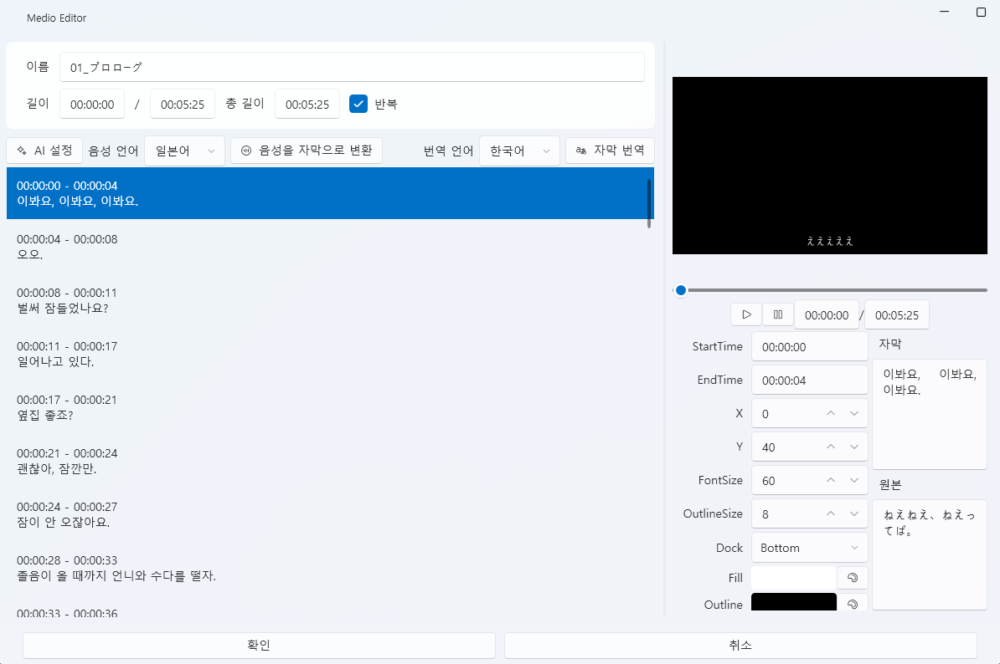
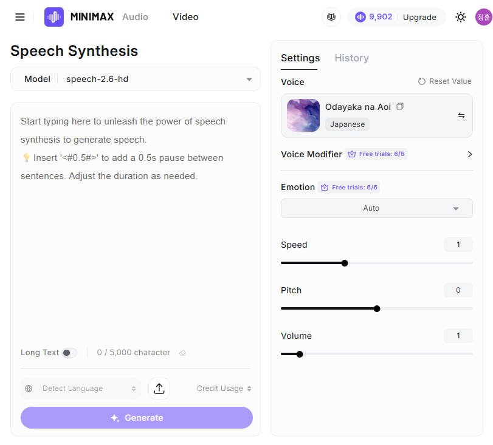

# サウンドタブ（Sound Tab）

VoiceScriptPlayer の **サウンドタブ** は、プロジェクトの中心となるオーディオを管理し、  
字幕（STT）、翻訳、音声合成（TTS）を行う編集タブです。  
すべてのトラックやイベントはサウンドを基準に同期されます。

---

## 1. 基本インターフェース

サウンドタブでは、プロジェクトで使用するすべてのオーディオファイルを管理します。  
TTS生成、字幕設定、ファイルのインポートなど、音声に関するほとんどの操作をここで行います。

| 項目 | 説明 |
|------|------|
| **① プロジェクトに含める** | チェックを入れると、読み込んだサウンドが**プロジェクト内部フォルダーにコピー**されます。 チェックを外すと、外部ファイルを**参照のみ**し、実際のファイルはコピーされません。 |
| **② インポート** | ローカルディスクから `.wav`、`.mp3` ファイルを読み込みます。 「プロジェクトに含める」の状態に応じてコピーまたは参照として動作します。 |
| **③ 新規作成** | 新しい TTS 音声を生成します。 クリックすると **TTS 生成ウィンドウ** が開き、入力したセリフを指定した音声エンジン（例：COEIROINK）で合成します。 |
| **④ 編集 ✏️** | 選択したサウンドの詳細編集ウィンドウを開きます。 インポートした音声は **字幕設定ウィンドウ**、生成した TTS 音声は **TTS エディター** が表示されます。 |
| **⑤ 削除 🗑️** | 選択したサウンドをリストから削除します。 |
| **⑥ エクスポート ↗ / 再インポート ↙** | プロジェクトに含まれるサウンドを外部フォルダーに書き出したり、再度プロジェクトに戻すことができます。 |
| **⑦ サウンドフォルダーを開く 📂** | 現在のプロジェクト内に保存されている**サウンドファイルのフォルダー**を開きます。 |
| **⑧ 波形プレビュー領域** | 選択したサウンドの波形と再生時間を表示します。下部にはファイル名・長さ・含有状況が表示されます。 |

---

### ⚙️ 動作まとめ

| 状況 | 結果 |
|------|------|
| 「プロジェクトに含める」にチェックを入れてインポート | ファイルがプロジェクトフォルダー（`Asset/Sound/`）に**コピー**されます。 |
| チェックを外してインポート | ファイルは**外部参照**として登録され、移動されません。 |
| 「外部にエクスポート」ボタン | 選択されたサウンドを指定フォルダーにコピーします。 |
| 「プロジェクトに再インポート」ボタン | 外部ファイルをプロジェクト内に再度取り込みます。 |

---

> 💡 **ヒント：**  
> 「プロジェクトに含める」のチェックを**外す**と以下の利点があります：
>
> - ✅ **容量の節約：** 大きな音声ファイルをコピーしないため、保存容量を削減できます。  
> - ⚡ **高速読み込み：** コピー処理が不要になるため、インポートが速くなります。  
> - 🛠️ **外部編集が容易：** 外部で編集した音声（ノイズ除去・差し替えなど）が即時反映されます。  
> - 🧾 **著作権保護：** 有料音源や商用音声をプロジェクト内に含める必要がありません。  
>
> ただし、外部参照にした音声は**エクスポート（配布）**時に含まれず、  
> 他のユーザーに配布しても**音声ファイルは含まれません。**

---

## 2. 字幕設定（Medio Editor）

サウンドファイルを選択し、**✏️ 編集**ボタンをクリックすると  
`Medio Editor` ウィンドウが開き、字幕生成（STT）、翻訳、位置調整などをまとめて行えます。

---

### 🎛️ 基本構成

| 項目 | 説明 |
|------|------|
| **名前** | 編集中の音声ファイル名です。 |
| **長さ** | 再生区間と全体の長さを表示します。 |
| **AI 設定** | Whisper や DeepL などの AI エンジン設定を直接開けます。ウィンドウを閉じる必要はありません。 |
| **音声言語** | STT に使用する音声の言語を選択します（例：日本語、韓国語、英語など）。 |
| **翻訳言語** | 翻訳先の言語を指定します。 |
| **プレビューウィンドウ** | 字幕のプレビューを表示します。 |
| **字幕リスト（右側）** | 変換された字幕の時間区間や位置を個別に修正できます。 |

---

### 🗣️ 音声を字幕に変換（STT）

1. **音声言語** を設定します。  
2. **[音声を字幕に変換]** ボタンをクリックします。  
3. 登録済みの **STT エンジン**（例：Whisper）を使用して音声をテキスト化します。  
4. 結果は自動的に**時間ごとの字幕リスト**として表示されます。

| 項目 | 説明 |
|------|------|
| **StartTime / EndTime** | 字幕の開始・終了時間を調整します。 |
| **字幕内容** | 変換されたテキストが表示され、直接編集可能です。 |
| **X / Y** | 字幕の表示位置を指定します。 |
| **FontSize / OutlineSize** | 字幕の文字サイズとアウトラインの太さを調整します。 |
| **Dock** | 字幕の基準位置（上・中央・下）を選択します。 |
| **Fill / Outline** | 字幕の色とアウトラインの色を設定します。 |

> 💡 **備考：**  
> 変換された字幕はプロジェクトの `Asset/Sound/` フォルダーに自動保存され、  
> 他の音声や映像でも再利用可能です。

---

### 🌐 字幕の翻訳

1. 字幕を生成した後、**[字幕を翻訳]** ボタンをクリックします。  
2. 選択した **翻訳エンジン**（DeepL、LibreTranslate など）を使用して  
   `音声言語 → 翻訳言語` に自動変換します。  
3. 翻訳結果は原文と並んで表示され、個別編集が可能です。

| オプション | 説明 |
|------|------|
| **自動翻訳エンジン** | 設定で指定された翻訳 API を使用します。 |
| **結果プレビュー** | プレビューウィンドウで翻訳結果を即時確認できます。 |
| **編集反映** | 翻訳結果を右パネルから直接編集して反映可能です。 |

> 💡 **ヒント：**  
> - 日本語音声を韓国語に翻訳する場合、**音声言語=日本語、翻訳言語=韓国語** に設定します。  
> - 翻訳された字幕は**原文と一緒に保存**され、再生時に自動で表示されます。

---

### ▶️ プレビューと確認

- 下部の **再生ボタン ▶** をクリックすると、字幕の同期を確認できます。  
- スライダーで特定区間のみ確認することも可能です。  

> ⚙️ **STT および翻訳エンジン設定：**  
> - [AI → Whisper](../ai/whisper.md)  
> - [AI → DeepL](../ai/deepl.md)  
> - [AI → LibreTranslate](../ai/libretranslate.md)

---

### 📦 出力先

| 種類 | パス |
|------|------|
| STT 字幕ファイル | `Asset/Sound/元ファイル名.srt` |

---

## 3. 音声合成（TTS）

サウンドタブで **[新規作成]** をクリックすると、  
`Audio Editor` ウィンドウが開き、複数の文を入力し、文ごとに音声エンジン設定を行うことができます。  
COEIROINK や Hailuo などのエンジンを使用して、自然なセリフ単位の音声を合成できます。

---

### 🧩 主な更新点

| 項目 | 説明 |
|------|------|
| **複数文の入力に対応** | 1 回の編集で複数の文を登録し、それぞれ独立して合成可能。 |
| **文単位の TTS 設定** | キャラクター、速度、音高、ボリュームなどを文ごとに設定可能。 |
| **タイムライン追加** | TTS専用タイムラインを追加。動画やイベントなどと同じ操作感。 |
| **プレビュー改善** | 文単位再生や全体再生が可能。 |

---

### 🎛️ 基本構成

| 項目 | 説明 |
|------|------|
| **名前** | 生成される音声ファイルの名前です。 |
| **長さ** | 登録された文の合計再生時間を表示します。 |
| **AI 設定** | 選択中の TTS エンジン設定ウィンドウを開きます。 |
| **TextToSpeech エンジン** | 使用するエンジンを選択（例：`COEIROINK`、`Hailuo`）。 |
| **タイムライン** | 各文が時間軸上に配置され、長さや位置を調整可能。 動画やイベントと同様に操作できます。 |

---

### 🗣️ 文単位編集

各文は独立したブロックとして管理され、  
**テキスト、音声設定、字幕スタイル** を個別に調整できます。

| 項目 | 説明 |
|------|------|
| **テキスト入力欄** | 合成するテキストを入力。改行ごとに別文として扱われます。 |
| **キャラクター選択** | 使用する音声キャラクターを指定（例：リリン、ノエルなど）。 |
| **速度 / ピッチ / 強度 / 音量** | 各文ごとに独立して調整可能。 |
| **字幕プレビュー** | 下部に字幕が表示され、同期確認が可能。 |
| **字幕設定** | X/Y 位置、文字サイズ、色、アウトラインなどを設定。 |

---

### 📜 タイムライン操作

新しく追加された **TTS タイムライン** は、他のトラック編集と同様に動作します。

| 項目 | 説明 |
|------|------|
| **文ノード** | 各文がノードとして表示され、ドラッグで位置を調整可能。 |
| **区間長さ調整** | ノードの端をドラッグして長さを変更。 |
| **順序変更** | 文の順番を入れ替えるとタイムラインも自動更新。 |
| **再生コントロール** | 区間再生・全体再生・一時停止などを提供。 |

> 💡 **ヒント：**  
> タイムラインを利用することで、音声・字幕・イベントの完全な同期が可能です。  
> 他トラックと同じショートカット・操作感で扱えます。

---

### 🎧 エンジン別特徴

#### 🪶 COEIROINK

- 日本製オープンソース音声合成エンジン  
- 感情表現やイントネーション制御に優れる  
- ローカル生成と高速プレビュー対応  
- 出力形式：WAV  
- 主な設定：`Speed`、`Pitch`、`Volume`

#### 🌊 Hailuo

- クラウドベースの AI 音声エンジン  
- 自然な発音とスムーズな接続処理が強み  
- 多言語（日・韓・英など）対応  
- クラウド API による高音質合成  
- 主な設定：`Pitch`、`Intensity`、`Timbre`、`Emotion`

🎧 **ウェブで試す**  
[Hailuo 公式デモページ](https://www.minimax.io/audio/text-to-speech) で  
さまざまなボイスプロファイルを試聴し、好みのスタイル（女性・男性・感情型など）を確認できます。  
VoiceScriptPlayer でも同じ設定を使用可能です。

> - [AI → COEIROINK](../ai/coeiroink.md)  
> - [AI → Hailuo](../ai/hailuo.md)

---

### ▶️ プレビューと合成

- **▶ ボタン** で現在の文を即時再生可能。  
- 全体再生および区間再生にも対応。  
- テキストを修正すると即時再合成されます。  

---

### 📦 出力先

| 項目 | パス |
|------|------|
| **生成された音声ファイル** | 自動的に `Asset/Sound/` フォルダーに保存されます。 |
| **字幕データ** | `.srt` またはプロジェクトメタデータとして同フォルダーに保存。 |

---

### 💡 ヒント

- 文ごとにキャラクターや感情を変えたい場合は、  
  文を分割してそれぞれ異なる設定を適用することで、自然な会話表現が可能です。  
- COEIROINK と Hailuo を併用することも可能です。  
  （例：日本語パート＝COEIROINK、韓国語ナレーション＝Hailuo）

---

## 4. トラックに追加する

生成または読み込んだ音声は、**ドラッグ＆ドロップでタイムラインに追加**できます。

- 左のリストからトラック上にドラッグすると、自動的にノードが生成されます。  
- ノードの長さや位置は即時に調整可能。  
- 複数の音声を並べて配置し、**複合的なオーディオ演出**が可能です。

> 💡 **ヒント：**  
> サウンドノードは他のリソース（Live2D、UI、イベントなど）と同様に  
> 時間軸上で正確に同期できます。

---

### 🎚️ サウンドノード設定

タイムラインに追加された音源は、**サウンド設定ウィンドウ**で詳細調整が可能です。  
サウンドノードを**右クリック →「編集」**、または**ダブルクリック**で開けます。

| 項目 | 説明 |
|------|------|
| **開始時間 / 終了時間** | 再生区間の始まりと終わりを設定します。 |
| **ループ** | チェックすると、指定区間を繰り返し再生します。 |
| **左 / 右 音量** | ステレオバランスを個別に調整します。 |

この機能を使うことで、特定区間のループや  
左右音量の分離による**立体的な音響演出**が可能です。

---

## 5. 関連ドキュメント

- [タイムライン編集](timeline.md)  
- [ビデオタブ](video.md)  
- [スクリプト編集](script.md)  
- [AI → Speech Recognition](../ai/speechRecognition.md)  
- [AI → COEIROINK](../ai/coeiroink.md)
