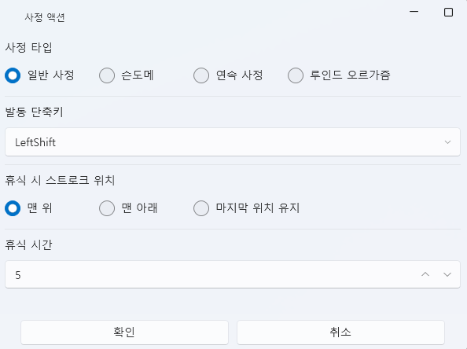

# クライマックスタブ（Climax Tab）

クライマックスタブは、**射精（Climax）や状態変化に応じて実行される特別なトリガーイベント**を管理します。  
現在は 4 種類の固定イベントが用意されており、  
それぞれのイベントはタイムライン上にノードとして配置し、発動タイミングを制御できます。

すべてのイベントは固定の動作を持ち、  
ユーザーがカスタマイズしたり新しいイベントを追加することはできません。  
（ただし、タイムライン上に配置したノードは個別に編集・削除が可能です。）

---

## 1. イベント一覧

| イベント | 説明 |
|-----------|------|
| **通常射精** | 最も基本的な射精イベントです。射精タイミングで該当アクションがトリガーされます。 |
| **ハンドドメ** | 射精直前にストローク（デバイス動作）を停止します。 |
| **連続射精** | 射精後もストロークが途切れず、一定時間継続します。 |
| **ルインドオーガズム** | 射精直前にストロークを止め、精液を抑えるような演出を行います。 |

> 💡 **補足：**  
> 各イベントはシステムに固定された動作を持ち、  
> 詳細なロジックを変更することはできません。  
> ただし、ショートカットキーや休止設定は個別に調整可能です。

---

## 2. イベントエディター

タイムライン上に特殊イベントを配置すると、  
そのノードをダブルクリックして **イベントオプションウィンドウ** を開くことができます。  
ここでイベントの発動条件や、射精後のデバイス挙動を設定します。

---

### ⚙️ 設定項目

| 項目 | 説明 |
|------|------|
| **射精タイプ** | 4種類の特殊イベントの中から選択します。 |
| **発動ショートカットキー** | イベントを即時実行するキーを指定します。（例：LeftShift） |
| **休止時のストローク位置** | イベント後のデバイス位置を設定します。 「最上部」「最下部」「最後の位置を維持」から選択可能。 |
| **休止時間** | イベント発生後にデバイスが停止したままになる時間（秒）を指定します。 |

---

### 💡 動作フロー

1. ユーザーがショートカットキーを押下し、トリガーが発生  
2. 指定された**特殊イベント動作**が実行  
3. 指定された**休止時間中はストロークが停止**  
4. 休止終了後、次のストロークパターンまたはイベントへ自動的に移行

---

### 🧭 概要

| 項目 | 説明 |
|------|------|
| **イベント数** | 現在 4 種類（通常射精、ハンドドメ、連続射精、ルインドオーガズム） |
| **設定可能項目** | ショートカットキー、ストローク位置、休止時間 |
| **カスタマイズ** | 不可（システム固定イベント） |
| **タイムライン連携** | 可能 – 各イベントはノードとして配置できます。 |

> ⚙️ **補足：**  
> 特殊イベントはサウンド、ストローク、スクリプトなどと組み合わせて  
> タイムライン上で複合的な演出を構築できます。  
> たとえば、「ハンドドメ」イベントをトリガーとして特定のサウンドを再生させることで、  
> より自然でインタラクティブな流れを演出できます。

---

## 3. 関連ドキュメント

- [ストロークタブ](stroke.md) — ストローク定義  
- [スクリプト](script.md) — 条件変数・トリガー定義  
- [ランタイムヘルパー](runtime-helper.md) — デバッグおよび再生テスト  
