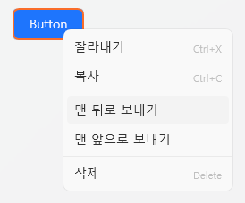

# UIタブ

UIタブは、**プロジェクト内のインターフェースを構築・制御するための編集タブ**です。  
ボタン、画像、テキストなどのUIコントロールを配置し、  
各要素にスクリプトを紐付けることで**インタラクションを実現**できます。

---

## 1. 基本インターフェース

| 要素 | 説明 |
|------|------|
| **① ドラッグして空のUIを追加** | 新しい **UIインスタンス** を作成します。 |
| **② UIテンプレート** | 再利用可能な **UI構成テンプレート** を管理します。 |
| **③ インポート** | 既存のUIテンプレートを読み込みます。 |
| **④ 新規作成** | 新しいUIテンプレートを作成します。 |
| **⑤ 編集 ✏️** | 選択したUIをエディターで開きます。 |
| **⑥ 削除 🗑️** | 選択したUIをリストから削除します。 |
| **⑦ フォルダーを開く 📂** | `Asset/UI/` フォルダーを直接開きます。 |

> 💡 **ヒント：**  
> UIインスタンスは個別に動作し、  
> UIテンプレートを修正すると全てのインスタンスに反映されます。

---

## 2. UIテンプレートとインスタンス

UIは **テンプレート型** と **インスタンス型** の2種類に分かれます。  
両者は適用範囲や編集方法が異なります。

| 種類 | 説明 | 特徴 |
|------|------|------|
| **UIテンプレート** | 共有して再利用可能なUI構成です。 | 複数画面で共通利用でき、修正時に一括反映されます。 |
| **UIインスタンス** | 個別シーン専用の独立したUIです。 | 各インスタンスが独立して動作し、テンプレート変更の影響を受けません。 |

> 💡 **例：**  
> 「選択肢UI」「ポーズメニュー」「スタート画面」などはテンプレート化に適しています。  
> 特定イベント専用のポップアップなどはインスタンスとして追加するのが良いでしょう。

---

## 3. UIエディター

UIエディターは、左側のコントロールリスト、中央のキャンバス、右側のプロパティパネルで構成されます。  
リストから要素を選んでキャンバスに配置し、右側で詳細設定を行います。

---

### 🎛️ 上部オプション

| 項目 | 説明 |
|------|------|
| **Name（名前）** | UIの名前を指定します。 |
| **一時停止中も実行** | プロジェクトがポーズ中でもUIを表示・操作できます。 |
| **字幕の下に表示** | 字幕の背面にUIを配置します。（HUDや背景UI向け） |

---

## 4. コントロール一覧

| コントロール | 説明 |
|--------------|------|
| **Panel** | 他のコントロールを含む基本コンテナ。 |
| **Button** | クリックイベントを処理します。 |
| **ComboBox** | ドロップダウンから項目を選択できます。 |
| **Input** | テキスト入力フィールドです。 |
| **Label / OutlineLabel** | テキストを表示します。OutlineLabelは外枠付きです。 |
| **Slider / ProgressBar** | 値の範囲を調整したり進捗を表示します。 |
| **Image** | 画像ファイルを表示します。 |
| **CheckBox** | ON/OFF状態を持つUI要素です。 |

> ⚙️ **注意：**  
> 子コントロールを持てるのは `Panel` のみです。  
> 他のコントロールはすべて単独要素として動作します。

---

## 5. プロパティ編集

UIコントロールのプロパティは種類によって異なりますが、  
以下のような**共通プロパティ**をほとんどのコントロールが共有しています。

| 項目 | 説明 |
|------|------|
| **Name** | スクリプトやトリガーで参照するための一意な名前。 |
| **Width / Height** | コントロールのサイズ。 |
| **Horizontal / Vertical Alignment** | 親コンテナ基準での配置位置。 |
| **Margin** | 親との余白。 |
| **Foreground / Background Color** | 前景色と背景色。 |
| **Opacity / Rotation / Scale** | 透明度、回転角度、拡大縮小率。 |
| **IsEnabled / IsVisible** | 有効・表示状態を制御します。 |

> 💡 **補足：**  
> コントロールによっては追加のプロパティがあります。  
> 例：`Text`、`FontSize`、`ImageSource`、`MaxValue` など。

---

## 6. スクリプトイベント

UIコントロールは動作に応じて**イベントをトリガー**できます。  
右側の `Script` タブからスクリプトを関連付けることができます。

---

### 🧩 共通イベント（全コントロール）

| イベント | 説明 |
|----------|------|
| **MouseDown / MouseUp** | マウスクリックまたは解放時に実行。 |
| **MouseEnter / MouseLeave** | マウスが領域に入る・離れるときに実行。 |

> 💡 **特別イベント：**  
> メイン `Panel` は **Tick** イベントを持ちます。  
> UIが開いている間、毎フレーム呼び出され、  
> リアルタイム更新やアニメーション制御に使用できます。

---

### 🎛️ コントロール固有イベント

| コントロール | イベント | 説明 |
|--------------|-----------|------|
| **Panel** | `Loaded` | パネルが表示されたときに実行。 |
| **Panel** | `Unloaded` | パネルが閉じられたときに実行。 |
| **Button** | `Click` | クリック時に実行。 |
| **Input** | `TextChanged` | 入力テキストが変更されたときに実行。 |
| **Slider / ComboBox / CheckBox** | `ValueChanged` | 値が変更されたときに実行。 |

> 💡 **補足：**  
> 各イベントは独立したスクリプトを設定でき、  
> ランタイムで自動的に呼び出されます。

---

### 💡 UIスクリプト制御

UIコントロールはスクリプトから直接アクセス・制御可能です。  
スクリプト内にはデフォルト変数 **`CurrentUI`** が自動で提供され、  
現在開いているUIやその内部コントロールに簡単にアクセスできます。

> 💡 **例：**  
> ボタンクリック時に  
> `CurrentUI | NewButton | FontSize` の値を変更し、  
> 指定ボタンの文字サイズをリアルタイムで変更できます。  
> これにより **テキスト変更、色変更、状態更新** など  
> 様々なUIリアクションを実現できます。

また、スクリプトで **UIテンプレートを開閉** することも可能です。

> 💡 **例：**  
> `UI "新しいUI" を識別子 "TEST" として開く`  
> というスクリプトで、指定したUIテンプレートを動的に表示可能。  
> イベントやトリガーに応じて  
> 自動的にUIを切り替えたりポップアップを表示したりできます。

---

## 7. コントロール管理

コントロールを右クリックすると、以下の管理メニューが表示されます。

| メニュー | 説明 |
|----------|------|
| **切り取り / コピー / 貼り付け** | コントロールを移動または複製します。 |
| **最前面 / 最背面に移動** | 重なり順を変更します。 |
| **削除 (Delete)** | 選択中のコントロールを削除します。 |

また、右上の **コンボボックス** を使うと  
キャンバス上でクリックしづらいコントロールも簡単に選択できます。

---

## 8. Panelとレイアウトシステム

`Panel` はUIのルートコンテナであり、  
全ての子コントロールの**配置基準**となります。

---

### 🧱 WPFレイアウト構造

UI配置は **WPFレイアウトシステム** に基づいて動作します。  
絶対座標ではなく、**相対配置と余白(Margin)** によって構成され、  
異なる解像度でも一貫した位置と比率を維持できます。

| 概念 | 説明 |
|------|------|
| **Alignment** | 親基準で左/右/中央に配置。 |
| **Margin** | 親コンテナとの余白を設定。 |
| **Z-Order** | 表示の優先順位を設定。 |
| **Relative Layout** | 解像度に応じて自動調整される相対配置システム。 |

> 💡 **参考資料：**  
> - [Microsoft Docs: WPF レイアウトの概要](https://learn.microsoft.com/ja-jp/dotnet/desktop/wpf/advanced/layout?view=netframeworkdesktop-4.8)  
> - [WPF パネルの概要 (Grid, StackPanel, Canvasなど)](https://learn.microsoft.com/ja-jp/dotnet/desktop/wpf/controls/panels-overview?view=netframeworkdesktop-4.8)

> ⚙️ **ヒント：**  
> 初めて使う場合は、`HorizontalAlignment` と `VerticalAlignment` を  
> 左上基準に設定し、`Margin` で位置を調整すると分かりやすいです。

---

## 9. ファイル構造

| 項目 | パス |
|------|------|
| **UIテンプレートデータ** | `Asset/UI/` |
| **リソース（画像など）** | `Asset/Image/` |

---

## 10. 関連ドキュメント

- [Live2Dタブ](live2d.md)  
- [スクリプトタブ](script.md)  
- [タイムライン編集](timeline.md)  
