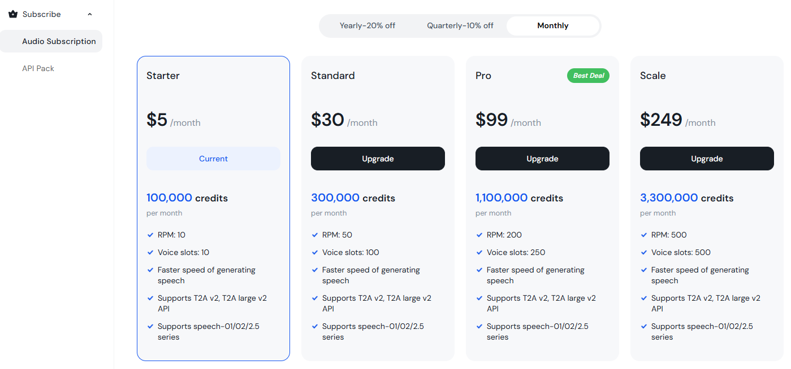

# Hailuo 구독 및 결제 가이드

## 1. 개요 (Overview)
[Hailuo](https://www.minimax.io/audio)는 Minimax에서 제공하는 **클라우드 기반 음성 합성 서비스**입니다.  
VoiceScriptPlayer에서 Hailuo를 사용하기 위해서는 **별도의 API 요금제 구독**이 필요합니다.  
일반 웹 요금제와 API 요금제는 서로 다르므로 반드시 구분해서 결제해야 합니다.

> ⚠️ **중요:**  
> Hailuo API는 무료로 제공되지 않습니다.  
> 일반 웹 요금제(웹 음성 합성)는 VoiceScriptPlayer에서 사용할 수 없습니다.  
> 반드시 API 구독 플랜을 활성화해야 합니다.

---

## 2. 구독 단계 (Subscription Steps)

1. **Minimax 계정 생성**  
    [Minimax 회원가입 페이지](https://www.minimax.io/audio)에서 계정을 생성하고 로그인합니다.
2. **API 구독 페이지 접속**  
    [Audio Subscription 페이지](https://platform.minimax.io/subscribe/audio-subscription)에 접속합니다.  
    여기에서 **API 요금제**를 선택할 수 있습니다.
    
3. **요금제 선택 및 결제**  
    - 원하는 API 플랜을 선택하고 결제를 진행합니다.  
    - 결제 수단은 일반적으로 **신용카드** 또는 **해외 결제 지원 카드**가 필요합니다.
4. **API Key 발급**  
    결제가 완료되면 상단 메뉴에서 **Account → API Keys** 로 이동합니다.  
    화면 하단의 **「Create new secret key」** 버튼을 클릭하면 새 API 키를 생성할 수 있습니다.  
      
    처음 생성 시 표시되는 **Secret Key** 가 여러분의 **Hailuo API 키**입니다.  
    이 키는 보안상의 이유로 **한 번만 표시되므로 반드시 복사하여 안전한 곳에 보관하세요.**  
    만약 분실할 경우, 새로운 키를 다시 생성해야 합니다.  
      
    생성한 키를 VoiceScriptPlayer의 **AI 설정 → Hailuo** 항목에 입력하면 연결이 완료됩니다.
5. **남은 코인(사용량) 확인**  
    구독 후에는 [Audio Subscription 페이지](https://platform.minimax.io/subscribe/audio-subscription)에서  
    **남은 코인(잔여 사용량)** 을 실시간으로 확인할 수 있습니다.
    

---

## 3. 요금제 안내 (Pricing Overview)

| 구분 | 설명 |
|------|------|
| **웹 요금제** | Hailuo 사이트 내에서 음성을 합성할 수 있는 일반 요금제 (VoiceScriptPlayer와 호환되지 않음) |
| **API 요금제** | 외부 프로그램(VoiceScriptPlayer 등)에서 API를 통해 음성을 합성할 수 있는 요금제 |
| **결제 주기** | 월 단위 구독 방식 (자동 갱신 가능) |
| **코인 사용 방식** | 음성 길이에 따라 코인이 차감되며, 코인이 소진되면 추가 결제가 필요 |

---

## 4. 주의사항 (Notes)
- API 요금제는 **무료 체험이 제공되지 않습니다.**  
- 구독 취소 시 잔여 코인은 환불되지 않습니다.  
- API 요청당 코인이 차감되므로, 불필요한 테스트 호출은 피하는 것이 좋습니다.  
- 네트워크 연결이 불안정하면 API 요청 실패로 코인이 차감될 수 있습니다.  
- 결제 시 반드시 **“Audio API Subscription”** 항목을 선택해야 합니다.  

---

## 5. 관련 문서
- [AI → Hailuo 사용 방법](../ai/hailuo.md)  
- [Hailuo 공식 사이트](https://www.minimax.io/audio)  
- [Audio Subscription 관리 페이지](https://platform.minimax.io/subscribe/audio-subscription)
