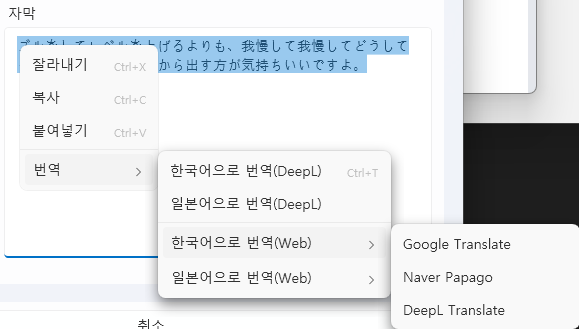

# LibreTranslate 번역 (Translation)

## 1. 개요 (Overview)
LibreTranslate는 오픈소스 기반의 **기계 번역 엔진**입니다.  
무료로 사용할 수 있으며, 로컬에서 직접 실행하여 인터넷 연결 없이 번역을 수행할 수 있습니다.  
VoiceScriptPlayer에서는 LibreTranslate 서버를 통해 **자막, 대본 번역** 기능을 제공합니다.  

> ⚠️ LibreTranslate는 다른 AI 기능들과 달리, 사용자가 직접 Python 환경을 준비하고 설치해야 합니다.  
> 설치만 완료하면 실행과 연결은 VoiceScriptPlayer가 자동으로 처리합니다.  

---

## 2. 설치 및 준비 (Installation & Setup)

### 1) Python 설치
- **지원되는 버전:** Python **3.11**  
- **지원되지 않는 버전:** Python **3.12, 3.13** (호환성 문제로 동작하지 않음)  
- 다운로드: [Python 3.11.x](https://www.python.org/downloads/release/python-3119/)  

설치 시 주의사항:
- 반드시 **“Add Python to PATH”** 옵션을 체크하세요.  
- 설치 후 명령 프롬프트에서 확인:

    python --version  
    pip --version

### 2) LibreTranslate 설치
Python이 준비되면 명령 프롬프트(또는 PowerShell)에서 입력:

    pip install libretranslate

이 과정을 마치면 LibreTranslate가 사용자 환경에 설치됩니다.  

---

## 3. VoiceScriptPlayer에서의 사용
- 설치가 완료되면, VoiceScriptPlayer가 **자동으로 LibreTranslate 실행 파일을 탐색**하고 서버를 실행합니다.  
- 사용자는 별도의 명령어 입력이나 경로 지정이 필요하지 않습니다.  
- 서버가 실행 중일 때 번역 기능이 동작하며, 서버 실행 여부도 프로그램이 자동 확인합니다.  

---

## 4. VoiceScriptPlayer 내 번역 기능 활용 (공통 기능)

VoiceScriptPlayer에서는 모든 텍스트 입력창(TextBox)에서  
**우클릭 컨텍스트 메뉴**를 통해 바로 번역 기능을 사용할 수 있습니다.  

---

### 🧭 사용 방법

1. **텍스트를 선택한 뒤 마우스 오른쪽 클릭**  
2. **“번역 → 한국어로 번역(DeepL)”** 또는 **“일본어로 번역(Web)”** 등을 선택  
3. 선택한 번역 엔진(DeepL, Google, Papago 등)으로 즉시 결과가 표시됩니다.

---

### ⚡ 단축키 지원
- **Ctrl + T**  
  → 현재 선택된 텍스트를 **기본 번역 엔진**으로 즉시 번역합니다.  
  (기본 엔진은 설정에서 변경 가능)

---

### 🌐 지원 번역 엔진
| 구분 | 엔진 | 특징 |
|------|------|------|
| **로컬 API** | DeepL Translate | 높은 정확도, 문맥 인식 우수 |
| **웹 번역** | Google Translate | 다국어 폭넓게 지원 |
| **웹 번역** | Naver Papago | 한국어 및 일본어에 강점 |

---

> 💡 **참고:**  
> 이 기능은 모든 번역 엔진(DeepL, Google, Papago)에 공통 적용되며,  
> 프로젝트 내의 **대사 편집기, 자막 편집기, 텍스트 입력창** 등  
> 텍스트를 입력할 수 있는 거의 모든 곳에서 동일하게 작동합니다.

---

## 5. 주의사항 (Notes & Limitations)
- 반드시 Python 3.11 버전을 설치해야 합니다. (3.12/3.13은 지원되지 않음)  
- 사용자는 설치만 진행하면 되며, 실행과 연결은 프로그램이 담당합니다.  
- 번역 품질은 DeepL, Papago 등 상용 번역기보다 낮을 수 있습니다.  
- 긴 문장보다는 짧게 나눠 번역하는 것이 더 정확합니다.  

---

## 6. 라이선스 및 출처 (License & Credits)
- **LibreTranslate**: AGPL v3 License  
- 공식 GitHub: [https://github.com/LibreTranslate/LibreTranslate](https://github.com/LibreTranslate/LibreTranslate)  
