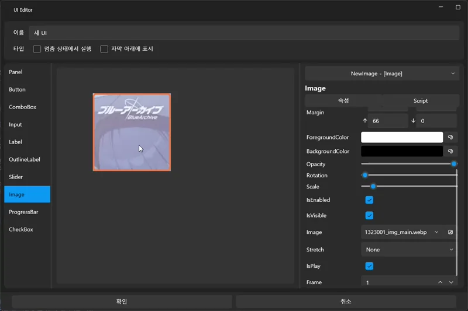
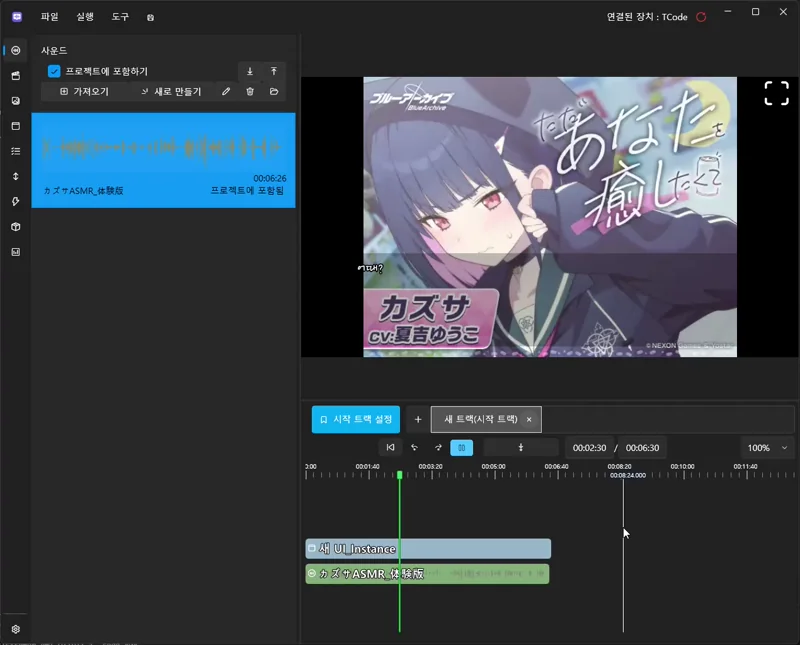

# 음성을 영상처럼 만들고 자막 달기

이 튜토리얼에서는 **오디오 파일만 있을 때도 영상처럼 섬네일을 보여주고**,  
**자막을 자동 생성하여 텍스트 콘텐츠로 확장하는 방법**을 배웁니다.

오디오 중심 콘텐츠(ASMR, 더빙, 예시 내레이션 등)를  
VSP 프로젝트에서 자연스럽게 “영상 트랙처럼” 활용하는 데 도움이 됩니다.

---

## 🎯 이 튜토리얼에서 배우는 것

- 오디오 파일 불러오기  
- 오디오를 “영상처럼 보이게” 하는 썸네일 설정  
- Whisper를 이용해 자동 자막 생성하기  
- 자막 블록 배치 및 스타일 조정  
- 오디오 기반 콘텐츠를 영상 트랙과 혼합하는 기본 원리

---

## 📌 예제 사운드 안내 (전연령 콘텐츠)

이 튜토리얼에서는 이해를 돕기 위한 전연령용 오디오 콘텐츠를 사용했습니다.
DLsite의 다음 작품을 참고하여 구성했습니다:

https://www.dlsite.com/home/work/=/product_id/RJ01323001.html

※ 예제 오디오는 문서에 포함되지 않으며,
사용자는 합법적으로 이용 가능한 오디오 파일을 사용해야 합니다.

---

# 1️⃣ 오디오 파일 가져오기

오디오는 프로젝트 폴더에 직접 넣는 것이 아니라
에디터 내부에서 불러오는 방식으로 등록합니다.

---

## 📥 사운드 가져오기 방법

1. 좌측 패널에서 Sound(사운드) 탭 선택
2. 가져오기(Import) 버튼 클릭
3. 사용할 오디오 파일 선택
4. 목록에 파일이 추가되면 준비 완료

가져온 사운드는 프로젝트의 Asset/Sound 폴더에 자동 정리됩니다.

---

# 2️⃣ 오디오를 “영상처럼” 보이도록 만들기  
(썸네일 설정 – UI 기능 활용)

오디오만 트랙에 배치하면 화면에는 아무것도 나타나지 않기 때문에  
프로젝트에 **UI 화면을 만들어서 이미지 컨트롤을 배치**하면  
오디오가 마치 영상처럼 보이도록 꾸밀 수 있습니다.

이 방법은 오디오 기반 콘텐츠를 영상처럼 자연스럽게 보여주는 데 가장 자주 사용됩니다.

---

## 📋 UI 화면 생성하기

1. 상단 메뉴에서 **UI 탭** 선택  
2. **새로 만들기(New UI)** 버튼 클릭  
3. 새로운 UI 화면이 생성되고 편집기로 열립니다

이 화면은 프로젝트 재생 시 항상 표시되는 “영상 레이어”처럼 사용할 수 있습니다.

---

## 🖼 Image 컨트롤 배치하기

1. UI 편집기 왼쪽의 **컨트롤 목록(Control Panel)** 에서  
   **Image(이미지)** 컨트롤을 드래그  
2. 화면 중앙의 UI 캔버스로 가져와 드롭  
3. 이미지 컨트롤이 생성되면 사이즈를 조절해  
   “배경 이미지 / 썸네일” 역할을 하도록 맞춥니다

---

## 📥 이미지 불러오기 (Image 컨트롤에서 직접 Import)

이미지는 UI 편집기 안에서 **Image 컨트롤을 통해 바로 가져올 수 있습니다.**

1. UI 화면에서 **Image 컨트롤을 선택**합니다  
2. 우측 속성 패널(Property Panel)에 있는  
   **이미지 불러오기(Import Image)** 버튼 클릭  
3. 사용할 PNG/JPG/WebP 파일을 선택하면 프로젝트에 등록됩니다  
4. 등록된 이미지는 자동으로 이미지 목록에 포함됩니다

※ 이 단계는 “프로젝트에 이미지를 가져오는 과정”이며,  
   아직 Image 컨트롤에 표시되는 이미지는 아닙니다.

---

## 🖼 Image 컨트롤에 실제 이미지 적용하기

이미지를 가져온 뒤에는  
Image 컨트롤이 그릴 이미지를 **콤보박스에서 선택**해야 합니다.

1. Image 컨트롤 선택  
2. 우측 속성 패널에서 **Image Source(이미지 선택)** 콤보박스 클릭  
3. 방금 불러온 이미지 목록이 표시됩니다  
4. 사용할 이미지를 선택하면 즉시 Image 컨트롤에 적용됩니다

중요한 점:  
- “Import Image”는 **파일을 프로젝트에 가져오는 기능**  
- “Image Source”는 **가져온 파일 중 어떤 걸 화면에 표시할지 선택하는 기능**

두 단계는 분리되어 있습니다.

---

## 🎛 이미지 크기 및 위치 조정하기

오디오 콘텐츠를 영상처럼 보이게 하려면  
이미지를 화면에 맞게 배치하는 과정이 필요합니다.

1. Image 컨트롤을 선택하고  
2. 모서리/변을 드래그하여 **크기(Size)** 조정  
   - 전체 화면을 채워 배경처럼 사용  
   - 로고나 작은 섬네일처럼 부분 배치도 가능

3. 드래그하여 **위치(Position)** 이동  
   - 중앙 정렬  
   - 상단/하단 고정  
   - UI와 겹치지 않도록 보정

4. 필요하면 속성 패널에서 다음도 설정 가능  
   - **Fill / Uniform**  
   - **Opacity(투명도)**  
   - **Alignment**  
   - **Margin / Padding**

영상형 UI를 만들고 싶다면  
**화면 전체를 가득 채우는 Uniform 방식**이 가장 자연스럽습니다.

---

## 🎛 “자막 아래에 표시” 옵션 설정하기 (중요!)

오디오 + 자막 조합에서는  
자막이 항상 **이미지 위에 표시**되어야 자연스럽습니다.

이를 위해:

1. Image 컨트롤 선택  
2. 우측 속성 패널의 옵션 중 **“자막 아래에 표시(Behind Subtitle)”** 체크  
3. 체크하면 재생 시 자막이 이미지보다 위에 표시됩니다

이 옵션은 영상처럼 표현할 때 매우 중요합니다.
만약 체크하지 않으면 자막이 이미지 뒤에 가려질 수 있습니다.

---

## ✨ 결과

이제 UI 화면에는 **이미지가 고정된 배경처럼 표시**되며,  
오디오 재생 동안 영상 배경처럼 자연스럽게 사용될 준비가 되었습니다.

다만, UI 화면은 **만들어만 두면 자동으로 표시되지 않습니다.**  
UI 화면도 반드시 트랙에 배치해야 재생됩니다.

---

## 📌 UI 화면을 트랙에 배치하기

1. 좌측 패널에서 **UI 탭**을 선택  
2. 방금 만든 UI 화면을 확인  
3. 이를 오디오와 동일한 구간에 맞춰 **타임라인 위로 드래그하여 배치**  
4. UI 블록은 오디오보다 위쪽 레이어에 위치합니다  
   - 오디오 재생 동안 UI 화면이 유지됨  
   - 자막은 UI 위에 표시됨  
   - Behind Subtitle 옵션 덕분에 자막 가림 문제 없음

이 과정을 거치면  
사용자 입장에서는 **오디오 + 이미지 UI가 하나의 영상처럼 보이게 됩니다.**

---

## 🎬 이후 화면 전환

오디오가 끝난 후에는 다음과 같은 동작이 가능합니다:

- 다른 UI 화면으로 전환  
- 애니메이션 UI로 변경  
- 영상/이미지를 교체  
- 선택지 UI 팝업 표시  

즉, UI는 단순 배경이 아니라  
**오디오 기반 콘텐츠 전체를 영상처럼 구성하는 핵심 요소**가 됩니다.

---

## 🧩 트랙 채우기(Fill Track) 기능으로 UI 크기 자동 맞추기

UI 화면을 트랙에 배치하면 기본적으로  
“작은 블록” 형태로 들어가서 오디오 길이와 맞지 않을 수 있습니다.  
이럴 때 **트랙 채우기(Fill Track)** 기능을 사용하면  
UI 블록이 해당 트랙 구간 전체를 자동으로 채우도록 조정됩니다.

---

## 📌 트랙 채우기 사용 방법

  
1. UI 화면을 타임라인에 드래그하여 배치  
2. 배치된 UI 블록을 클릭해 선택  
3. 우클릭 메뉴에서  
   **트랙 채우기(Fill Track)** 선택  
4. UI 블록이 **현재 트랙의 전체 길이**에 맞게 확장됩니다

---

## 🎯 언제 사용하나요?

트랙 채우기는 다음과 같은 상황에서 매우 유용합니다:

- 오디오가 재생되는 동안 **UI 화면이 계속 유지되어야 할 때**  
- 시간대별로 UI 화면을 나누지 않고 하나의 화면을 지속하고 싶을 때  
- 배경 이미지처럼 전체 구간을 덮는 UI가 필요할 때  
- 여러 오디오 구간마다 UI 블록을 반복해서 늘려야 하는 번거로움을 줄이고 싶을 때

즉, 오디오 기반 콘텐츠에서 UI를 “영상 배경”처럼 사용하려면  
트랙 채우기 기능을 사용해 UI 블록을 오디오 길이에 맞게 확장하는 것이 가장 간편합니다.

---

## ✨ 적용 후 모습

트랙 채우기를 사용하면  
UI 블록이 트랙의 시작부터 끝까지 가득 차면서

- 오디오 전체 구간에서 UI가 유지되고  
- 배경처럼 자연스럽게 표시되며  
- 자막, 인터랙션 UI와 함께 재생 시 완전한 영상 형태가 완성됩니다.

이제 오디오 기반 콘텐츠도 시각적으로 영상처럼 구성할 수 있게 됩니다.

---

## 3️⃣ 트랙에 오디오 배치하기

1. 왼쪽 패널의 사운드 목록에서 오디오 파일을 드래그  
2. 타임라인의 원하는 트랙에 드롭  
3. 길이, 위치를 조절하여 콘텐츠 흐름을 맞춥니다

썸네일을 설정했다면 영상처럼 표시되어  
UI 구성하기가 훨씬 쉬워집니다.

---

## 4️⃣ Whisper로 자동 자막 생성하기

오디오 파일의 자막 생성은 **타임라인이 아닌**,  
왼쪽 패널의 **Sound(사운드)** 탭에서 오디오를 더블클릭하여 여는  
**오디오 세팅 화면(Audio Settings)** 에서 진행합니다.

---

## 🧠 Whisper 자막 생성 절차

1. 좌측 패널에서 **Sound(사운드)** 탭을 선택  
2. 자막을 만들고 싶은 오디오 파일을 **더블클릭**  
3. 오디오 세팅 화면(Audio Settings)이 열립니다  
4. **음성 언어(Speech Language)**를 **일본어(Japanese)** 로 선택  
   - 원본 오디오가 일본어라면 필수 설정입니다  
5. **음성을 자막으로 변환(Generate Subtitle)** 버튼 클릭  
6. Whisper 엔진이 분석을 시작하며,  
   완료되면 Subtitle 트랙에 **자동으로 자막 블록이 생성**됩니다

---

## 🌍 자막 번역하기 (사용자 언어로 변환)

Whisper는 원본 언어 그대로 자막을 생성합니다.  
필요하다면 이를 **사용자의 언어(예: 한국어/영어/중국어)** 로 번역할 수 있습니다.

1. 오디오 세팅 화면에서 **번역 언어(Translate To)** 항목 선택  
   - 한국 사용자라면 한국어(Korean)  
   - 영어 사용자라면 English  
   - 일본 사용자라면 Japanese  
2. 언어 선택 후 **자막 번역(Translate Subtitle)** 버튼 클릭  
3. 선택한 언어로 변환된 번역 자막이 Subtitle 트랙에 자동 추가됩니다

원본 자막과 번역 자막은 별도의 트랙으로 관리 가능합니다.

---

## ⚠️ Whisper 자막 생성 & 자막 번역 기능은 AI 설정이 필요합니다

Whisper 엔진 및 번역 엔진을 사용하기 위해  
AI 설정을 먼저 완료해야 합니다.

아래 가이드를 참고해 설정을 완료하세요:

👉 [AI 기능 설정 안내](../ai/ai.md)

(Whisper / DeepL / Hailuo / LibreTranslate 등 설정 가능)

---

## 📌 정리

- 일본어 오디오는 **Speech Language = Japanese** 로 설정해야 정확도↑  
- Whisper로 **원본 자막 자동 생성**  
- 번역 언어 설정 후 **Translate Subtitle** 버튼으로 번역 가능  
- 두 기능 모두 **AI 설정 선행 필요**

이제 오디오 기반 콘텐츠도 영상처럼 자연스럽게  
“오디오 + 섬네일 UI + 자동 자막 + 번역 자막” 구조로 완성할 수 있습니다.

---

## 5️⃣ 자막 스타일 조정하기

1. 자막 블록 선택  
2. 우측 패널에서 다음 항목 조정 가능:

---

## 6️⃣ 재생하여 확인하기

- 재생 버튼(▶)을 눌러  
  오디오 + 썸네일 + 자막이 제대로 표시되는지 확인합니다.
- 자막 타이밍이 어색하면 블록을 드래그하여 맞춰줍니다.

---

## 📌 다음 단계

이제 오디오 기반 콘텐츠도 VSP에서 영상처럼 자연스럽게 연동할 수 있습니다.  
다음 튜토리얼에서는 분기 구조를 활용하는 방법을 배웁니다:

👉 [간단한 선택지와 분기](beginner-choice.md)
