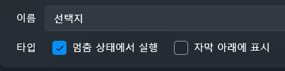

# 간단한 선택지와 분기 만들기

이 튜토리얼에서는 **이전 챕터(음성을 영상처럼 만들고 자막 달기)** 에서 만든 프로젝트를 이어서 사용합니다.  
그 프로젝트에서 이어 재생 도중 **선택지가 나타나고**,  
선택에 따라 **진행 / 스킵 / 종료**의 흐름을 만들 수 있는  
간단한 분기 시스템을 구현해봅니다.

---

## 🧭 전체 흐름 미리보기

아래와 같은 구조가 만들어집니다:

1. 트랙이 특정 지점에서 정지  
2. 화면에 선택지 UI 표시  
3. 버튼 클릭 →  
   - 그대로 진행  
   - 특정 구간으로 점프  
   - 종료  

---

# 1️⃣ 분기 처리 UI 만들기

분기 선택지가 표시될 전용 UI 화면을 만듭니다.

---

## 📌 UI 화면 생성

1. 상단 메뉴에서 **UI 탭** 선택  
2. **새로 만들기(New UI)** 클릭  
3. 새로운 UI 화면이 생성됩니다

---

## 📌 “멈춤 상태에서 실행” 옵션 켜기

트랙이 멈춘 상태에서도 UI가 작동하려면  
UI 속성에서 다음 옵션을 **반드시 활성화**합니다:

- **멈춤 상태에서 실행(Execute When Paused)** ✔

---

# 1-2️⃣ 선택지 버튼 3개 만들기

이제 사용자에게 보여줄 **3개의 선택지 버튼**을 UI 화면에 배치합니다.

준비할 버튼:

- 그래 아이스크림 먹자  
- 싫어  
- 종료  

왼쪽 컨트롤 목록에서 **Button** 컨트롤을 3번 드래그하여 UI 화면에 배치하세요.

---

## 💡 TIP: 버튼 배치 & 디자인 팁

- 버튼의 **정렬 포인트(Alignment)** 를 가운데 정렬로 바꾸면  
  UI 중앙에 깔끔하게 배치할 수 있습니다.
- 버튼의 표시 텍스트는 오른쪽 속성 창의 **Content** 항목에서 변경 가능합니다.
- 실제 장면 크기에 맞춰, 버튼의 **FontSize** 와 **크기(Width/Height)** 를  
  중간중간 재생 미리보기를 보면서 조절하는 것을 추천합니다.

---

# 3️⃣ 타임라인에 임시 스크립트 배치하기

이 분기 시스템은 **전역 스크립트(Global Script)** 가 아니라  
**타임라인에 직접 배치되는 임시 스크립트(Inline Script)** 를 사용해야 합니다.

임시 스크립트는 특정 시점에만 실행되는 스크립트로,  
분기 UI를 띄우는 데 가장 적합합니다.

---

## 📌 임시 스크립트 추가하기

1. 좌측 스크립트 패널에서  
   **“드래그하여 빈 스크립트 추가”** 항목을 클릭 & 드래그  
2. 타임라인의 스크립트 트랙 위에 놓습니다

---

## ⏱ 스크립트 실행 위치 맞추기

타임라인에 스크립트가 배치되면  
해당 블록을 드래그하여 **01:31.000(1분 31초)** 지점에 정확히 맞춥니다.

이 위치에 도달하면  
프로젝트는 멈추고 분기 UI가 표시될 것입니다.

---

# 3-1️⃣ 임시 스크립트 더블클릭하여 내용 편집하기

이제 배치한 임시 스크립트를 **더블클릭**하면  
스크립트 편집 화면이 열립니다.

여기에서 다음 두 액션을 추가합니다:

---

## ✨ ShowChoiceUI 임시 스크립트 구성

편집 화면에서 다음 두 동작을 순서대로 배치하세요:

1. **UI Show → 분기 UI 화면**  
   - 선택지 UI를 화면에 표시  
2. **Track Pause**  
   - 트랙을 즉시 일시 정지하여 버튼 선택을 기다림

주의
UI를 닫아도 지속적으로 열리는걸 방지하려면 1회 실행에 체크해야합니다.

아래는 구성 예시입니다.

---

이제 재생이 **01:31.000** 지점에 도달하면

- 트랙은 자동으로 멈추고  
- 선택지 UI가 팝업되며  
- 사용자가 버튼을 눌러 흐름을 선택할 수 있게 됩니다.

---

# 4️⃣ 선택지 버튼에 동작 연결하기

이제 UI에 있는 3개의 버튼이  
클릭되었을 때 어떤 동작을 할지 설정하겠습니다.

각 버튼의 동작을 설정하려면  
**UI 편집 화면에서 버튼 → Script → Click 이벤트 편집** 순으로 진행해야 합니다.

---

## 📌 버튼의 Click 이벤트 설정 화면 들어가기

1. 상단 메뉴에서 **UI 탭**을 눌러 UI 편집 화면을 엽니다  
2. 동작을 부여할 버튼(예: 그대로 진행 버튼)을 클릭  
3. 오른쪽 속성 패널의 **Script(스크립트)** 섹션으로 이동  
4. **Click 이벤트 → 편집(Edit)** 버튼 클릭  
5. 스크립트 편집 창이 열립니다

---

# ✔ “그대로 진행” 버튼 (Resume)

트랙을 다시 재생시키는 버튼입니다.

Click 이벤트 편집 화면에서 아래 두 액션을 추가합니다:

- **UI를 닫습니다.**  
- **트랙을 다시 재생합니다.**  

---

# ✔ “특정 구간 스킵” 버튼 (Jump Track)

특정 위치로 이동하는 선택지입니다.

예: **1분 20초(00:01:20.000)** 로 점프시키기

Click 이벤트 편집 화면에서 아래 두 액션을 순서대로 추가합니다:

- **UI를 닫습니다.**  
- **시간을 이동합니다.**  
- **트랙을 다시 재생합니다.**  

---

# ✔ “종료” 버튼 (Exit/Stop)

프로젝트를 종료하는 버튼입니다.

Click 이벤트에서 아래 액션 추가하세요:

- **종료합니다.**

종료 기능은 편집에서는 아무 기능이 없지만 플레이 모드에서는 실제로 프로그램이 종료됩니다.

---

## ✨ 결과

이제 UI 버튼 3개는 다음과 같이 동작합니다:

- **그대로 진행** → UI 닫고 트랙 재개  
- **특정 구간 스킵** → UI 닫고 특정 시간으로 이동  
- **종료** → 프로젝트 종료  

트랙이 멈춰 있는 동안 UI 버튼이 정상적으로 작동하는 것은  
UI 생성 시 **“멈춤 상태에서 실행”** 옵션을 켜두었기 때문입니다.

---

# 6️⃣ 전체 동작 흐름 요약

- 분기 시점 도달  
- ShowChoiceUI 실행 → UI 표시 + 트랙 정지  
- 사용자 선택  
- 버튼별 스크립트 실행  
  - 진행: Resume  
  - 스킵: Jump Track  
  - 종료: Project Stop  

---

# ✨ 완성

이제 다음 기능을 완전히 구현했습니다:

- 트랙이 분기 시점에서 자동 정지  
- 선택지 UI 팝업  
- 버튼 선택에 따라 다른 흐름 진행  
- 간단한 메뉴 시스템도 구현 가능  

다음 튜토리얼에서는 **중급 변수 & 조건 논리 시스템**을 배웁니다.

👉 [변수와 조건 논리](intermediate-logic.md)
