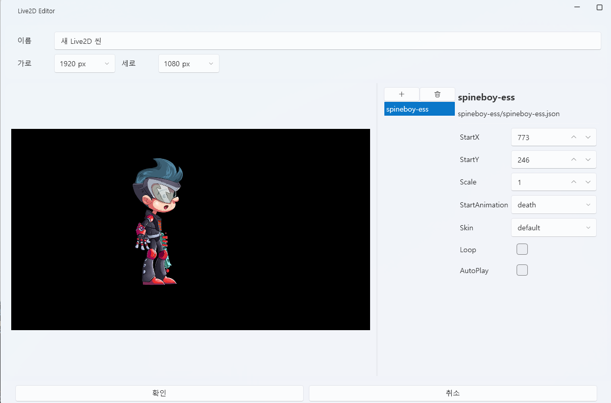

# Live2D 탭

Live2D 탭은 **캐릭터 씬(Scene)** 을 구성하고  
Spine 모델을 배치하여 애니메이션을 설정하는 편집 탭입니다.  
모든 Live2D 리소스는 **프로젝트 내부(`Asset/Live2D/`)에 자동 저장**되며,  
외부 참조 옵션은 제공되지 않습니다.

---

## 1. 기본 인터페이스

| 구성 요소 | 설명 |
|------------|------|
| **① 가져오기** | Live2D Scene(`.live2d`) 파일을 불러옵니다. |
| **② 새로 만들기** | 새 Live2D 씬(Scene)을 생성합니다. |
| **③ 편집 ✏️** | 선택한 씬의 세부 편집 창을 엽니다. |
| **④ 삭제 🗑️** | 선택한 씬을 프로젝트에서 제거합니다. |
| **⑤ 폴더 열기 📂** | `Asset/Live2D/` 폴더를 바로 엽니다. |

> 💡 **참고:**  
> Live2D 씬은 프로젝트 내에서만 관리되며,  
> 외부 참조나 내보내기 기능은 지원하지 않습니다.

---

## 2. Live2D 씬 편집기

Live2D 편집기는 여러 Spine 오브젝트를 한 화면에 배치하여  
캐릭터 연출을 구성할 수 있는 독립된 에디터입니다.

---

### 🎛️ 상단 패널

| 항목 | 설명 |
|------|------|
| **이름** | 현재 편집 중인 씬(Scene)의 이름을 지정합니다. |
| **가로 / 세로 해상도** | 씬의 해상도를 설정합니다. (예: 1920x1080) |
| **씬 미리보기 영역** | 배경과 함께 Spine 오브젝트를 시각적으로 배치할 수 있습니다. |
| **오브젝트 목록 (오른쪽 패널)** | 현재 씬에 포함된 Spine 오브젝트의 리스트가 표시됩니다. |

---

### 🧩 Spine 오브젝트 관리

Live2D 씬 내부에는 여러 Spine 오브젝트를 추가할 수 있습니다.  
각 오브젝트는 고유의 위치, 크기, 애니메이션, 스킨을 개별적으로 가집니다.

| 항목 | 설명 |
|------|------|
| **이름** | Spine 오브젝트 이름입니다. |
| **StartX / StartY** | 씬 내 위치 좌표를 지정합니다. (가로/세로 픽셀 단위) |
| **Scale** | 캐릭터의 크기를 조정합니다. |
| **StartAnimation** | 처음 재생할 애니메이션을 지정합니다. (예: `idle`, `aim`, `walk`) |
| **Skin** | Spine 모델의 외형 스킨을 선택합니다. |
| **Loop** | 애니메이션을 반복 재생합니다. |
| **AutoPlay** | 씬 로드 시 자동으로 애니메이션을 시작합니다. |

> 💡 **팁:**  
> 오브젝트는 미리보기 화면에서 **드래그로 직접 위치 조정**할 수도 있습니다.  
> 여러 캐릭터를 배치해 장면 전체를 구성할 수 있습니다.

---

### ➕ 오브젝트 추가 및 삭제

| 작업 | 설명 |
|------|------|
| **추가(+) 버튼** | 새로운 Spine 오브젝트를 씬에 추가합니다. |
| **삭제(🗑️ 버튼)** | 선택된 Spine 오브젝트를 씬에서 제거합니다. |

---

## 3. 트랙 및 스크립트 연동

Live2D 씬은 타임라인뿐만 아니라 **스크립트와 직접 연동**할 수 있습니다.  
이를 통해 특정 이벤트나 조건에 따라 **모션, 위치, 크기, 진행도** 등을 실시간으로 제어할 수 있습니다.

---

### 🎞️ 트랙 연동

Live2D 씬은 타임라인 트랙에 배치하여  
다른 리소스(사운드, 이벤트, UI 등)와 시간축 기준으로 연동할 수 있습니다.

| 기능 | 설명 |
|------|------|
| **드래그 추가** | Live2D 씬을 타임라인에 드래그해 배치합니다. |
| **조건 편집** | 특정 조건을 만족할 때만 씬이 표시되도록 설정합니다. |
| **시간 조정** | 씬의 표시 구간(시작/종료 시점)을 직접 지정할 수 있습니다. |

> 💡 **예시:**  
> - 특정 사운드 구간에 캐릭터 모션을 표시  
> - UI 선택 이후 캐릭터의 표정 전환 트리거  
> - 클라이맥스 이벤트 시 자동 재생

---

### ⚙️ 스크립트 연동

Live2D 오브젝트는 스크립트에서 **직접 변수로 제어**할 수 있습니다.  
변수 설정 창을 열면 다음과 같은 구조로 Live2D 항목이 표시됩니다.

| 구성 요소 | 설명 |
|------------|------|
| **Live2D 씬 선택** | 제어할 씬(Scene)을 선택합니다. |
| **Spine 오브젝트 선택** | 씬 안에 포함된 개별 오브젝트를 선택합니다. |
| **속성 선택** | 조작할 변수를 선택합니다. |

---

### 📊 제어 가능한 주요 변수

| 변수 | 설명 |
|------|------|
| **AnimationProgress** | 현재 애니메이션 진행률(0.0~1.0) — 시간 기반 제어에 사용 |
| **X / Y** | 오브젝트의 좌표를 변경합니다. |
| **Scale** | 캐릭터의 크기를 조절합니다. |

> 💡 **팁:**  
> 스크립트 내에서 Live2D 변수를 실시간으로 변경하면  
> 애니메이션 도중 캐릭터의 위치, 크기, 표정 등을 자연스럽게 조정할 수 있습니다.  

---

### 🧩 예시 스크립트

> 🎯 **결과:**  
> 위 스크립트를 실행하면 캐릭터의 위치와 크기, 애니메이션 진행률이  
> 실시간으로 변경되어 타임라인과 완벽하게 동기화됩니다.

---

### 🔗 트리거 연동 활용 예시

| 상황 | 트리거 동작 |
|------|--------------|
| 버튼 클릭 시 | 특정 Spine 캐릭터의 `AnimationProgress`를 1로 설정하여 애니메이션 즉시 완료 |
| 이벤트 발생 시 | `Scale` 값을 1.0 → 1.5로 변경하여 캐릭터 확대 연출 |
| 타이머 기반 | `Y` 값을 점진적으로 변경하여 캐릭터가 위로 이동하는 효과 |

---

> 💡 **참고:**  
> Live2D 변수는 UI, 사운드, 스트로크 이벤트와 동일한 방식으로 접근할 수 있으며,  
> **PlayData 스크립트 시스템**을 통해 모든 이벤트에서 통합 제어가 가능합니다.

---

### 🎬 Spine 제어 스크립트

Live2D 씬의 Spine 오브젝트는 스크립트를 통해  
**애니메이션 재생**과 **스킨 변경**을 직접 제어할 수 있습니다.

---

#### 🕹️ Spine 애니메이션 재생

이 스크립트를 사용하면 특정 Spine 오브젝트의 애니메이션을 원하는 타이밍에 재생할 수 있습니다.

| 항목 | 설명 |
|------|------|
| **Live2D 씬 선택** | 제어할 씬을 지정합니다. |
| **Spine 오브젝트 선택** | 재생할 Spine 모델을 선택합니다. |
| **애니메이션 이름** | 실행할 애니메이션(`idle`, `attack`, `death` 등)을 지정합니다. |
| **상태** | 애니메이션 종료 시 동작을 설정합니다.  예: `멈춤`, `루프`, `다음 애니메이션으로` 등 |
| **중첩 재생 모드** | 다른 애니메이션 위에서 재생할지(Blend) 여부를 지정합니다. |
| **활성화 / 비활성화** | 애니메이션을 활성 또는 중지 상태로 설정합니다. |

> 💡 **활용 예시:**  
> - 대사 구간에서 캐릭터의 `talk` 모션 재생  
> - 이벤트 완료 시 `happy` 모션으로 전환  
> - 클라이맥스 장면에서 `death` 애니메이션 재생

---

#### 🎨 Spine 스킨 변경

Spine 캐릭터의 스킨을 변경하여 다른 복장, 표정, 장비 등을 적용할 수 있습니다.

| 항목 | 설명 |
|------|------|
| **Live2D 씬 선택** | 제어할 씬을 지정합니다. |
| **Spine 오브젝트 선택** | 스킨을 변경할 Spine 모델을 선택합니다. |
| **스킨 이름** | 적용할 스킨 이름(`default`, `costume1`, `damaged` 등)을 선택합니다. |

> 💡 **활용 예시:**  
> - 스토리 진행에 따라 복장 전환 (`default` → `battle`)  
> - 특정 트리거에서 손상 상태(`damaged`)로 변경  
> - 선택지 결과에 따라 다른 캐릭터 외형 표시

---

> ⚙️ **추가 팁:**  
> Spine 애니메이션 제어 스크립트와 Live2D 변수 제어 스크립트를 함께 사용하면,  
> “모션 + 위치 이동 + 확대/축소” 같은 복합 연출을 손쉽게 구성할 수 있습니다.

---

## 4. 파일 구조

| 항목 | 경로 |
|------|------|
| **씬 데이터** | `Asset/Live2D/SceneName.live2D` |
| **Live2D 모델 파일** | `Asset/Live2DModel/` |
| **Spine 모델 파일** | `Asset/SpineModel/` |
| **텍스처 / 애니메이션 데이터** | Spine 모델 내부 폴더 구조 유지 |
| **미리보기 캐시** | `Asset/Live2D/` |

> ⚙️ **주의:**  
> Live2D 씬은 프로젝트 내부 전용으로 관리되며,  
> 경로를 변경하거나 외부로 이동할 경우 정상적으로 로드되지 않을 수 있습니다.

---

## 5. 관련 문서

- [사운드 탭](sound.md)  
- [비디오 탭](video.md)  
- [UI 탭](ui.md)  
- [타임라인 편집](timeline.md)
