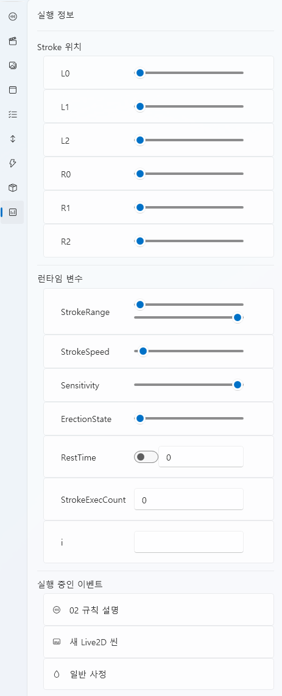

# 런타임 도우미 탭

런타임 도우미(Runtime Helper) 탭은 **프로젝트 실행 중 내부 상태를 실시간으로 확인하고 디버깅하는 도구**입니다.  
현재 동작 중인 Stroke의 위치, 런타임 변수 값, 전역 변수, 그리고 실행 중 이벤트 정보를  
한눈에 확인할 수 있습니다.

이 탭은 일반 사용자보다는 **개발자 및 스크립트 디버깅용**으로 설계되었습니다.

---

## 1. 인터페이스 개요

| 구성 요소 | 설명 |
|------------|------|
| **Stroke 위치** | 각 축(L0~R2)의 현재 동작 위치를 실시간으로 표시합니다. |
| **런타임 변수** | 실행 중 변하는 주요 제어 변수(속도, 범위 등)를 표시합니다. |
| **전역 변수** | 프로젝트 전역(Global) 변수의 현재 값을 보여줍니다. |
| **실행 중 이벤트** | 현재 활성화된 이벤트(사정, Live2D 씬, 자막 등)를 나열합니다. |

---

## 2. Stroke 위치

Stroke 위치 섹션은 장치의 각 축(Axis)의 실시간 좌표를 보여줍니다.  
이 값은 **읽기 전용(Read-only)** 상태이며, 실제 장치 또는 시뮬레이터의 움직임을 그대로 반영합니다.

| 축 이름 | 설명 |
|----------|------|
| **L0 ~ L2** | 왼쪽 채널의 축 위치 |
| **R0 ~ R2** | 오른쪽 채널의 축 위치 |

> 💡 **참고:**  
> 슬라이더의 위치는 물리적 장치의 실시간 모션을 그대로 표현하며,  
> 수동으로 변경은 불가능하며, 내부 상태를 관찰하기 위한 용도입니다.

---

## 3. 런타임 변수

실행 중 동적으로 변하는 주요 제어 변수를 표시합니다.  
이 값들은 스크립트나 이벤트에 따라 자동으로 갱신됩니다.

| 변수명 | 설명 |
|--------|------|
| **StrokeRange** | Stroke의 진폭(최대 이동 범위) |
| **StrokeSpeed** | Stroke의 속도 배율 |
| **Sensitivity** | 입력 감도 또는 반응 민감도 |
| **ErectionState** | 상태 기반 변수 (예: 흥분도, 감정 수치 등) |
| **RestTime** | 휴식 중인 시간(초) |
| **StrokeExecCount** | Stroke가 실행된 횟수 |
| *(기타 변수)* | 현재 스크립트나 환경에서 선언된 전역 변수 |

> 💡 **팁:**  
> 이 영역의 값은 **스크립트 로직 테스트나 밸런스 조정 시 디버깅용**으로 활용됩니다.  

---

## 4. 실행 중 이벤트

이 영역은 현재 활성화된 이벤트 목록을 보여줍니다.  
각 이벤트는 해당 시점에 동작 중인 기능(자막, Live2D, 스트로크, 특수 이벤트 등)을 나타냅니다.

| 예시 | 설명 |
|------|------|
| **새 Live2D 씬** | 활성화된 Live2D 애니메이션 |
| **일반 사정** | 현재 진행 중인 특수 이벤트 |

> 💡 **참고:**  
> 이벤트가 종료되면 목록에서 자동으로 제거됩니다.  
> 여러 이벤트가 동시에 작동할 경우, 상단부터 순서대로 표시됩니다.

---

## 5. 활용 예시

| 목적 | 활용 방법 |
|------|------------|
| **디버깅** | 스트로크 위치, 변수 상태, 이벤트 동작 여부를 실시간으로 확인 |
| **테스트** | 스크립트 실행 시 변수 변화량 검증 |
| **성능 점검** | 여러 이벤트가 동시에 작동할 때 변수 변화를 모니터링 |

---

## 7. 관련 문서

- [스트로크 탭](stroke.md)  
- [특수 이벤트 탭](special-event.md)  
- [리소스 관리 탭](resources.md)
