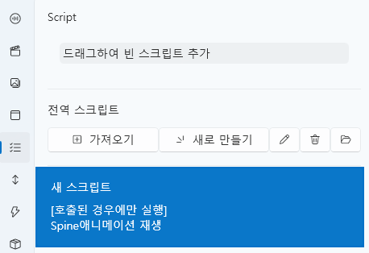

# 스크립트 탭

스크립트 탭은 **VoiceScriptPlayer의 핵심 로직을 담당하는 시스템**으로,  
프로젝트 내의 모든 이벤트, 인터랙션, 애니메이션, UI, 사운드 등을  
**조건과 동작(액션)** 으로 제어할 수 있는 편집 도구입니다.

---

## 1. 기본 인터페이스

| 구성 요소 | 설명 |
|------------|------|
| **① 드래그하여 빈 스크립트 추가** | 인스턴스 스크립트를 생성하여 프로젝트에 추가합니다. |
| **② 전역 스크립트** | 항상 로드되는 전역 스크립트를 관리합니다. |
| **③ 가져오기** | 기존에 저장된 Script 템플릿을 불러옵니다. |
| **④ 새로 만들기** | 새 Script 템플릿을 생성합니다. |
| **⑤ 편집 ✏️** | 선택한 Script를 편집기로 엽니다. |
| **⑥ 삭제 🗑️** | 선택한 Script를 목록에서 제거합니다. |
| **⑦ 폴더 열기 📂** | `Asset/Trigger/` 폴더를 바로 엽니다. |

> 💡 **참고:**  
> 전역 스크립트는 기본적으로 항상 존재하지만,  
> “호출된 경우에만 실행” 옵션을 통해 템플릿처럼 활용할 수도 있습니다.

---

## 2. 스크립트 편집기

스크립트 편집기는 **조건(Condition)** 과 **액션(Action)** 블록을 자유롭게 배치하여  
복잡한 논리를 시각적으로 구성할 수 있는 에디터입니다.

---

### 🧭 상단 패널

| 항목 | 설명 |
|------|------|
| **이름(Name)** | 스크립트의 고유 이름을 지정합니다. |
| **설명(Description)** | 스크립트의 목적이나 기능을 간단히 메모합니다. |
| **1회 실행** | 한 번만 실행되고 다시 호출되지 않습니다. |
| **멈춤 상태에서 실행** | 일시정지 중에도 실행됩니다. (메뉴, 설정 창 등에서 사용) |
| **호출된 경우에만 실행** | 외부 트리거나 명령으로 호출될 때만 실행됩니다. |

---

### 🧩 지역 변수

| 기능 | 설명 |
|------|------|
| **추가(＋)** | 스크립트 내부에서 사용할 지역 변수를 생성합니다. |
| **편집(✏️)** | 변수 이름과 초기값을 변경합니다. |
| **삭제(🗑️)** | 선택된 변수를 제거합니다. |

> 💡 **참고:**  
> 지역 변수는 해당 스크립트 내부에서만 유효하며,  
> 다른 스크립트나 전역 변수와 충돌하지 않습니다.

---

## 3. 조건(Condition) 블록

조건(Condition) 블록은 **스크립트가 실행될지 여부를 결정**하는 역할을 합니다.  
하나 이상의 조건을 조합하여 **세밀한 트리거 논리**를 구성할 수 있습니다.

---

### ⚙️ 기본 개념

- 조건이 **모두 참(True)** 일 경우, 연결된 **액션(Action)** 블록이 실행됩니다.  
- 여러 조건을 나열하면 **AND (그리고)** 관계로 평가됩니다.  
- 분기(Branch) 블록을 사용하면 **조건 만족 / 불만족 시 각각 다른 경로**로 이어질 수 있습니다.  
- 조건 목록은 아래 [조건 목록](#10) 섹션을 참고하세요.

---

### 🧩 예시

| 상황 | 조건 예시 |
|------|------------|
| 특정 키 입력 | “키 [Space]가 눌린 경우입니다.” |
| 음성 인식 | “음성 [시작해]가 인식된 경우입니다.” |
| 변수 검사 | “변수 [Score]가 [100] 이상일 경우입니다.” |
| 자막 반응 | “자막에 [Hello]가 포함된 경우입니다.” |

> 💡 **팁:**  
> 조건은 UI, 사운드, Live2D 등 다양한 리소스 상태와도 연동됩니다.  
> 예를 들어 “현재 트랙이 1번이고, 자막에 특정 문장이 포함된 경우”와 같이 다중 조건을 설정할 수 있습니다.

---

## 4. 액션(Action) 블록

액션(Action) 블록은 조건이 충족되었을 때 **실제로 수행할 동작**을 정의합니다.  
사운드 재생, 변수 수정, 트랙 이동, UI 열기 등  
프로젝트 내 모든 동작은 액션 블록을 통해 제어됩니다.

---

### ⚙️ 기본 개념

- 액션은 **위에서 아래로 순차 실행**됩니다.  
- 대기(`Wait`) 액션을 삽입하여 **시간 제어**도 가능합니다.  
- 반복문과 함께 사용하면 **조건 충족 시 루프 동작**을 만들 수 있습니다.  
- 세부 명령어는 아래 [액션 목록](#11) 섹션을 참고하세요.

---

### 🧩 예시

| 상황 | 액션 예시 |
|------|-----------|
| 사운드 재생 | “사운드 [Voice01]를 재생합니다.” |
| 트랙 전환 | “트랙 [NextScene]으로 변경합니다.” |
| 변수 조정 | “변수 [Volume]을 +10만큼 증가시킵니다.” |
| UI 열기 | “UI [OptionMenu]를 식별자 [Main]으로 엽니다.” |
| Live2D 제어 | “Live2D [Scene01]의 애니메이션 [smile]을 재생합니다.” |

> 💡 **참고:**  
> 액션은 시간 기반으로도 동작할 수 있으며,  
> “3초 동안 변수 증가”, “2초간 애니메이션 전환”과 같은 연속적 효과를 만들 수 있습니다.

---

## 5. 분기(Branch) 블록

분기 블록은 **조건 충족 시**와 **불충족 시**의 동작을 나누는 구조입니다.

| 구성 | 설명 |
|------|------|
| **조건문** | 조건이 참(True)일 때 실행되는 구문입니다. |
| **조건 불만족문** | 조건이 거짓(False)일 때 실행되는 구문입니다. |

> 💡 여러 개의 분기문을 중첩하면 **복잡한 이벤트 시나리오**도 표현할 수 있습니다.

---

## 6. 반복문(Loop) 블록

반복문은 지정된 조건이 참인 동안 특정 액션 블록을 **지속적으로 반복**합니다.

| 항목 | 설명 |
|------|------|
| **반복 조건** | 변수나 이벤트 상태 등으로 반복 여부를 판단합니다. |

> 💡 반복문은 “특정 키가 눌린 동안 지속 재생”, “자막이 나올 때까지 대기” 등  
> 지속적인 반응 처리에 유용합니다.

---

## 7. 조건과 액션의 조합

스크립트는 여러 조건과 액션을 조합하여 동작합니다.  
각 블록은 드래그로 순서를 조정할 수 있으며,  
상단의 아이콘을 통해 복사 / 잘라내기 / 이동이 가능합니다.

| 아이콘 | 기능 |
|--------|------|
| ➕ | 새 블록(조건 또는 액션)을 추가합니다. |
| 🔀 | 조건 분기를 추가합니다.   (조건문 / 조건 불만족문 형태로 구성됩니다.) |
| 🔀 | 반복문을 추가합니다.   (조건이 충족되는 동안 지정된 블록을 반복 실행합니다.) |
| ✏️ | 선택한 블록을 수정합니다. |
| ✂️ | 블록을 잘라냅니다. |
| 📋 | 복사 / 붙여넣기 기능을 수행합니다. |
| 🗑️ | 선택한 블록을 삭제합니다. |
| ⬆️ / ⬇️ | 블록의 실행 순서를 위아래로 조정합니다. |

> ⚙️ **팁:**  
> 스크립트 내의 블록 구조는 언제든지 수정 가능하며,  
> 실행 중에도 실시간으로 디버깅이 가능합니다.

---

## 8. 전역 스크립트와 인스턴스 스크립트

스크립트는 **전역(Global)** 과 **인스턴스(Instance)** 두 가지 형태로 구분됩니다.

| 구분 | 설명 |
|------|------|
| **전역 스크립트** | 항상 로드되며 프로젝트 전체에 적용됩니다. |
| **인스턴스 스크립트** | 특정 트랙이나 UI, 이벤트에 종속되어 실행됩니다. |

> 💡 **활용 예시:**  
> - 전역 스크립트 → HUD 업데이트, 시간 경과 이벤트  
> - 인스턴스 스크립트 → 특정 선택지나 연출에만 적용되는 로직

---

## 9. 스크립트 실행 방식

| 옵션 | 설명 |
|------|------|
| **1회 실행** | 조건이 충족되면 한 번만 실행됩니다. |
| **호출된 경우에만 실행** | 다른 스크립트나 트리거에서 호출될 때만 실행됩니다. |
| **멈춤 상태에서 실행** | 일시정지 중에도 실행됩니다. (메뉴/설정창 등에서 활용) |
| **무한 반복(Loop)** | 조건을 충족하는 동안 계속 실행됩니다. |

---

## 10. 조건 목록 {: #10 }

조건(Condition)은 스크립트 실행의 전제 조건을 정의합니다.  
아래는 사용 가능한 조건과 각 인자 설명입니다.

---

### 🖱️ 키 입력 관련

#### 🔹 KeyDown
키 **[Key]** 가 눌려 있는 경우입니다.  
- **Key** : 감지할 키를 지정합니다. (예: `A`, `Space`, `Enter`)

#### 🔹 KeyUp
키 **[Key]** 가 눌려 있지 않은 경우입니다.  
- **Key** : 검사할 키를 지정합니다.

#### 🔹 KeyPressed
키 **[Key]** 가 눌린 경우입니다.  
- **Key** : 눌림 순간(Down → Up)을 감지합니다.

---

### 🗣️ 음성 / 자막 관련

#### 🔹 SpeechRecognition
음성 **[Text]** 가 볼륨 **[Volume]** 이상, 정확도 **[Precision]** 이상으로 감지된 경우입니다.  
- **Text** : 인식할 음성 내용  
- **Volume** : 최소 볼륨 (0~1)  
- **Precision** : 인식 정확도 기준 (0~1)

#### 🔹 SubtitleRecognition
자막에 **[Text]** 가 포함된 경우입니다.  
- **Text** : 검색할 문자열

---

### 📊 상태 및 변수 관련

#### 🔹 VariableComparison
변수 **[Variable]** 이 **[Text]** 보다 **[Comparison]** 일 경우입니다.  
- **Variable** : 비교할 변수 이름  
- **Text** : 비교할 값  
- **Comparison** : `이상`, `이하`, `초과`, `미만`, `같음`, `다름`

#### 🔹 CurrentTrack
현재 트랙이 **[Track]** 인 경우입니다.  
- **Track** : 트랙 이름 또는 ID

#### 🔹 CumAction
사정 액션 **[CumType]** 이 발동된 경우입니다.  
- **CumType** : 사정 액션 종류 (`모두`, `Edge` 등)

#### 🔹 RestStatus
휴식 상태가 **[Status]** 인 경우입니다.  
- **Status** : `활성`, `비활성`

#### 🔹 EventStatus
이벤트 **[EventType]** 가 **[EventStatus]** 인 경우입니다.  
- **EventType** : 이벤트 종류  
- **EventStatus** : `활성화`, `모두 비활성화`

---

## 11. 액션 목록

액션(Action)은 조건 충족 시 실행되는 실제 동작을 정의합니다.

---

### ⏱️ 시간 제어

#### 🔹 WaitTime
시간 **[Seconds]** 초 만큼 대기합니다.  
- **Seconds** : 대기 시간 (초)

---

### 🔊 사운드 제어

#### 🔹 PlaySound
사운드 **[Sound]** 를 재생합니다.  
왼쪽 볼륨: **[LeftVolume]**, 오른쪽 볼륨: **[RightVolume]**  
- **Sound** : 사운드 이름  
- **LeftVolume / RightVolume** : -1~1 범위의 볼륨 비율, -1일 경우 반대쪽에서 들림

---

### 📦 변수 / 트랙 제어

#### 🔹 SetVariable
변수 **[WritableVariable]** 를 **[Text]** 만큼 **[Modify]** 합니다.  
**[Seconds]** 초 동안 진행됩니다.  
- **WritableVariable** : 변경할 변수  
- **Text** : 값 또는 수식  
- **Modify** : `대입`, `덧셈`, `뺄셈`, `곱셈`, `나누기`, `나머지`  
- **Seconds** : 적용 시간

#### 🔹 MoveTrack
트랙 **[Track]** 으로 변경합니다.  
- **Track** : 이동할 트랙 이름 또는 ID

#### 🔹 SeekTime
현재 트랙의 시간을 **[Seconds]** 초로 변경합니다.  
- **Seconds** : 이동할 시간 (초)

#### 🔹 PauseTrack / ResumeTrack / ToggleTrack
트랙 재생 상태를 일시 정지 / 재개 / 토글합니다.

---

### 💾 데이터 관리

#### 🔹 Save / Load
현재 진행 상태를 **Slot:[Slot]** 에 저장 / 불러옵니다.  
- **Slot** : 저장 슬롯 번호

#### 🔹 Close
현재 프로그램을 종료합니다.

---

### 🧩 UI 제어

#### 🔹 OpenUI / CloseUI
UI **[UI]** 를 식별자 **[Text]** 로 엽니다 / 닫습니다.  
- **UI** : UI 이름  
- **Text** : 인스턴스 식별자

---

### 🔁 스크립트 제어

#### 🔹 TriggerExec / ReturnScript
스크립트 **[Trigger]** 를 실행하거나 현재 스크립트를 종료합니다.  
- **Trigger** : 실행할 스크립트 이름

---

### 💦 액션 / 이벤트 제어

#### 🔹 CumActionExec
사정 액션 **[CumType]** 을 강제로 발생시킵니다.  
- **CumType** : 사정 액션 종류

#### 🔹 RestTime
시간 **[Seconds]** 초 만큼 휴식합니다.  
- **Seconds** : 대기 시간

#### 🔹 StrokeExec
스트로크 **[Stroke]** 를 **[Seconds]** 초간 발생시킵니다.  
- **Stroke** : 스트로크 이름  
- **Seconds** : 지속 시간

---

### 🎬 Live2D / Spine 제어

#### 🔹 SpinePlayAnimation
Live2D **[Live2D]** 에서 Spine **[Model]** 의 **[Animation]** 을  
**[PlayType]** 으로 **[TrackIndex]** 에 중첩 재생 **[Status]** 로 재생합니다.  
- **Live2D** : Live2D 씬 이름  
- **Model** : Spine 오브젝트 이름  
- **Animation** : 실행할 애니메이션 이름  
- **PlayType** : 재생 방식 (`멈춤상태`, `한번재생`, `반복재생`)  
- **TrackIndex** : 트랙 인덱스  
- **Status** : 활성 / 비활성 여부

#### 🔹 SpineSetSkin
Live2D **[Live2D]** 에서 Spine **[Model]** 의 스킨을 **[Skin]** 으로 설정합니다.  
- **Live2D** : Live2D 씬 이름  
- **Model** : Spine 오브젝트 이름  
- **Skin** : 적용할 스킨 이름

---

> ⚙️ **참고:**  
> 모든 조건과 액션은 시각적 블록 기반으로 구성되어있습니다.

---

## 12. 파일 구조

| 항목 | 경로 |
|------|------|
| **전역 스크립트** | `Asset/Trigger/` |

> ⚙️ **주의:**  
> 스크립트는 반드시 프로젝트 내부에 저장되어야 하며,  
> 외부 파일을 직접 참조할 수 없습니다.

---

## 14. 관련 문서

- [UI 탭](ui.md)  
- [Live2D 탭](live2d.md)  
- [타임라인 편집](timeline.md)
