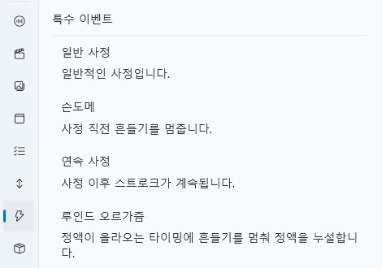

# 클라이맥스 탭

클라이맥스 탭은 **사정(Climax)이나 상태 변화에 따라 실행되는 특별한 트리거 이벤트**를 관리합니다.  
현재는 네 가지 고정 이벤트를 제공하며,  
각 이벤트는 타임라인 상의 노드 형태로 배치하여 작동 시점을 제어할 수 있습니다.

모든 이벤트는 고정 동작을 가지며,  
사용자가 직접 커스터마이징하거나 새로운 이벤트를 추가할 수는 없습니다.  
(단, 타임라인에 배치된 노드는 개별적으로 수정 및 삭제 가능합니다.)

---

## 1. 이벤트 목록

| 이벤트 | 설명 |
|---------|------|
| **일반 사정** | 가장 기본적인 사정 이벤트입니다. 사정 시점에 해당 동작이 트리거됩니다. |
| **손도메** | 사정 직전에 스트로크(기기 동작)를 멈춥니다. |
| **연속 사정** | 사정 이후에도 스트로크가 끊기지 않고 일정 시간 지속됩니다. |
| **루인드 오르가즘** | 사정 타이밍 직전에 스트로크를 멈추며, 정액을 억제하는 연출을 표현합니다. |

> 💡 **참고:**  
> 각 이벤트는 고정된 시스템 동작을 가지며,  
> 세부 로직은 수정할 수 없습니다.  
> 단축키와 휴식 설정만 개별적으로 조정 가능합니다.

---

## 2. 이벤트 편집기

타임라인 상에 특수 이벤트를 배치하면,  
해당 노드를 더블 클릭하여 **이벤트 옵션 창**을 열 수 있습니다.  
여기서 이벤트 발동 조건과 사정 이후의 동작을 설정합니다.

---

### ⚙️ 설정 항목

| 항목 | 설명 |
|------|------|
| **사정 타입** | 4가지 특수 이벤트 중 하나를 선택합니다. |
| **발동 단축키** | 이벤트를 즉시 실행할 키를 지정합니다. (예: LeftShift) |
| **휴식 시 스트로크 위치** | 이벤트 후 기기의 위치를 결정합니다. 맨 위 / 맨 아래 / 마지막 위치 유지 중 선택 가능 |
| **휴식 시간** | 이벤트 발생 후 기기가 정지된 상태를 유지하는 시간(초)을 지정합니다. |

---

### 💡 동작 흐름

1. 사용자가 단축키를 누르면 트리거 발생  
2. 지정된 **특수 이벤트 동작**이 실행됨  
3. 지정된 **휴식 시간 동안 스트로크가 정지**  
4. 휴식이 끝나면 다음 스트로크 패턴 또는 이벤트로 자동 전환

---

### 🧭 요약

| 항목 | 설명 |
|------|------|
| **이벤트 개수** | 현재 4종류 (일반 사정, 손도메, 연속 사정, 루인드 오르가즘) |
| **설정 가능 항목** | 단축키, 스트로크 위치, 휴식 시간 |
| **커스터마이징** | 불가 (고정된 시스템 이벤트) |
| **타임라인 연동** | 가능 – 각 이벤트는 노드 형태로 배치 가능 |

> ⚙️ **참고:**  
> 특수 이벤트는 사운드, 스트로크, 스크립트 등과 함께  
> 타임라인 상에서 조합되어 복합 연출을 구성할 수 있습니다.  
> 예를 들어, “손도메” 이벤트를 캐치하여 특정 사운드 재생을 연결하면  
> 자연스러운 인터랙티브 흐름을 만들 수 있습니다.

## 3. 관련 문서

- [스트로크 텝](stroke.md) — 스트로크 정의
- [스크립트](script.md) — 조건 변수, 트리거 정의  
- [런타임 도우미](runtime-helper.md) — 디버그 및 재생 테스트
