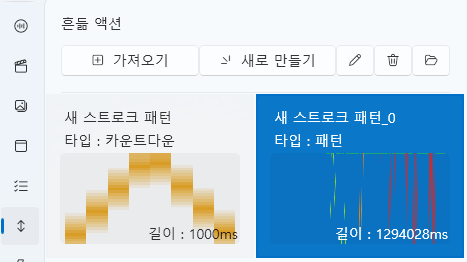

# 스트로크 탭

스트로크 탭은 **기기 동작(모션) 패턴을 설계하고 제어하는 편집 탭**입니다.  
각 축(Axis)의 움직임을 시간 단위로 제어하여  
진동·회전·왕복 등의 물리적 패턴을 구성할 수 있습니다.

모든 스트로크 데이터는 **프로젝트 내부(`Asset/Stroke/`)** 에 저장되며,  
외부 포맷(`.funscript`)과의 **호환 가져오기 / 내보내기** 기능을 제공합니다.

---

## 1. 기본 인터페이스

| 구성 요소 | 설명 |
|------------|------|
| **① 가져오기** | 저장된 스트로크(`.stroke`) 파일을 불러옵니다. |
| **② 새로 만들기** | 새로운 스트로크 패턴을 생성합니다. |
| **③ 편집 ✏️** | 선택한 스트로크의 세부 편집 창을 엽니다. |
| **④ 삭제 🗑️** | 선택된 스트로크를 프로젝트에서 제거합니다. |
| **⑤ 폴더 열기 📂** | `Asset/Stroke/` 폴더를 바로 엽니다. |

> 💡 **참고:**  
> 스트로크 탭의 기본 화면은 Live2D 탭과 동일한 구조를 가지고 있으며,  
> “혼듦 액션” 목록에 패턴을 추가하거나 편집할 수 있습니다.

---

## 2. 스트로크 편집기

“새로 만들기” 또는 “편집” 버튼을 클릭하면  
**Stroke Editor(스트로크 편집기)** 창이 열립니다.  
여기서 각 축의 움직임, 속도, 범위 등을 직접 조정할 수 있습니다.

---

### 🎛️ 상단 패널

| 항목 | 설명 |
|------|------|
| **이름** | 현재 스트로크 패턴의 이름을 지정합니다. |
| **타입** | 스트로크의 실행 방식을 선택합니다. |
| **시간에 고정** | 패턴 전체의 시간을 일정하게 유지합니다. |
| **속도 조절** | 재생 속도가 변수를 따라가는지 여부입니다. |
| **범위 조절** | 축의 최대 진폭이 변수를 따라가는지 여부입니다. |
| **축 타입** | `싱글 축`, `싱글 회전 축`, `멀티 회전 축` 중 선택합니다. |
| **길이** | 패턴 전체 길이를 밀리초(ms) 단위로 설정합니다. |
| **배율(%)** | 미리보기 화면의 표시 배율을 조정합니다. |

---

### 🧰 툴바

Stroke Editor 상단에는 **패턴 편집에 사용되는 주요 도구 모음(툴바)**이 있습니다.  
각 아이콘은 편집 중 빠르게 전환할 수 있으며, 단축키도 함께 제공합니다.

| 아이콘 | 이름 | 단축키 | 설명 |
|--------|------|---------|------|
| 📂 | **가져오기** | — | 외부 `.funscript` 파일을 불러옵니다. |
| 💾 | **내보내기** | — | 현재 패턴을 `.funscript` 형식으로 저장합니다. |
| ⬜ | **선택 툴** | — | 포인트나 영역을 선택합니다. 기본 편집 도구입니다. |
| ✥ | **이동 툴** | **M** | 선택된 포인트나 그래프를 이동합니다. 선택 상태에서도 `M`키를 누르면 이동 할 수 있습니다. |
| 🗑️ | **삭제** | **Del** | 선택된 포인트를 삭제합니다. |
| ✂️ | **잘라내기** | — | 선택된 영역만 남기고 나머지를 삭제합니다. |
| ➕ | **포인트 추가** | — | 포인트 추가 툴이 활성화된 상태에서 그래프를 클릭하면 포인트가 생성됩니다. |
| ⏺️ | **녹화 (미지원)** | — | 실시간 장치 입력을 기반으로 모션을 기록하는 기능입니다. (현재 비활성화) |

> 💡 **팁:**  
> 툴은 언제든 단축키로 즉시 전환할 수 있습니다.  
> 예를 들어 `M`키를 눌러 이동 툴로 전환하거나, `S`키로 다시 선택 툴로 돌아올 수 있습니다.

> ⚙️ **참고:**  
> `.funscript`는 널리 사용되는 개방형 모션 포맷으로,  
> 대부분의 외부 장치 및 소프트웨어와 호환됩니다.

---

### 🩰 축 관리

왼쪽의 축 목록(L0~R2)은 실제 장치의 각 축(Axis)을 의미하며,  
체크 상태로 활성화된 축만 편집과 재생에 반영됩니다.

| 축 이름 | 설명 |
|----------|------|
| **L0~L2** | 왼쪽 채널에 해당하는 축입니다. |
| **R0~R2** | 오른쪽 채널에 해당하는 축입니다. |
| **활성화 체크박스** | 각 축을 타임라인에 보여주는 옵션을 설정합니다. |

---

### 🧩 그래프 & 타임라인

중앙의 그래프 영역은 각 축(Axis)의 움직임을 시간에 따라 시각적으로 표시하는 공간입니다.  
시간 축(가로)과 값 축(세로)으로 구성되어 있으며,  
선택된 축의 포인트(점)들을 연결하여 모션 곡선을 형성합니다.

- **가로축(Time):** 시간 흐름 (ms 단위)  
- **세로축(Value):** 축의 상대적 위치 (0~100%)  
- **격자선(Grid):** 시간 단위와 값을 구분하기 위한 보조선  
- **포인트(Point):** 특정 시간에 축의 위치 값을 나타내는 조정 가능한 점  

---

#### 🎯 그래프 조작

그래프 영역은 **정적 편집 전용 인터페이스**로,  
줌이나 재생 기능 없이 포인트 이동과 추가를 중심으로 작동합니다.

| 기능 | 설명 |
|------|------|
| **선택 (Select Tool)** | 선택 툴 상태에서 클릭 또는 드래그로 여러 포인트를 선택할 수 있습니다. |
| **이동 (Move Tool)** | 툴바에서 이동 도구를 활성화하면, 선택된 포인트를 드래그하여 위치를 변경할 수 있습니다. |
| **포인트 추가 (Add Tool)** | 포인트 추가 툴이 활성화된 상태에서 그래프를 클릭하면 새로운 포인트가 생성됩니다. |
| **삭제 (Delete)** | 포인트를 선택한 뒤 Delete 키를 누르면 삭제됩니다. |
| **잘라내기 (Trim)** | 선택된 구간만 남기고 나머지 포인트를 제거합니다. |

> 💡 **참고:**  
> Stroke Editor는 타임라인 재생 개념이 없는 **정적 패턴 편집기**입니다.  
> 실제 동작 재생은 Stroke Player에서 이루어지며, 이 편집기에서는 패턴 형태만 설계합니다.

---

#### 🗺️ 미니맵 (Minimap)

그래프 하단에는 전체 스트로크 패턴의 축 움직임을 축소해 표시하는 **미니맵(Minimap)** 이 있습니다.  
현재 보고 있는 구간은 네모 박스로 강조되며,  
미니맵을 클릭하면 해당 구간으로 바로 이동할 수 있습니다.

| 기능 | 설명 |
|------|------|
| **뷰 이동** | 미니맵을 클릭하면 해당 위치로 스크롤이 이동합니다. |
| **현재 영역 표시** | 흰색 박스로 현재 편집 중인 화면 범위를 표시합니다. |
| **패턴 개요 확인** | 전체 패턴의 분포를 한눈에 확인할 수 있습니다. |

> 💡 **팁:**  
> 미니맵은 긴 패턴 편집 시 유용하며,  
> 빠르게 특정 구간으로 이동하거나 전체 구조를 파악할 수 있습니다.

---

## 3. 스트로크 타입

스트로크의 동작 방식은 **타입(Type)** 설정에 따라 달라집니다.  
아래 네 가지 타입을 통해 다양한 제어 방식을 구현할 수 있습니다.

---

### 3.1 패턴

시간 기반으로 자동 재생되는 일반적인 스트로크입니다.  
타임라인에 배치하거나 스크립트로 실행하면 설정된 패턴이 순차적으로 재생됩니다.

| 특징 | 설명 |
|------|------|
| **자동 재생** | 타임라인에 올리면 지정된 시간 동안 자동으로 실행됩니다. |
| **배속/범위 조정** | “속도 조절”, “범위 조절” 옵션으로 전체 속도와 진폭을 조정합니다. |
| **반복 루프** | 스크립트에서 반복 재생하도록 설정할 수 있습니다. |

---

### 3.2 수동 실행

**Space 키**를 누를 때마다 패턴이 1회 재생됩니다.  
직접적인 조작이나 인터랙티브 이벤트에 적합합니다.

| 항목 | 설명 |
|------|------|
| **1회 재생** | 키가 눌릴 때마다 설정된 패턴이 1회 실행됩니다. |

---

### 3.3 마우스 제어

마우스의 움직임을 실시간으로 추적하여 축을 이동시킵니다.  
L0 축은 세로(위/아래), R0 축은 가로(좌/우) 움직임에 반응합니다.

| 항목 | 설명 |
|------|------|
| **L0 축** | 마우스의 세로(위/아래) 이동을 따라갑니다. |
| **R0 축** | 마우스의 가로(좌/우) 이동을 따라갑니다. |
| **실시간 제어** | 패턴이 아닌 현재 마우스 위치를 실시간으로 반영합니다. |

---

### 3.4 카운트다운

카운트다운 타입은 **사정 단계(Progress)** 와 **카운터(Counter)** 간의 상호작용을 기반으로  
패턴의 속도와 형태를 동적으로 조정하는 고급 제어 모드입니다.

| 항목 | 설명 |
|------|------|
| **0~10 단계 버튼** | 각 카운터 단계별로 사용할 패턴을 지정합니다. |
| **패턴 설정 패널** | 카운터 값과 사정 단계(Progress)에 따라 실행할 패턴을 구성합니다. |
| **초기화 버튼** | 패턴 설정 패널 왼쪽 위의 초기화 버튼을 누르면 패턴이 초기화됩니다. |
| **패널 그래프** | 가로축은 카운터, 세로축은 사정 단계(Progress)이며, 셀의 값은 실행 패턴 번호를 나타냅니다. 왼클릭으로 증가, 우클릭으로 감소합니다. |
| **카운트 소리 설정** | 각 카운터를 셀때 출력 할 소리입니다. |

---

#### ⚙️ 속도 보정 (Penalty Speed)

| 항목 | 설명 |
|------|------|
| **패널티 최대 속도** | 카운터보다 **사정과 멀(숫자가 클) 경우**, 속도가 **가속**됩니다. |
| **패널티 최저 속도** | 카운터보다 **사정에 가까울(숫자가 작을) 경우**, 속도가 **감속**됩니다. |

> 💡 **예시**  
> - 카운터 = 1, 사정 단계 = 10 → 속도 **최대 가속**  
> - 카운터 = 10, 사정 단계 = 1 → 속도 **최저 감속**

---

## 4. 스크립트 연동

| 명령 | 설명 |
|------|------|
| **StrokeExec** | 특정 스트로크를 지정 시간 동안 재생합니다. |

> 💡 **팁:**  
> 스트로크를 타임라인에 직접 드래그하여 배치할 수도 있으며,  
> 다른 리소스(사운드, Live2D 등)와 함께 정밀하게 동기화할 수 있습니다.

---

## 5. 파일 구조

| 항목 | 경로 |
|------|------|
| **스트로크 데이터** | `Asset/Stroke/StrokeName.stroke` |
| **미리보기 캐시** | `Asset/Stroke/` |

> ⚙️ **참고:**  
> 스트로크 데이터는 프로젝트 내부 전용이며,  
> 파일을 외부로 이동하거나 이름을 변경할 경우  
> 타임라인 연동이 정상적으로 작동하지 않을 수 있습니다.

---
## 6. 스트로크 사운드 설정

스트로크 탭에서는 **모션(스트로크)에 사운드를 연동**할 수 있습니다.  
이를 통해 스트로크의 위치, 속도, 범위에 따라  
리듬감 있는 효과음이나 인터랙션 사운드를 재생할 수 있습니다.

---

### 🔊 사운드 팩 템플릿

| 항목 | 설명 |
|------|------|
| **불러오기** | 기존에 저장된 사운드 팩 템플릿을 불러옵니다. |
| **팩 저장** | 현재 설정된 사운드 조합을 사운드 팩으로 저장합니다. |

---

### 📁 패턴 파일 관리

| 항목 | 설명 |
|------|------|
| **패턴 불러오기** | 저장된 사운드 패턴을 불러옵니다. |
| **패턴 저장** | 현재 사운드 패턴을 저장합니다. |

---

### 📃 사운드 목록

왼쪽 패널에는 현재 스트로크에 연결된 **사운드 목록**이 표시됩니다.

| 버튼 | 설명 |
|------|------|
| ➕ 추가 | 새로운 사운드를 추가합니다. |
| ✏️ 편집 | 선택한 사운드를 편집합니다. |
| 🗑️ 삭제 | 선택한 사운드를 제거합니다. |

---

## 6.1 사운드 프로퍼티

사운드 목록에서 항목을 선택하면  
오른쪽에 **사운드 프로퍼티(Sound Property)** 패널이 표시됩니다.

---

### 🎯 기본 설정

| 항목 | 설명 |
|------|------|
| **트리거 타입** | 사운드가 재생되는 기준 위치 (`Continuous`,`AtTop`,`AtBottom`,`MovingUp`,`MovingDonw` 등) |
| **사운드 파일** | 재생할 사운드 파일 목록 (여러 개 지정 가능) |
| **음량** | 사운드의 출력 볼륨 |
| **피치** | 사운드의 재생 피치 |
| **재생 확률** | 사운드가 재생될 확률 (%) |
| **쿨타임 (초)** | 사운드가 다시 재생되기까지의 최소 간격 |

> 💡 여러 사운드를 등록한 경우  
> 재생 시 무작위로 하나가 선택됩니다.

---

### ⚡ 속도 임계값 (Speed Threshold)

스트로크의 **속도**에 따라 사운드를 제한하는 설정입니다.

| 항목 | 설명 |
|------|------|
| **최소 속도** | 이 값 이상일 때만 사운드가 재생됩니다. |
| **최대 속도** | 이 값을 초과하면 사운드가 재생되지 않습니다. |

> 💡 빠른 스트로크에서만 효과음을 내고 싶을 때 유용합니다.

---

### 📏 구간 및 거리 설정

스트로크의 **위치 범위**와 **최소 이동량**에 따라 사운드를 제어합니다.

| 항목 | 설명 |
|------|------|
| **시작 지점** | 사운드가 유효한 스트로크 시작 범위 |
| **종료 지점** | 사운드가 유효한 스트로크 종료 범위 |
| **최소 스트로크** | 사운드가 재생되기 위한 최소 이동 거리 |

> 💡 짧은 미세 움직임에서는 소리를 내지 않도록 필터링할 수 있습니다.

---

### 🔄 동작 흐름 예시

1. 스트로크가 실행됨  
2. 설정된 **트리거 타입**에 도달  
3. 속도 / 위치 / 최소 스트로크 조건 검사  
4. 재생 확률 체크  
5. 조건을 만족하면 사운드 재생  
6. 쿨타임 동안 재생 제한

---

## 6.2 활용 팁

- 스트로크의 **리듬감 강화**
- 카운트다운 / 패턴 타입과 함께 사용하여 몰입도 상승
- 속도 기반 효과음으로 동작의 강약 표현
- 여러 짧은 사운드를 등록해 반복 재생의 단조로움 방지

---

## 7. 관련 문서

- [특수 이벤트 탭](special-event.md)
- [사운드 탭](sound.md)
- [비디오 탭](video.md)
- [UI 탭](ui.md)
- [스크립트 탭](script.md)
