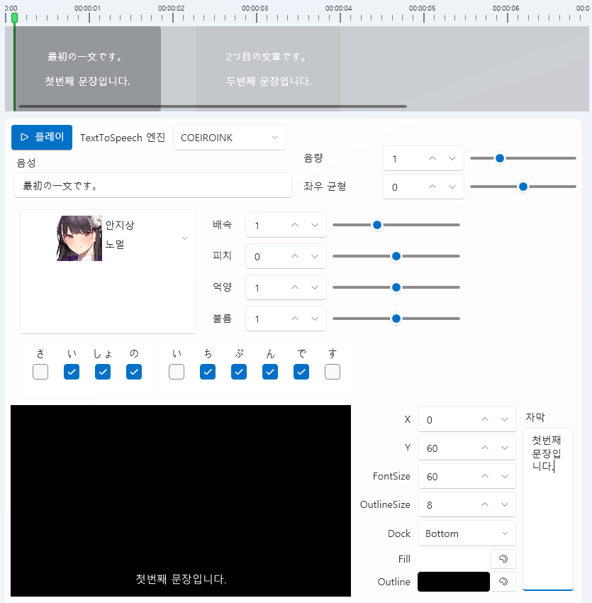

# COEIROINK 语音合成 (Text-to-Speech)

## 1. 概述 (Overview)
COEIROINK 是一款以日语为中心的 **文本语音合成（TTS）软件**。  
它可以生成自然流畅的对白式语音，并且可以下载和添加多种角色声音。  
在 VoiceScriptPlayer 中，可用于 **剧本语音化** 和 **角色配音合成** 等功能。  

---

## 2. 安装与准备 (Installation & Setup)
1. **下载 COEIROINK**  
   从 [官方网站](https://coeiroink.com/download) 下载最新版本。  

   - **CPU 版本**  
     - 可在所有 PC 上运行  
     - 虽然速度较慢，但在没有 GPU 的环境下也能稳定运行  

   - **GPU 版本（使用 CUDA）**  
     - 适用于 NVIDIA GPU 环境  
     - 比 CPU 快约 3~10 倍  
     - 需要安装 **CUDA（推荐版本 11.8）**  
     - [CUDA 下载地址](https://developer.nvidia.com/cuda-11-8-0-download-archive)  

   

2. **运行准备**  
   - COEIROINK 无需安装。  
   - 将下载的压缩包（zip 文件）解压到任意位置，  
     然后直接运行其中的 **`COEIROINK2.exe`** 文件即可。  
   - 无需修改路径或使用管理员权限。  
   

3. **首次启动时的使用条款**  
   - 第一次启动 COEIROINK 时会显示 **使用条款（利用規約）**。  
   - 必须先点击 "利用規約" 查看内容后，左侧的 **「同意する（同意）」按钮** 才会启用。  
   - 不同意则无法继续使用。  
   - 使用 COEIROINK 时，**必须标注署名（Credit）**（例如：`COEIROINK:合成音声名`）。  
   

---

## 3. 设置方法 (Configuration)
只需运行 COEIROINK，VoiceScriptPlayer 即可自动连接。  
以下为程序顶部菜单的说明。

---

### 📂 项目菜单

- **新建项目 (新規プロジェクトを作成)**  
- **打开项目 (プロジェクトを開く)**  
- **另存为 (プロジェクトを名前をつけて保存)**  
- **保存项目 (プロジェクトを上書き保存)**  
- **导出选定语音 (選択中の音声の書き出し)**  
- **导出全部语音 (全ての音声の書き出し)**  
- **合并导出全部语音 (全ての音声の繋げて書き出し)**  
- **导入文本文件 (テキストファイルを読み込み)**  
- **导出文本文件 (テキストファイルを書き出し)**  
- **恢复上次状态 (前回終了時の状態を復元)**  

---

### 👤 角色菜单

- **角色设置 (キャラクター設定)** → 配置角色资料（名称、属性等）  
- **下载角色 (キャラクターダウンロード)** → 从官方库下载角色语音  
- **合并角色 (キャラクター結合)** → 合并多个角色数据  

---

### ⚙️ 设置菜单

- **帮助 (ヘルプ)**  
- **词典注册 (辞書登録)** → 注册用户词典（发音/单词修正）  
- **预设管理 (プリセット管理)** → 保存/加载设置预设  
- **快捷键列表 (ショートカット一覧)**  
- **选项 (オプション)** → 修改 API 端口、基础设置等  

---

### 🎛️ 语音调节面板
- **話速 (语速)** → 控制说话速度（默认值 1.0）  
- **声の高さ (音高)** → 调整语音音调（Pitch）  
- **加工手法 (处理方式)** → 例如 TD-PSOLA  
- **強さ (强度)** → 发音力度  
- 每个选项都可用 -5/-1/+1/+5 微调  

---

### 💬 文本输入与执行
- 在底部输入框中输入文本后点击 ▶ 按钮 → 执行语音合成  
- 🔄 → 重新合成  
- 💾 → 保存语音文件  

---

## 4. 在 VoiceScriptPlayer 中的使用方法

COEIROINK 可在 VoiceScriptPlayer 的 **音频编辑器 (Audio Editor)** 中直接控制。  
只要程序正在运行，API 会自动连接。

---

### 🗣️ 基本使用流程
1. **选择 TextToSpeech 引擎**  
   从下拉菜单中选择 `COEIROINK`。  
   若连接正常，会显示角色列表。  

2. **输入文本**  
   在时间轴或输入框中输入多句文本。  
   每句将显示为独立的 TTS 块，可调整顺序。  

3. **选择角色与风格**  
   从左侧角色列表选择声音，并可设定风格（例如：`普通`、`感情型`、`低语`）。  

4. **调整语音参数**

   | 参数 | 说明 |
   |------|------|
   | **速度** | 控制说话速度（1.0 = 默认） |
   | **音高** | 调整语音的高低 |
   | **语调** | 控制节奏与重音 |
   | **音量** | 调整整体输出音量 |

5. **合成与预览**  
   点击 ▶ **播放按钮** 即可立即播放合成语音。  
   修改参数后将自动重新合成并更新预览。  

---

### 🗾 平假名/重音控制
COEIROINK 针对日语进行了优化，可精确控制每个音节（モーラ）的重音模式。  
编辑器底部会显示音节级复选框，可手动设置重音。

| 标记 | 含义 |
|------|------|
| 🔹 选中 | 重音位置（上升/下降） |
| ⚪ 未选中 | 普通语调部分 |

> 💡 **提示:**  
> 此功能与 **Prosody Editor（韵律编辑器）** 相同，可逐个音节定义重音。

---

### 💬 字幕设置
在底部字幕面板中可实时查看与修改字幕样式。

| 项目 | 说明 |
|------|------|
| **X / Y** | 屏幕上的字幕位置 |
| **FontSize / OutlineSize** | 字体大小与边框厚度 |
| **Dock** | 对齐方式（上/中/下） |
| **Fill / Outline** | 字体与轮廓颜色 |
| **字幕预览** | 与语音同步显示 |

---

### 🧩 时间轴控制
- 每句文本在时间轴中显示为独立块  
- 可拖动调整位置和长度  
- 与视频或脚本轨完全相同的方式工作  
- 可排列多句对白组成完整场景  

---

### 📦 输出路径
| 项目 | 路径 |
|------|------|
| **生成的语音文件** | 自动保存至 `Asset/Sound/` 文件夹 |
| **字幕数据** | 保存为 `.srt` 或项目元数据 |

---

## 5. 注意事项 (Notes & Limitations)
- COEIROINK 是 **可执行文件形式**，无需安装。  
- 仅支持 Windows 系统。  
- CPU 版速度较慢但兼容性好；GPU 版更快但需 **NVIDIA GPU + CUDA (推荐 11.8)**。  
- 某些语音 **禁止商用**，请确认其授权条款。  
- 若 API 端口（`50032`）与其他程序冲突，可在设置中修改。  
- **使用 COEIROINK 时必须标注致谢（例如：`COEIROINK:语音名称`）。VoiceScriptPlayer 会自动添加致谢信息。**

---

## 6. 许可证与来源 (License & Credits)
- **COEIROINK 主程序**：免费分发（可商用/非商用）  
- **语音数据**：各创作者许可证不同  
- 官方网站：[https://coeiroink.com/](https://coeiroink.com/)  

---

## 7. 故障排查 (Troubleshooting / FAQ)
- ❓ *“VoiceScriptPlayer 无法找到 COEIROINK”*  
  → 请确认 `COEIROINK.exe` 已运行。  

- ❓ *“API 连接失败”*  
  → 检查 COEIROINK 是否正在运行，以及端口 (`50032`) 是否被占用。  

- ❓ *“语音列表未显示”*  
  → 请确认已在 COEIROINK 内添加语音库。  

- ❓ *“运行速度太慢”*  
  → 请安装 GPU 版本，或将长台词分段合成。  
