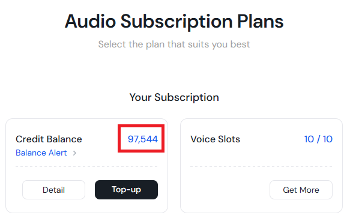
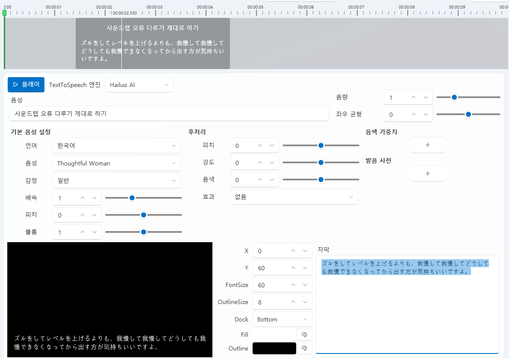

# Hailuo 语音合成 (Text-to-Speech)

## 1. 概述 (Overview)
[Hailuo AI](https://www.minimax.io/audio) 是由中国 **Minimax** 开发的  
高品质 **云端语音合成（TTS）** 服务。  
它以自然的发音、多语言支持和情感表达为特点，  
在 VoiceScriptPlayer 中可用于 **AI 角色配音**、**字幕同步** 等  
创作型语音制作场景。

> ⚠️ **重要提示：**  
> Hailuo 的 **API 套餐** 与 **网页版套餐** 是分开的。  
> API 功能无法免费使用，  
> 必须单独订阅 Minimax 的 **API 计划**。  
> 订阅后可在 [**Hailuo 订阅管理页面**](https://platform.minimax.io/subscribe/audio-subscription)  
> 查看 **剩余 Coins（使用额度）**。

📘 **第一次使用吗？**  
➡ [**查看 Hailuo 订阅与支付指南**](../ai/hailuo-subscription.md)

---

## 2. 在 VoiceScriptPlayer 中的使用方法

在 VoiceScriptPlayer 的 **Audio Editor（音频编辑器）** 中，  
可以直接使用 Hailuo 引擎将文本转换为语音。  
界面设计与 COEIROINK 相同，可同时合成多句台词，  
并在时间轴中调整每句话的长度与播放顺序。

---

### 🗣️ 基本使用流程

1. **选择语音引擎 (TextToSpeech Engine)**  
   在顶部下拉菜单中选择 `Hailuo AI`。  
   如果 API Key 设置正确，会自动连接成功。

2. **输入文本**  
   在上方的时间轴或文本框中输入多条语句。  
   每条语句都会以独立区块显示，可自由调整顺序和时长。

3. **基本语音设置**  

   | 项目 | 说明 |
   |------|------|
   | **语言** | 选择使用的语言（中文、日文、英文等） |
   | **语音** | 选择语音角色（如：Thoughtful Woman、Gentle Male 等） |
   | **情感** | 语气或语调（普通、柔和、活泼等） |
   | **语速** | 控制说话速度（默认 1.0） |
   | **音调** | 控制声音的高低（Pitch） |
   | **音量** | 调整整体输出音量 |

4. **后期处理选项（可选）**  
   可微调音调、强度、音色等参数。  
   通过发音词典功能，可自定义专有名词或特殊词汇的发音。  
   在“效果”选项中，可添加简单的回声或滤波效果。

5. **合成与预览**  
   点击 ▶ **播放按钮** 即可立即播放合成结果。  
   若修改了文本或参数，会自动重新合成并更新预览。  
   合成结果会自动保存到 `Asset/Sound/` 文件夹中。

---

### 💬 字幕设置

| 项目 | 说明 |
|------|------|
| **X / Y** | 字幕在画面中的位置 |
| **FontSize / OutlineSize** | 字体大小与描边粗细 |
| **Dock** | 字幕对齐位置（上 / 中 / 下） |
| **Fill / Outline** | 字体颜色与描边颜色 |
| **预览** | 可实时查看语音与字幕的同步效果 |

---

### 🧩 时间轴控制 (Timeline Control)

- 每句话在时间轴中显示为独立区块。  
- 可拖动区块位置或拉伸两端调整时长。  
- 时间轴的操作方式与 COEIROINK 或视频轨道相同。  
- 可顺序排列多句文本以构建完整的对话场景。

---

## 3. 输出位置 (Output Path)

| 项目 | 路径 |
|------|------|
| **生成的语音文件** | 自动保存到 `Asset/Sound/` 文件夹 |
| **字幕数据** | 同路径下以 `.srt` 或项目元数据形式保存 |

---

## 4. 注意事项 (Notes & Limitations)
- Hailuo API **不是免费服务**。  
- **网页套餐与 API 套餐是独立的**，  
  即使在官网上使用了网页语音合成功能，  
  调用 API 时仍会产生额外费用。  
- 由于为云端服务，**必须保持网络连接**。  
- 部分语音不支持情感参数。  
- 建议以短句为单位进行合成，以避免 API 调用超时。  
- 若出现响应延迟，请检查 Hailuo 服务器状态或网络状况。

---

## 5. 许可证与出处 (License & Credits)
- **Hailuo API**: © Minimax Inc.  
- 官方网站: [https://www.minimax.io/audio](https://www.minimax.io/audio)  
- 可用于商业用途（但必须遵守 Minimax 服务条款）。
