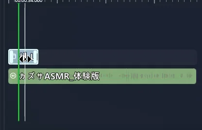

# 将音频像视频一样显示并添加字幕

本教程将教你如何在 **只有音频文件的情况下也能像视频一样显示缩略图**，  
以及如何 **自动生成字幕，将音频扩展为文本内容**。

对于以音频为主的内容（ASMR、配音、旁白示例等），  
本教程能帮助你在 VSP 项目中让它们像“视频轨道”一样自然呈现。

---

## 🎯 本教程将学习的内容

- 导入音频文件  
- 为音频设置“视频风格”缩略图  
- 使用 Whisper 自动生成字幕  
- 调整字幕区块与样式  
- 将音频类内容与视频轨道混合使用的基本原理

---

## 📌 示例音频说明（全年龄内容）

本教程使用了有助于理解的全年龄音频内容，  
参考了 DLsite 的以下作品：

https://www.dlsite.com/home/work/=/product_id/RJ01323001.html

※ 示例音频不会包含在文档中，  
请用户自行准备可合法使用的音频文件。

---

# 1️⃣ 导入音频文件

音频不是直接放入项目文件夹，  
而是通过编辑器内部“导入”方式进行注册。

---

## 📥 导入音频步骤

1. 在左侧面板选择 Sound（音频）  
2. 点击 Import（导入）  
3. 选择要使用的音频文件  
4. 列表中出现文件即表示导入完成

导入后的音频会自动整理到项目的 Asset/Sound 文件夹中。

---

# 2️⃣ 让音频“看起来像视频”
（通过 UI 设置缩略图）

仅将音频放入轨道时，画面上不会显示任何内容。  
通过 **创建 UI 画面并放置 Image 控件**，  
可以让音频在播放时呈现为类似“视频背景”的效果。

这是最常使用的方式，让音频内容具备视频的视觉表现形式。

---

## 📋 创建 UI 画面

1. 选择顶部菜单中的 **UI**  
2. 点击 **New UI（新建 UI）**  
3. 会生成新的 UI 画面并进入编辑器

这个画面可以作为播放时始终显示的“视频层”使用。

---

## 🖼 放置 Image 控件

1. 在 UI 编辑器左侧的 **控件列表** 找到 **Image（图片）**  
2. 拖动到中央画布  
3. 调整大小，使其成为  
   - 背景图  
   - 缩略图  
   - 或其他视觉元素

---

## 📥 在 Image 控件内部导入图片

图片可以直接在 UI 编辑器中通过 Image 控件导入。

1. 选择 Image 控件  
2. 在右侧属性面板点击 **Import Image**（导入图片）  
3. 选择 PNG/JPG/WebP 文件  
4. 文件将添加到项目的图片列表中

※ 此步骤只是将文件导入项目，  
并 **不会立即显示在 Image 控件中**。

---

## 🖼 将图片应用到 Image 控件

导入图片后，仍需手动选择显示哪一张：

1. 选择 Image 控件  
2. 右侧属性 → **Image Source**  
3. 从下拉框中选择刚导入的图片  
4. 图片即可显示在控件上

要点：

- Import Image = 将图片文件加入项目  
- Image Source = 从已有文件中选择显示哪一张  

两者是**独立步骤**。

---

## 🎛 调整图片大小与位置

1. 拖拽角和边缘调整 **大小（Size）**  
2. 拖拽控件调整 **位置（Position）**  
3. 使用属性面板可进一步设置：  
   - Fill / Uniform  
   - Opacity（透明度）  
   - Alignment  
   - Margin / Padding

若希望呈现视频背景效果，  
推荐使用 **Uniform + 全屏覆盖** 的方式。

---

## 🎛 设置“位于字幕下方”选项（重要）

为了让字幕正常显示在图片上方：

1. 选择 Image 控件  
2. 在右侧属性中勾选 **Behind Subtitle（位于字幕下方）**  
3. 播放时字幕将显示在图片之上

若不勾选，字幕可能被图片遮挡。

---

## ✨ 结果

UI 画面中的图片将作为“固定背景”呈现，  
并在音频播放期间让内容看起来像视频。

但请注意：  
**仅创建 UI 画面不会自动生效，必须添加到轨道！**

---

## 📌 将 UI 画面添加到轨道

1. 左侧面板选择 **UI**  
2. 找到刚创建的 UI  
3. 拖到与音频相同的区间位置  
4. UI 区块会显示在音频的上方图层  
   - 音频播放期间 UI 会保持显示  
   - 字幕显示在 UI 之上  
   - Behind Subtitle 选项确保字幕不被遮挡

这样用户看到的就是：  
**音频 + UI 图片 = 类似视频的表现方式**

---

## 🎬 音频后的画面切换

音频结束后可以：

- 切换到其他 UI  
- 更换为动画 UI  
- 更换图片或视频  
- 显示选择 UI  

UI 不只是背景，  
更是构建“视觉型音频内容”的核心工具。

---

## 🧩 使用 Fill Track 自动适配 UI 长度

UI 添加到轨道后通常是“短小区块”，  
可能无法覆盖整个音频时长。

使用 **Fill Track（填满轨道）** 可以自动将 UI 延展到整个音频长度。

---

## 📌 Fill Track 使用方法

1. 将 UI 拖入轨道  
2. 点击选中 UI 区块  
3. 右键 → **Fill Track**  
4. UI 自动扩展到整个轨道长度

---

## 🎯 Fill Track 的使用场景

- 音频播放期间 UI 需要持续显示  
- 不想拆分多个 UI 片段  
- 作为全程背景图使用  
- 避免重复调整 UI 长度

---

## ✨ 应用效果

使用 Fill Track 后：

- UI 从开始延续到结束  
- 背景自然衔接  
- 字幕与互动 UI 显示正常  
- 呈现完整的视频风格画面

你的音频现在已经可作为“视觉音频内容”播放。

---

## 3️⃣ 将音频放入轨道

1. 将音频从左侧列表拖入轨道  
2. 放置在想要的位置  
3. 调整长度与时间点

若设置了缩略图，将更像一段完整的视频内容。

---

## 4️⃣ 使用 Whisper 自动生成字幕

字幕生成不是在轨道上进行的，  
而是在左侧 **Sound** 面板中  
双击音频进入 **Audio Settings（音频设置）** 完成。

---

## 🧠 Whisper 字幕生成流程

1. 左侧选择 Sound  
2. 双击想生成字幕的音频  
3. 打开 Audio Settings  
4. 将 **Speech Language** 设置为 **Japanese**（若原音频为日语）  
5. 点击 **Generate Subtitle**  
6. Whisper 分析完成后会自动生成字幕区块

---

## 🌍 翻译字幕（可选）

Whisper 生成字幕后，可以根据需要将其翻译为：

- 韩语  
- 英语  
- 中文  
等多种语言。

步骤：

1. 在 Audio Settings 设置 **Translate To** 为目标语言  
2. 点击 **Translate Subtitle**  
3. 翻译字幕会自动添加到 Subtitle 轨道

---

## ⚠️ 使用 Whisper 与翻译功能必须先设置 AI

Whisper / DeepL / Hailuo / LibreTranslate  
都需要在 AI 设置中先配置。

请参考以下文档完成配置：

👉 [AI 功能设置指南](../ai/ai.md)

---

## 📌 小结

- 日语音频必须设置 Speech Language = Japanese  
- Whisper 会自动生成原文字幕  
- 可通过 Translate Subtitle 生成翻译字幕  
- 两者都需要预先完成 AI 设置

完成后，你的音频内容将具备：

**音频 + 缩略图 UI + 自动字幕 + 翻译字幕**

像视频一样自然呈现。

---

## 5️⃣ 调整字幕样式

1. 选择字幕区块  
2. 在右侧面板可调整：

---

## 6️⃣ 播放检查

- 点击播放按钮 ▶  
- 确认音频 + 图片 + 字幕是否显示正常  
- 如果字幕时机不准确，可拖动字幕区块进行修正

---

## 📌 下一步

现在，你已经能在 VSP 中让音频自然地以“视频形式”呈现。  
下一章将学习分支结构：

👉 [简单选择与分支](beginner-choice.md)
