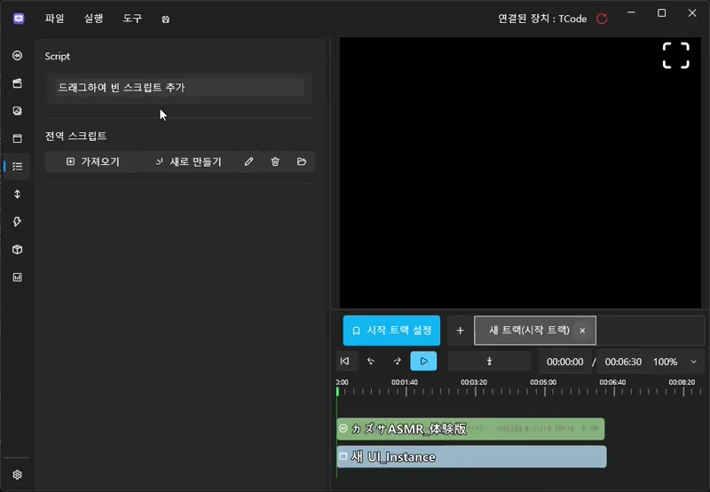

# 创建简单的选择与分支

本教程将延续**上一章节（将音频像视频一样显示并添加字幕）**中完成的项目。  
在该项目的基础上，我们将实现一个系统：  
在播放过程中出现**选择按钮**，  
根据玩家选择执行 **继续 / 跳转 / 结束** 的分支流程。

---

## 🧭 整体流程预览

最终将实现如下结构：

1. 轨道在特定时间点暂停  
2. 弹出选择 UI  
3. 点击按钮 →  
   - 继续播放  
   - 跳转到指定时间  
   - 结束项目  

---

# 1️⃣ 创建用于分支的 UI 画面

将在其中显示选择按钮的专用 UI 画面。

---

## 📌 创建 UI 画面

1. 在顶部菜单选择 **UI**  
2. 点击 **New UI（新建 UI）**  
3. 一个新的 UI 画面将被创建

---

## 📌 启用“暂停状态下执行”选项（重要）

为了使轨道暂停时 UI 仍能响应输入，  
必须在 UI 属性中启用：

- **Execute When Paused（暂停状态下执行）** ✔

---

# 1-2️⃣ 创建 3 个选择按钮

在 UI 画面中放置 **3 个按钮**：

- 好吧，我们去吃冰淇淋  
- 不要  
- 结束  

在左侧控件栏拖入 **Button** 三次即可。

---

## 💡 按钮布局 & 设计技巧

- 将按钮的 **Alignment（对齐方式）** 设为居中，可使 UI 更整洁  
- 按钮文字可在右侧属性栏的 **Content** 中修改  
- 根据场景实际效果调整 **FontSize、Width、Height**  
- 边编辑边播放预览效果会更精确

---

# 3️⃣ 在时间轴中放置临时脚本（Inline Script）

这个分支系统不能使用全局脚本，  
而应该使用 **临时脚本（Inline Script）**，  
它只在时间线的特定点触发，非常适合做分支触发点。

---

## 📌 添加临时脚本

1. 在左侧脚本面板  
   将 **“拖曳以添加空脚本”** 拖到时间轴脚本轨道上  
2. 松开鼠标即可添加

---

## ⏱ 调整脚本触发时间

将脚本区块拖动到 **01:31.000（1 分 31 秒）** 的位置。

当播放到这里时，将自动暂停并显示选择 UI。

---

# 3-1️⃣ 双击临时脚本进入编辑

编辑内容如下：

---

## ✨ 配置 ShowChoiceUI 临时脚本

按以下顺序加入动作：

1. **UI Show → 选择 UI**  
   - 在屏幕显示选择按钮  
2. **Track Pause（暂停轨道）**  
   - 等待玩家选择

⚠ 注意：  
为了防止 UI 不断重复出现，  
请启用 **“只执行一次（One-Time Execution）”**。

示例：

---

到达 **01:31.000** 的瞬间：

- 轨道暂停  
- 选择 UI 弹出  
- 玩家可进行选择  

---

# 4️⃣ 设置按钮点击事件

UI 中的按钮需要分别设置点击脚本。

操作步骤：

1. 打开 UI 编辑界面  
2. 点击任意一个按钮（例：继续按钮）  
3. 右侧属性栏 → Script（脚本）  
4. 点击 **Click → Edit（编辑）**

---

# ✔ “继续”按钮（Resume）

作用：关闭 UI → 恢复播放

脚本动作：

- **关闭 UI**  
- **恢复播放（Track Resume）**

---

# ✔ “跳转”按钮（Jump Track）

例：跳到 **00:01:20.000**

脚本动作：

- **关闭 UI**  
- **Jump Track（时间跳转）**  
- **恢复播放**

---

# ✔ “结束”按钮（Exit / Stop）

脚本动作：

- **结束项目**

提示：  
编辑模式下不会退出，但播放模式会真正结束程序。

---

## ✨ 结果

三个按钮将具备以下功能：

- **继续** → 关闭 UI + 继续播放  
- **跳转** → 关闭 UI + 跳转并继续播放  
- **结束** → 停止项目  

轨道暂停时按钮能正常工作，  
正是因为在 UI 上启用了 **Execute When Paused** 选项。

---

# 6️⃣ 整体流程总结

- 到达分支点  
- ShowChoiceUI → 显示 UI + 暂停  
- 玩家选择  
- 根据按钮动作分支到不同流程：  
  - Resume  
  - Jump Track  
  - Stop  

---

# ✨ 完成效果

你现在已经实现了：

- 在轨道特定时间停止  
- 自动弹出选择 UI  
- 根据玩家操作进入不同分支  
- 可用于制作简单菜单或剧情分歧

接下来将学习 **变量 & 条件逻辑（中级）**

👉 [变量与条件逻辑](intermediate-logic.md)
