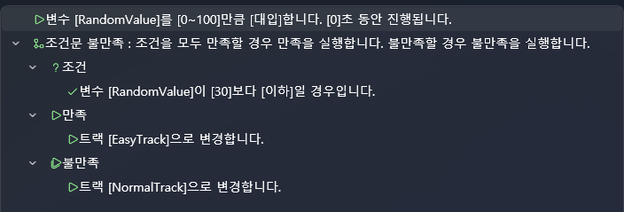

# 理解变量与条件逻辑

本教程将学习 **变量（Variable）** 与 **条件逻辑（Condition Logic）** 的概念，  
并说明如何利用它们来控制项目内部的整体流程。

虽然 VSP 的变量系统与一般编程语言类似，  
但它的特点是 **扩展性极强，可以直接控制项目中的所有元素**，  
这是它最强大的部分。

---

## 📌 1. 什么是变量？

变量是用来存储数字、文本、状态等内容的小“盒子”。

示例：

- 冲击（Stroke）次数  
- 选择结果  
- 场景进度  
- 累积分数  
- 定时器数值  

一般编程语言中，变量只负责存储值，  
但在 VSP 中，变量还能执行 **影响整个项目的各种功能**。

---

## 📌 2. VSP 独有的强大变量系统

VSP 的变量不仅能存数据，  
更是一个 **可直接访问并控制项目内部所有组成要素的统一接口**。

以下是变量可访问的主要项目元素：

---

### 🔷 基础变量（与一般编程相同）

- 数字、文本变量  
- 变量递增/递减  
- 条件分支（If / Else）

---

### 🔷 ✔ 扩展的变量输入源（VSP 专属）

设置变量时，可直接读取以下内容：

#### 🟦 **1) 随机数（Random）**
- 可指定 0~100 等范围  
- 用于概率事件、随机分支

#### 🟪 **2) 常数（Constant）**
- 固定值  
- 用于计算或比较

#### 🟥 **3) 轴（Axis）数值**
- 设备输入（X0 / X1 等）  
- UI 控件的滑块值  
- Live2D 参数值

可根据设备动作触发条件事件。

#### 🟧 **4) 项目设置（Project Settings）**
- 播放次数  
- 通关次数  
- 失败次数等  

常用于根据玩家进度调整分支。

#### 🟩 **5) 轨道 / 媒体信息**
- 轨道名称  
- 当前播放时间  
- 媒体文件路径、名称  
- 音频播放状态  

用于根据当前媒体内容进行条件判断。

#### 🟨 **6) UI 元素状态**
- 按钮文本  
- 复选框是否选中  
- 滑块数值  
- UI 显示/隐藏状态  

可实现复杂的 UI 交互效果。

#### 🟫 **7) Live2D 参数**
- 表情、动作参数  
- 可根据条件切换动作

---

因此，VSP 的变量系统是 **读取与控制整个项目的核心工具**。  
如果你有编程经验，可以把它理解为“全局系统 API”。

---

## 📌 3. 什么是条件逻辑？

条件逻辑根据变量的值决定执行不同的动作。

例：

- `StrokeCount >= 5` → 播放呼吸音  
- `Choice == 2` → 跳转到另一个轨道  
- `Random(0~100) < 30` → 30% 进入特殊场景  

---

## 📌 4. 条件逻辑可用于哪些地方？

- 脚本中的 If / Else  
- 按钮点击事件  
- UI 显示/隐藏控制  
- 跳转轨道（Jump Track）  
- Live2D 表情切换  
- 设备动作条件检测  
- 保持高度检测等  

---

## 📌 5. 脚本动作列表

所有脚本动作可在以下文档查看：

👉 **脚本动作说明：**  
[脚本](../editor/script.md)

---

接下来将使用变量系统来制作一个  
**利用随机数的自动分支系统**。

---

# 变量与条件逻辑：使用随机数进行自动分支

本节将使用 **随机数（Random）**、**条件逻辑（Condition）**、  
以及 **局部变量（Local Variable）** 来实现  
在指定时间自动跳转到随机场景的系统。

与之前使用“按钮选择”进行分支不同，  
这次是 **无需用户操作的自动分支**。

---

# 1️⃣ 理解局部变量（Local Variable）

局部变量只在 **该脚本内部有效**。

### ✔ 特点

- 脚本执行时创建，结束后销毁  
- 不会与其他脚本的变量冲突  
- 适合保存随机值、临时计算数据  

---

# 2️⃣ 在时间线上放置临时脚本

1. 在左侧脚本面板中  
   将 **“拖拽以添加空白脚本”** 拖到时间线  
2. 放在你希望触发分支的位置（如 00:10.000）  
3. 双击脚本打开编辑器

---

# 3️⃣ 创建局部变量

1. 在脚本编辑器右侧的 **Variables** 区域  
2. 点击 **+**  
3. 输入变量名（示例：`RandomValue`）

---

# 4️⃣ 什么是随机分支？

当时间到达脚本所在位置时：

1. 生成 0~100 的随机数  
2. 根据数值跳转到不同场景  

例如：

- 小于 30 → 特殊场景（30% 概率）  
- 大于等于 30 → 普通场景（70% 概率）

---

# 5️⃣ 构建随机条件脚本

### 📌 第 1 步：生成随机数  
将 **RandomValue** 赋值为 **0~100 随机数**。

---

### 📌 第 2 步：添加条件判断

条件：  
`RandomValue < 30`

- 若为真 → 跳转到特殊场景  
- 若为假 → 跳转到普通场景

  

---

# 6️⃣ 全流程总结

1. 在指定时间执行脚本  
2. 创建局部变量  
3. 生成随机数  
4. 使用 If 判断  
5. 根据结果 Jump Track  

无需任何用户输入，  
即可实现 **自然且灵活的自动分支系统**。

---

# ✨ 完成

你已经掌握以下内容：

- 创建局部变量  
- 使用随机数 Random  
- 使用条件逻辑 If / Else  
- 使用 Jump Track  
- 构建自动分支系统  

这些功能非常适用于：  
游戏式演出、随机事件、可变剧情等。

---

# ➡️ 下一步教程

完成随机分支逻辑后，  
下一节将学习 **图像联动（Images Integration）**。

👉 [图像联动](intermediate-image.md)
