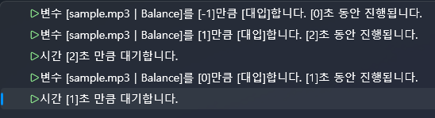

# 🎧 高级声音控制（左右声道移动）

本教程将学习如何实现声音从 **左 → 右 → 中央** 自然移动的  
“空间声道移动效果（Panning Effect）”。

在 VSP 中，只需控制音频的 **Balance（左右位置）**，  
即可轻松实现这类空间移动效果。

这里会特别强调两个非常重要的概念：

- **“~秒内进行”并不是阻塞（不是等待）**
- 若要让动作按顺序执行，必须使用  
  **“等待指定时间”** 动作

---

# 1️⃣ 导入声音

1. 左侧面板 → **Sound（声音）**  
2. 点击 **Import（导入）**  
3. 选择 mp3 文件  
4. 声音文件将显示在列表中

---

# 2️⃣ 将声音放入时间线

1. 将 mp3 文件拖拽  
2. 释放到 **音频轨道（Audio Track）** 上

放入后即可在脚本中对其进行控制。

---

# 3️⃣ 理解 Balance（左右位置）

Balance 数值的含义如下：

- **-1.0 → 完全左声道 (Left)**
- ** 0.0 → 中央 (Center)**
- **+1.0 → 完全右声道 (Right)**

在时间线中双击音频块可以调节 L/R 音量，  
但 **Balance（左右位置）只能通过脚本控制。**

---

# ⚠ 非常重要  
## “~秒内进行”不是阻塞（非等待）

例如：

Balance ← 1 （3秒内进行）

→ Balance 会在 3 秒内从 0 → 1 平滑移动  
→ **但脚本不会等待 3 秒，会立即执行下一条动作**

因此以下写法是错误的：

（错误示例）  
Balance ← 1 （3秒）  
Balance ← 0 （1秒）  

→ 两个动作会重叠，导致结果混乱

---

## ✔ 要实现可靠的顺序执行

必须同时使用：

- Balance 变化  
- 等待指定时间（Wait）

两者必须成对出现。

---

# 4️⃣ 创建声音移动脚本  
实现：左 → 右 → 中央

目标流程：

1) 立刻移到左侧（-1）  
2) 用 2 秒移动到右侧（+1）  
3) 等待 2 秒  
4) 用 1 秒回到中央（0）  
5) 再等待 1 秒

---

## 📌 正确的脚本结构

### ✔ 步骤 1：立即移动到左侧  
Balance ← -1 （0秒内进行）

### ✔ 步骤 2：2 秒内移动到右侧  
Balance ← 1 （2秒内进行）

### ✔ 步骤 3：等待 2 秒  
等待指定时间：2 秒

### ✔ 步骤 4：1 秒内移动到中央  
Balance ← 0 （1秒内进行）

### ✔ 步骤 5：等待 1 秒  
等待指定时间：1 秒

---

## 📌 为什么必须这样写？

Balance 的“X 秒内进行”只是一个 **平滑过渡（Lerp）**，  
**不会暂停脚本执行。**

因此：

1) 设置 Balance 的过渡  
2) 等待与过渡时间相同的秒数  

这两个步骤必须 **一一对应** 才能保证顺序。

---

# 5️⃣ 脚本示例截图

---

# 6️⃣ 高级技巧：使用变量控制声音移动

使用变量可以制作更灵活的声道动画。

示例流程：

1) Lerp ← 0  
2) Lerp ← 1 （3 秒内进行）  
3) Balance ← Lerp  
4) 等待 3 秒

优势：

- 可多处复用  
- 可与任何设备轴（X0）联动  
- 可与 UI 滑块联动  
- 常用于迷你游戏 / 过场演出

---

# 7️⃣ 使用 UI 滑块实时控制 Balance

这是创作者非常常用的技巧：

- ASMR 左右声道测试  
- VR 声音方向调试  
- 效果音平衡调节  
- X0 调试界面  
- 互动式声道移动小游戏  

下面制作一个：  
**滑块一移动，声音立即左右移动** 的 UI。

---

## 7-1️⃣ 放置滑块 UI

1. UI → **New UI**  
2. 从左侧控件区拖入 **Slider**  
3. 设置属性：

- Minimum = -1  
- Maximum = 1  
- Value = 0  

---

## 7-2️⃣ 为滑块添加脚本（ValueChanged）

1. 选择 Slider  
2. 右侧 → **Script → ValueChanged → Edit**  
3. 打开脚本编辑器

---

## 7-3️⃣ 编写脚本

让滑块值直接等于 Balance。

### ✔ 动作  
Balance ← (UI → Slider → Value)

只需一个动作即可完成。  
无需 Tick Script。

---

## 7-4️⃣ 完成效果

- 滑块左移 → 声音移到左声道  
- 滑块右移 → 声音移到右声道  
- 滑块居中 → 声音居中  

即可获得 **实时可交互的声道方向控制 UI**。

---

# 8️⃣ 整体流程总结

✔ 控制 Balance（左右声道位置）  
✔ “~秒内进行”不是阻塞  
✔ 顺序执行必须用等待动作  
✔ 实现左→右→中声音移动  
✔ 使用变量进行可复用的声音动画  
✔ 滑块 UI 实时控制 Balance  

---

# ✨ 下一教程

下一部分是 **字幕检测（Subtitle Detection）**。

👉 [字幕检测](intermediate-subtitle-detect.md)
