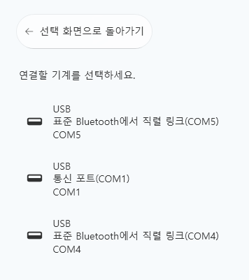

# TCode 设备连接（Serial Device Setup）

## 1. 概述（Overview）
**VoiceScriptPlayer** 使用 **TCode 协议**，  
可通过 **USB** 或 **串口（Serial）通信** 直接连接设备。  
这意味着程序与设备之间**直接通信**，无需经过 Intiface。

TCode 连接主要用于以下设备：
- **基于 USB-Serial 的 DIY 设备**（例如：OSR2、SR6 等）  
- **基于 Arduino / ESP32 的 TCode 控制器**  
- **常见 USB-Serial 芯片组**（如 CH340、CP210x、FTDI 等）

---

## 2. 连接步骤（Connection Steps）

### 🖱️ 第一步 — 选择连接方式
启动 VoiceScriptPlayer，点击左侧菜单中的“设备连接”。  
在“选择连接方式”界面中，选择 **直接连接（Direct Connection）**。

> 💡 从左到右依次是：  
> `不连接`、`直接连接`、`Intiface Central`  
> TCode 必须选择第二项 **直接连接**。

---

### 🔌 第二步 — 选择要连接的设备
下一步会显示可用的 **COM 端口列表**。

当通过 USB 连接设备时，端口几乎会立即显示；  
但 🔵 **如果使用蓝牙连接**，则设备名称可能需要等待约 5～10 秒才会出现。  
最初仅显示为 “标准蓝牙串口链接（COMx）” 的形式：

📷 **初始显示示例：**  

稍后蓝牙设备被识别后，会显示实际设备名称（例如 `FUNSR1-15877`）：

📷 **识别后显示示例：**  

> ⏳ 蓝牙连接可能因端口初始化过程而出现延迟。  
> 若名称未变化，请确认设备是否已配对，  
> 或重新打开列表进行刷新。

---

### ⚙️ 第三步 — 设置连接参数
在右侧面板中，将 **协议类型** 设置为 `TCode`，  
然后点击 **[连接]** 按钮打开端口。

连接成功后，“运行测试（Test Connection）”按钮会被激活。

---

### 🔁 第四步 — 运行测试
点击 **[运行测试]** 按钮后，设备会做出简单反应以确认连接状态。  
如果测试正常完成，**[保存]** 按钮会启用。  
请确认设备能上下运动 3～4 次。  
即使连接到错误的设备，也可能激活 **[保存]** 按钮，请谨慎确认。

> ✅ 点击保存后，当前连接将被设为默认设备。  
> 之后程序会自动记忆并在下次启动时自动连接。

---

### 🟢 第五步 — 确认连接状态
完成设置后，  
界面右上角会显示 `已连接设备: TCode`，  
同时选中的连接方式图标会出现 **绿色边框**。

> 💡 当边框显示为绿色时，说明连接正常，  
> TCode 指令会立即从事件或脚本中发送。

---

## 3. 连接后的运行（Operation）
- 连接保持期间，所有 **TCode 事件** 和 **Stroke 模式** 都会实时传输。  
- 若连接中断，界面顶部的状态指示会变为灰色。  
- 保存的端口将在下次启动时自动恢复。

---

## 4. 故障排除（Troubleshooting）

| 问题 | 原因 | 解决方法 |
|------|------|-----------|
| 设备未显示在列表中 | 驱动程序未安装 | 请在设备管理器中安装端口驱动程序 |
| 连接失败 | 端口被占用 | 检查是否有其他程序（如 Intiface）占用了同一端口 |
| 无法响应测试 | Baudrate 不匹配或不支持 TCode | 检查设备固件设置 |
| 连接后立即断开 | USB 线缆损坏或端口供电不足 | 更换 USB 端口或使用带电源的 USB 集线器 |

---

## 5. 注意事项（Notes）
- 如果同一设备也被 Intiface Central 使用，请确保**不要同时运行**，以避免端口冲突。
