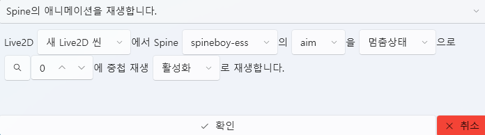
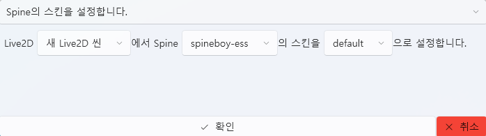

# Live2D 标签页

Live2D 标签页用于构建 **角色场景 (Scene)**，  
在其中放置 Spine 模型并设置动画。  
所有 Live2D 资源都会 **自动保存到项目内部 (`Asset/Live2D/`)**，  
不提供外部引用选项。

---

## 1. 基本界面

| 组件 | 说明 |
|------|------|
| **① 导入** | 载入 Live2D 场景 (`.live2d`) 文件。 |
| **② 新建** | 创建新的 Live2D 场景。 |
| **③ 编辑 ✏️** | 打开所选场景的详细编辑窗口。 |
| **④ 删除 🗑️** | 从项目中删除所选场景。 |
| **⑤ 打开文件夹 📂** | 直接打开 `Asset/Live2D/` 文件夹。 |

> 💡 **提示：**  
> Live2D 场景只能在项目内部管理，  
> 不支持外部引用或导出功能。

---

## 2. Live2D 场景编辑器

Live2D 编辑器是一个独立的界面，  
可以在同一画面中放置多个 Spine 对象来构建角色演出场景。

---

### 🎛️ 顶部面板

| 项目 | 说明 |
|------|------|
| **名称** | 设置当前编辑中的场景名称。 |
| **宽度 / 高度** | 设置场景分辨率（例如 1920x1080）。 |
| **场景预览区域** | 可视化地放置 Spine 对象及背景。 |
| **对象列表（右侧面板）** | 显示场景中包含的 Spine 对象列表。 |

---

### 🧩 Spine 对象管理

Live2D 场景中可以添加多个 Spine 对象。  
每个对象都拥有独立的位置、缩放、动画和皮肤设置。

| 项目 | 说明 |
|------|------|
| **名称** | Spine 对象的名称。 |
| **StartX / StartY** | 设置场景内坐标（以像素为单位）。 |
| **Scale** | 调整角色大小。 |
| **StartAnimation** | 指定初始播放的动画（例如 `idle`, `aim`, `walk`）。 |
| **Skin** | 选择 Spine 模型外观皮肤。 |
| **Loop** | 是否循环播放动画。 |
| **AutoPlay** | 场景加载时是否自动开始播放动画。 |

> 💡 **提示：**  
> 你可以在预览画面中通过 **拖拽** 直接调整对象位置，  
> 同时放置多个角色来构建完整场景。

---

### ➕ 添加与删除对象

| 操作 | 说明 |
|------|------|
| **添加(+) 按钮** | 向场景中添加新的 Spine 对象。 |
| **删除(🗑️ 按钮)** | 从场景中移除选中的 Spine 对象。 |

---

## 3. 轨道与脚本联动

Live2D 场景不仅能与时间轴联动，  
还可与 **脚本系统** 直接连接，  
从而在特定事件或条件下实时控制 **动画、位置、缩放、进度** 等。

---

### 🎞️ 时间轴联动

Live2D 场景可放置在时间轴轨道中，  
与音频、事件、UI 等资源在时间轴上同步。

| 功能 | 说明 |
|------|------|
| **拖拽添加** | 将 Live2D 场景拖动到时间轴上进行布局。 |
| **条件编辑** | 设置满足特定条件时才显示该场景。 |
| **时间调整** | 直接指定场景的显示区间（开始/结束时间）。 |

> 💡 **示例：**  
> - 在特定音频段显示角色动作  
> - 在 UI 选择后触发表情变化  
> - 在高潮事件中自动播放特效动画  

---

### ⚙️ 脚本联动

Live2D 对象可在脚本中通过变量进行直接控制。  
打开变量设置窗口后，将显示如下结构：

| 项目 | 说明 |
|------|------|
| **选择 Live2D 场景** | 指定要控制的场景。 |
| **选择 Spine 对象** | 选择场景中要操作的对象。 |
| **选择属性** | 指定要修改的变量。 |

---

### 📊 可控制的主要变量

| 变量 | 说明 |
|------|------|
| **AnimationProgress** | 当前动画的进度 (0.0~1.0)，用于时间控制。 |
| **X / Y** | 更改对象的坐标。 |
| **Scale** | 调整角色大小。 |

> 💡 **提示：**  
> 在脚本中实时修改 Live2D 变量，  
> 可以在动画播放过程中自然地改变角色位置、大小、表情等。

---

### 🧩 示例脚本

> 🎯 **结果：**  
> 执行上述脚本后，角色的位置、缩放与动画进度  
> 将实时变化，与时间轴完美同步。

---

### 🔗 触发器联动示例

| 情境 | 触发行为 |
|------|----------|
| 点击按钮时 | 将 `AnimationProgress` 设为 1，使动画立即结束。 |
| 事件发生时 | 将 `Scale` 从 1.0 改为 1.5，呈现放大效果。 |
| 基于计时器 | 逐步修改 `Y` 值，使角色向上移动。 |

---

> 💡 **提示：**  
> Live2D 变量可与 UI、音频、Stroke 事件相同方式访问，  
> 并可通过 **PlayData 脚本系统** 实现全局统一控制。

---

### 🎬 Spine 控制脚本

通过脚本可直接控制 Live2D 场景中的 Spine 对象，  
实现 **动画播放** 与 **皮肤更换**。

---

#### 🕹️ Spine 动画播放

此脚本可在任意时间触发指定 Spine 对象的动画播放。

| 项目 | 说明 |
|------|------|
| **选择 Live2D 场景** | 指定要控制的场景。 |
| **选择 Spine 对象** | 指定要播放的模型。 |
| **动画名称** | 输入要播放的动画 (`idle`, `attack`, `death` 等)。 |
| **状态** | 设置动画结束后的行为，如“停止”、“循环”、“播放下一个动画”。 |
| **混合播放模式** | 是否与其他动画叠加播放 (Blend)。 |
| **启用/禁用** | 控制动画是否激活或暂停。 |

> 💡 **应用示例：**  
> - 在台词播放期间触发 `talk` 动作  
> - 事件完成后切换到 `happy` 动作  
> - 高潮场景播放 `death` 动画  

---

#### 🎨 Spine 皮肤更换

可切换 Spine 角色的皮肤，以改变服装、表情或装备。

| 项目 | 说明 |
|------|------|
| **选择 Live2D 场景** | 指定要控制的场景。 |
| **选择 Spine 对象** | 指定要更换皮肤的模型。 |
| **皮肤名称** | 选择要应用的皮肤 (`default`, `costume1`, `damaged` 等)。 |

> 💡 **应用示例：**  
> - 随剧情进展切换服装 (`default` → `battle`)  
> - 触发受伤事件切换到 `damaged` 状态  
> - 根据选项结果显示不同角色外观  

---

> ⚙️ **额外提示：**  
> 将 Spine 动画控制脚本与 Live2D 变量控制脚本结合使用，  
> 可轻松实现“动作 + 移动 + 缩放”等复杂动态效果。

---

## 4. 文件结构

| 项目 | 路径 |
|------|------|
| **场景数据** | `Asset/Live2D/SceneName.live2D` |
| **Live2D 模型文件** | `Asset/Live2DModel/` |
| **Spine 模型文件** | `Asset/SpineModel/` |
| **纹理 / 动画数据** | 保持 Spine 模型文件夹原有结构 |
| **预览缓存** | `Asset/Live2D/` |

> ⚙️ **注意：**  
> Live2D 场景仅在项目内部使用，  
> 如果修改路径或移出项目文件夹，可能导致加载失败。

---

## 5. 相关文档

- [声音标签页](sound.md)  
- [视频标签页](video.md)  
- [UI 标签页](ui.md)  
- [时间轴编辑](timeline.md)
