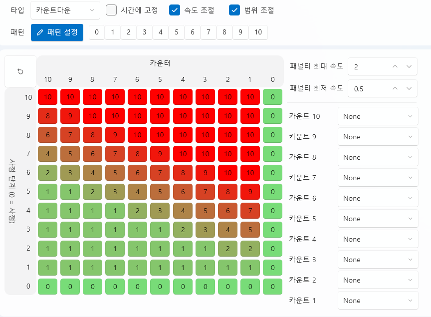

# 震动控制标签页（Stroke Tab）

震动控制标签页用于**设计和控制设备运动（动作）模式**。  
你可以按时间轴控制各个轴（Axis）的运动，  
从而构建震动、旋转、往复等物理动作模式。

所有震动数据都保存在项目内部目录 **`Asset/Stroke/`** 中，  
同时支持与外部格式（`.funscript`）的**导入 / 导出兼容**。

---

## 1. 基本界面

| 组件 | 说明 |
|------|------|
| **① 导入** | 导入已保存的 `.stroke` 文件。 |
| **② 新建** | 创建一个新的震动模式。 |
| **③ 编辑 ✏️** | 打开所选震动模式的详细编辑窗口。 |
| **④ 删除 🗑️** | 从项目中移除选定的震动模式。 |
| **⑤ 打开文件夹 📂** | 直接打开 `Asset/Stroke/` 文件夹。 |

> 💡 **提示：**  
> 震动控制标签页的结构与 Live2D 标签页相同，  
> 你可以在“动作模式”列表中添加或编辑震动模式。

---

## 2. 震动编辑器（Stroke Editor）

点击“新建”或“编辑”按钮后，将打开  
**Stroke Editor（震动编辑器）** 窗口，  
你可以在此调整每个轴的运动、速度与范围。

---

### 🎛️ 顶部面板

| 项目 | 说明 |
|------|------|
| **名称** | 设置当前震动模式的名称。 |
| **类型** | 选择震动的执行方式。 |
| **时间固定** | 保持整体播放时间固定。 |
| **速度调节** | 是否根据变量动态调整速度。 |
| **幅度调节** | 是否根据变量动态调整运动幅度。 |
| **轴类型** | 选择 `单轴`、`单旋转轴` 或 `多旋转轴`。 |
| **长度** | 设置模式总时长（以毫秒为单位）。 |
| **缩放(%)** | 调整预览界面的显示比例。 |

---

### 🧰 工具栏

编辑器顶部提供了主要的**编辑工具栏**，  
可快速切换编辑模式并支持快捷键操作。

| 图标 | 名称 | 快捷键 | 说明 |
|------|------|--------|------|
| 📂 | **导入** | — | 导入外部 `.funscript` 文件。 |
| 💾 | **导出** | — | 将当前模式保存为 `.funscript` 格式。 |
| ⬜ | **选择工具** | — | 选择点或区域，是默认编辑工具。 |
| ✥ | **移动工具** | **M** | 拖动移动选中的点或曲线。 |
| 🗑️ | **删除** | **Del** | 删除选中的点。 |
| ✂️ | **剪切** | — | 保留选定区域并删除其他部分。 |
| ➕ | **添加点** | — | 点击图表添加新的控制点。 |
| ⏺️ | **录制（未支持）** | — | 基于设备实时输入记录动作（暂未启用）。 |

> 💡 **提示：**  
> 工具可通过快捷键即时切换。  
> 例如按 `M` 切换为移动工具，按 `S` 返回选择工具。

> ⚙️ **说明：**  
> `.funscript` 是一种通用的开放式动作格式，  
> 可与大多数外部设备或软件兼容。

---

### 🩰 轴控制

左侧的轴列表（L0~R2）表示实际设备的运动轴。  
只有勾选启用的轴才会在编辑和播放中生效。

| 轴名 | 说明 |
|------|------|
| **L0~L2** | 左侧通道对应的轴。 |
| **R0~R2** | 右侧通道对应的轴。 |
| **启用复选框** | 控制是否在时间轴中显示该轴的运动曲线。 |

---

### 🧩 图表与时间轴

中部的图表区域显示各轴的随时间变化的运动轨迹。  
横轴为时间（ms），纵轴为运动值（0~100%），  
通过连接多个控制点形成动作曲线。

- **横轴（Time）：** 时间进程  
- **纵轴（Value）：** 相对位置（百分比）  
- **网格线（Grid）：** 辅助线，用于区分时间与数值  
- **点（Point）：** 代表某一时间的轴位置，可自由拖动调整  

---

#### 🎯 图表操作

图表为**静态编辑界面**，  
不提供播放或缩放，仅用于编辑和调整点位。

| 操作 | 说明 |
|------|------|
| **选择 (Select Tool)** | 点击或拖动选择一个或多个点。 |
| **移动 (Move Tool)** | 激活移动工具后可拖动选中点改变位置。 |
| **添加点 (Add Tool)** | 点击图表任意处即可新增控制点。 |
| **删除 (Delete)** | 按 Delete 键删除选中点。 |
| **剪切 (Trim)** | 保留选中范围，删除其他部分。 |

> 💡 **注意：**  
> Stroke Editor 仅用于**模式设计**，不包含播放功能。  
> 实际运行效果需在 Stroke Player 中查看。

---

#### 🗺️ 小地图（Minimap）

图表下方的小地图显示整个震动模式的概览。  
当前编辑区域以矩形高亮，  
点击小地图可快速跳转至对应位置。

| 功能 | 说明 |
|------|------|
| **视图移动** | 点击小地图任意区域以滚动至对应位置。 |
| **当前区域显示** | 白色矩形标示当前编辑视图范围。 |
| **模式总览** | 一眼查看整体模式结构与分布。 |

> 💡 **提示：**  
> 小地图在长模式编辑时非常有用，  
> 可快速定位或查看整体结构。

---

## 3. 震动类型（Stroke Type）

震动的行为取决于**类型（Type）**设置。  
可通过以下四种类型实现不同控制方式：

---

### 3.1 模式型（Pattern）

基于时间自动播放的常规震动模式。  
放置于时间轴或通过脚本触发时，  
将按设定顺序自动播放。

| 特点 | 说明 |
|------|------|
| **自动播放** | 放置在时间轴上后按时间自动运行。 |
| **速度/幅度调整** | 可通过选项动态调整速度与振幅。 |
| **循环播放** | 可在脚本中设置循环执行。 |

---

### 3.2 手动触发（Manual）

每次按下 **Space** 键时播放一次。  
适用于交互式触发或即时控制场景。

| 项目 | 说明 |
|------|------|
| **单次播放** | 每按一次键触发一次震动。 |

---

### 3.3 鼠标控制（Mouse Control）

实时追踪鼠标移动来控制轴的运动。  
L0 对应垂直移动，R0 对应水平移动。

| 项目 | 说明 |
|------|------|
| **L0 轴** | 跟随鼠标上下移动。 |
| **R0 轴** | 跟随鼠标左右移动。 |
| **实时控制** | 根据鼠标当前位置实时变化。 |

---

### 3.4 倒计时模式（Countdown）

倒计时类型基于**射精阶段（Progress）**与**计数值（Counter）**的交互，  
动态调整模式的速度与形态，是一种高级控制方式。

| 项目 | 说明 |
|------|------|
| **0~10 阶段按钮** | 为每个计数阶段分配不同的模式。 |
| **模式设置面板** | 根据计数值与射精阶段设定执行的模式。 |
| **重置按钮** | 点击左上角重置模式设置。 |
| **面板图表** | 横轴为计数，纵轴为射精阶段（Progress），格子数值代表对应模式编号。左键递增，右键递减。 |
| **计数音效** | 指定每次计数时播放的音效。 |

---

#### ⚙️ 速度惩罚（Penalty Speed）

| 项目 | 说明 |
|------|------|
| **最大惩罚速度** | 当计数值 **小于射精阶段** 时（距离较远），速度**加快**。 |
| **最小惩罚速度** | 当计数值 **接近射精阶段** 时（距离较近），速度**减慢**。 |

> 💡 **示例**  
> - Counter = 1，Progress = 10 → 速度 **最大加速**  
> - Counter = 10，Progress = 1 → 速度 **最小减速**

---

## 4. 脚本联动（Script Integration）

| 命令 | 说明 |
|------|------|
| **StrokeExec** | 在指定时间播放特定震动模式。 |

> 💡 **提示：**  
> 你也可以将震动直接拖入时间轴，  
> 与其他资源（音频、Live2D 等）同步执行。

---

## 5. 文件结构

| 项目 | 路径 |
|------|------|
| **震动数据** | `Asset/Stroke/StrokeName.stroke` |
| **预览缓存** | `Asset/Stroke/` |

> ⚙️ **说明：**  
> 震动数据为项目专用文件。  
> 若移动或重命名文件，  
> 时间轴链接可能会失效。

---

## 6. 相关文档

- [特殊事件标签页](special-event.md)
- [声音标签页](sound.md)
- [视频标签页](video.md)
- [UI 标签页](ui.md)
- [脚本标签页](script.md)
