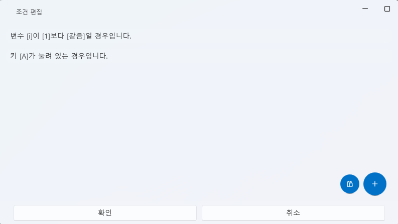

# 时间轴概览（Timeline Overview）

VoiceScriptPlayer 的 **时间轴（Timeline）** 是  
管理声音、视频、Live2D、UI、特殊事件等播放区间的核心功能。  
所有资源都以 **轨道（Track）** 为单位组织，  
每个轨道中包含一个或多个 **节点（Node）**。

---

## 1. 基本结构

时间轴由以下区域构成：

| 区域 | 说明 |
|------|------|
| **轨道列表** | 显示当前项目中创建的所有轨道。 |
| **添加 / 删除轨道按钮** | 使用 `+ 新轨道` 按钮可创建新轨道。 |
| **起始轨道设置** | 指定播放的起点轨道（播放器启动时从此轨道开始）。 |
| **播放控制区** | 包含 ▶ 播放 / ⏸ 暂停 / ⏮ 倒退 等控制按钮。 |
| **时间标尺** | 顶部刻度条显示当前时间与区间长度。 |
| **缩放** | 按 `Ctrl + 滚轮` 可放大或缩小时间轴。 |

---

## 2. 轨道管理

- 每个轨道可包含 **声音、视频、Live2D、UI 事件** 等资源。  
- 双击轨道名称可进行重命名。  
- 可拖拽轨道来调整顺序。  
- 选中轨道后，其对应的 **节点将显示在时间轴中**。

> 💡 **提示：**  
> 在复杂项目中，按资源类型划分轨道  
> 能让管理与调试更加高效。

---

## 3. 节点（Node）

时间轴上每个独立资源单元称为 **节点（Node）**。  
例如，一个语音片段、一个视频区间、一个 Live2D 动作等都属于节点。

| 操作 | 说明 |
|------|------|
| **拖拽添加** | 从左侧资源面板拖入时间轴以添加节点。 |
| **移动位置** | 拖动节点调整其开始时间。 |
| **调整长度** | 拖动节点两端改变播放区间长度。 |
| **复制 / 粘贴** | 使用 `Ctrl + C`, `Ctrl + V` 复制节点。 |
| **删除** | 使用 `Delete` 键或右键菜单删除节点。 |

---

## 4. 节点编辑

右键点击节点会显示以下菜单：

| 菜单 | 说明 |
|------|------|
| **条件编辑** | 设置节点执行条件（如变量或触发器）。 |
| **时间编辑** | 手动输入开始与结束时间，精确调整。 |
| **复制 / 粘贴** | 将节点复制到其他轨道或时间位置。 |

> ⚙️ **条件节点示例：**  
> - 仅当变量 `Flag_A` 为真时执行  
> - 某事件（如选择结果）成立时播放  
> - 禁止重复执行 等等  

---

## 5. 时间选择与区间编辑

在时间轴上 **拖动时间标尺** 即可选择一个时间区间，  
并对该区间进行多种编辑操作。

### 🔹 区间选择方法
- 用鼠标在时间刻度上 **拖动**，选中后该区域将以绿色显示。  
- 选中区域适用于所有轨道（声音 / Live2D / 事件等）。

---

### 🔹 右键菜单

右键点击选中区域将显示如下菜单：

| 菜单 | 说明 |
|------|------|
| **插入时间** | 在选中区间中插入时间，所有节点自动向后移动。 |
| **删除选区** | 删除选中的时间区间，后续节点前移。 |
| **仅保留选区** | 只保留选中区间，删除其他所有部分。 |

> ⚙️ **示例：**  
> 若选择 3 分钟～6 分钟区间并点击“仅保留选区”，  
> 整个时间轴将只保留该部分，并从 0 秒重新排列。

---

### 🔹 使用技巧

- 在 **长项目中预览特定场景** 时非常实用。  
- 可用于 **删除多余空白时间**。  
- **插入时间** 功能便于快速增加事件间隔。  

> 💡 **提示：**  
> 选区基于“时间单位”操作，  
> 无需逐个修改节点即可快速调整全局时间结构。

---

## 6. 时间控制

时间轴上方的 **时间控制器** 可直接操作播放进度。

| 功能 | 说明 |
|------|------|
| **当前时间** | 可手动输入或拖动滑块移动播放位置。 |
| **总时长设置** | 定义整个时间轴的长度。 |
| **缩放** | 按 `Ctrl + 鼠标滚轮` 调整缩放比例。 |
| **播放 / 暂停 / 循环** | 预览时的播放逻辑与实际播放器一致。 |

---

## 7. 节点条件系统

VoiceScriptPlayer 的时间轴不仅能控制播放顺序，  
还可基于**逻辑条件（Condition）** 控制节点启用与否。

这些条件可与 **脚本标签页** 中声明的变量或触发器联动。

---

## 8. 预览与同步

- 点击底部的 ▶ 按钮可预览整个时间轴。  
- 预览时，声音、Live2D、UI 会同步运行，  
  **再现与实际播放器一致的播放效果**。  
- 若只测试某部分，可通过 **起始轨道设置** 指定起点。

> 💡 **提示：**  
> 项目复杂时，可结合“条件编辑”功能  
> 测试分支逻辑与不同场景效果。

---

## 9. 相关文档

- [声音编辑](sound.md) — 音频文件、字幕生成、轨道结构  
- [脚本](script.md) — 变量与触发器定义  
- [特殊事件](special-event.md) — 基于时序的演出与特效控制  
- [运行时助手](runtime-helper.md) — 调试与播放测试  
