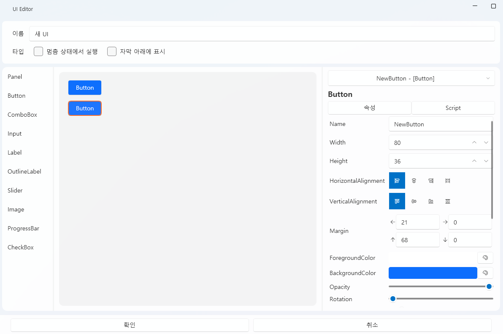
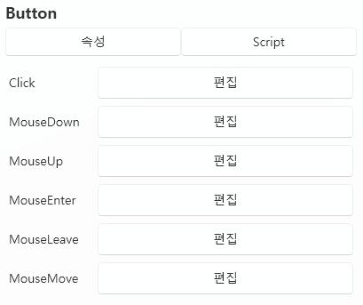

# UI 标签页

UI 标签页是用于**构建和控制项目界面（User Interface）**的编辑器。  
你可以在这里放置按钮、图像、文本等各种 UI 控件，  
并通过脚本将它们连接起来，实现**交互功能**。

---

## 1. 基本界面

| 组件 | 说明 |
|------|------|
| **① 拖动以添加空 UI** | 创建新的 **UI 实例**。 |
| **② UI 模板** | 管理可重复使用的 **UI 布局模板**。 |
| **③ 导入** | 载入已保存的 UI 模板。 |
| **④ 新建** | 创建新的 UI 模板。 |
| **⑤ 编辑 ✏️** | 打开选定 UI 的编辑器。 |
| **⑥ 删除 🗑️** | 从列表中移除选定的 UI。 |
| **⑦ 打开文件夹 📂** | 直接打开 `Asset/UI/` 文件夹。 |

> 💡 **提示：**  
> UI 实例是独立运行的，  
> 而 UI 模板的修改会同步影响所有引用该模板的实例。

---

## 2. UI 模板与实例

UI 分为 **模板型（Template）** 与 **实例型（Instance）** 两种类型，  
它们在应用范围与修改方式上有所不同。

| 类型 | 说明 | 特点 |
|------|------|------|
| **UI 模板** | 可重复使用的共享 UI 布局。 | 可在多个场景中通用，修改模板后会统一更新。 |
| **UI 实例** | 仅在单个场景中独立使用的 UI。 | 各实例相互独立，不受模板修改影响。 |

> 💡 **示例：**  
> “选项菜单”、“暂停界面”、“开始画面”等适合保存为模板；  
> 特定事件的弹窗或一次性界面适合作为实例添加。

---

## 3. UI 编辑器

UI 编辑器由三部分组成：  
左侧为控件列表，中间是编辑画布，右侧是属性面板。  
从控件列表中选择元素拖入画布，然后在右侧调整详细属性。

---

### 🎛️ 顶部选项

| 项目 | 说明 |
|------|------|
| **Name（名称）** | 指定 UI 的名称。 |
| **在暂停状态下运行** | 即使项目暂停，该 UI 仍会显示并响应操作。 |
| **显示在字幕下方** | 将 UI 层级放在字幕后面（用于 HUD 或背景 UI）。 |

---

## 4. 控件列表

| 控件 | 说明 |
|------|------|
| **Panel** | 可包含其他控件的基础容器。 |
| **Button** | 处理点击事件。 |
| **ComboBox** | 从下拉选项中选择一项。 |
| **Input** | 文本输入字段。 |
| **Label / OutlineLabel** | 显示文字，OutlineLabel 具有外轮廓效果。 |
| **Slider / ProgressBar** | 调节数值范围或显示进度。 |
| **Image** | 显示图像文件。 |
| **CheckBox** | 拥有开 / 关状态的控件。 |

> ⚙️ **注意：**  
> 只有 `Panel` 控件可以包含子控件；  
> 其他控件都是独立元素。

---

## 5. 属性编辑

UI 控件的属性因类型而异，但大多数共享以下 **通用属性**：

| 项目 | 说明 |
|------|------|
| **Name** | 控件的唯一标识，可在脚本中引用。 |
| **Width / Height** | 控件尺寸。 |
| **Horizontal / Vertical Alignment** | 相对于父容器的对齐方式。 |
| **Margin** | 与父容器的边距。 |
| **Foreground / Background Color** | 前景色与背景色。 |
| **Opacity / Rotation / Scale** | 透明度、旋转角度、缩放比例。 |
| **IsEnabled / IsVisible** | 控制启用与可见状态。 |

> 💡 **提示：**  
> 某些控件还有额外属性，例如：  
> `Text`、`FontSize`、`ImageSource`、`MaxValue` 等。

---

## 6. 脚本事件

UI 控件可以根据操作**触发事件**，  
并可在右侧的 `Script` 选项卡中连接对应的脚本。

---

### 🧩 通用事件（适用于所有控件）

| 事件 | 说明 |
|------|------|
| **MouseDown / MouseUp** | 鼠标按下或释放时触发。 |
| **MouseEnter / MouseLeave** | 鼠标进入或离开控件区域时触发。 |

> 💡 **特殊事件：**  
> 主 `Panel` 具有 **Tick** 事件，  
> 当 UI 打开时，该事件会在每一帧调用，  
> 可用于实时更新或动画控制。

---

### 🎛️ 控件特有事件

| 控件 | 事件 | 说明 |
|------|------|------|
| **Panel** | `Loaded` | 当面板被显示时触发。 |
| **Panel** | `Unloaded` | 当面板被关闭时触发。 |
| **Button** | `Click` | 点击时执行。 |
| **Input** | `TextChanged` | 文本输入发生变化时执行。 |
| **Slider / ComboBox / CheckBox** | `ValueChanged` | 当值发生变化时执行。 |

> 💡 **提示：**  
> 每个事件都可以绑定独立脚本，  
> 绑定的脚本会在运行时自动触发。

---

### 💡 UI 脚本控制

UI 控件可以通过脚本直接访问与操作。  
在脚本中会自动提供一个内置变量 **`CurrentUI`**，  
可用于访问当前打开的 UI 及其内部控件。

> 💡 **示例：**  
> 在按钮点击时修改  
> `CurrentUI | NewButton | FontSize` 的值，  
> 即可实时调整按钮文字大小。  
> 通过这种方式，可以实现 **动态文字、颜色变化、状态更新** 等效果。

还可以通过脚本直接**打开或关闭 UI 模板**：

> 💡 **示例：**  
> 使用脚本指令：  
> `打开 UI "New UI"，标识符为 "TEST"`  
> 即可动态显示指定的 UI 模板。  
> 利用此功能，可以根据事件或触发器  
> 自动切换界面或弹出对话框。

---

## 7. 控件管理

右键点击控件可显示管理菜单：

| 菜单 | 说明 |
|------|------|
| **剪切 / 复制 / 粘贴** | 移动或复制控件。 |
| **置于最前 / 置于最后** | 调整控件的显示层级。 |
| **删除 (Delete)** | 删除选中的控件。 |

右上角的下拉框可快速选择画布中难以点击的控件。

---

## 8. Panel 与布局系统

`Panel` 是 UI 的根容器，  
所有子控件的 **布局基准** 都以它为中心。

---

### 🧱 WPF 布局结构

UI 布局基于 **WPF（Windows Presentation Foundation）** 系统，  
采用 **相对定位与边距 (Margin)** 而非绝对坐标，  
可在不同分辨率下保持一致的位置与比例。

| 概念 | 说明 |
|------|------|
| **Alignment** | 相对于父容器的左/右/中对齐。 |
| **Margin** | 控件与父容器之间的间距。 |
| **Z-Order** | 控件的显示优先级。 |
| **Relative Layout** | 根据分辨率比例自动调整的相对布局系统。 |

> 💡 **参考资料：**  
> - [Microsoft Docs：WPF 布局概述](https://learn.microsoft.com/zh-cn/dotnet/desktop/wpf/advanced/layout?view=netframeworkdesktop-4.8)  
> - [WPF 面板介绍（Grid、StackPanel、Canvas 等）](https://learn.microsoft.com/zh-cn/dotnet/desktop/wpf/controls/panels-overview?view=netframeworkdesktop-4.8)

> ⚙️ **提示：**  
> 初学时可将 `HorizontalAlignment` 与 `VerticalAlignment`  
> 设为“左/上”，再用 `Margin` 调整位置，会更直观易懂。

---

## 9. 文件结构

| 项目 | 路径 |
|------|------|
| **UI 模板数据** | `Asset/UI/` |
| **资源（图片等）** | `Asset/Image/` |

---

## 10. 相关文档

- [Live2D 标签页](live2d.md)  
- [脚本标签页](script.md)  
- [时间轴编辑](timeline.md)  
