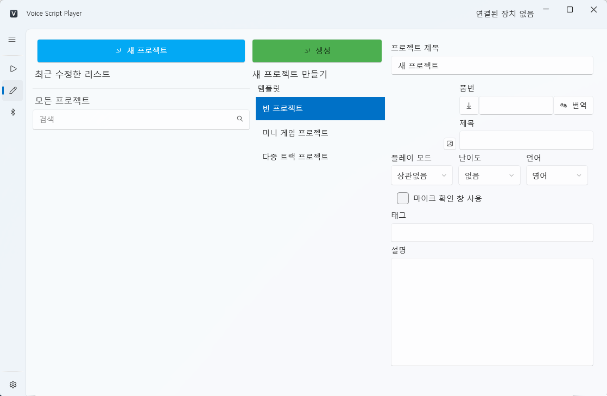

# 创建新项目

新项目是 **VoiceScriptPlayer** 中工作的起点。  
本文档将介绍如何通过“新建项目”界面创建项目的完整流程。

---

## 1. 打开新建项目界面

要创建新项目，请按照以下步骤操作：

1. 点击左侧边栏中的 **✏️ 图标（编辑器）**。  
2. 点击顶部的 **[新建项目]** 按钮。  
3. 在右侧面板中输入项目信息。

---

## 2. 设置项目信息

在右侧面板中可以设置新项目的基本信息。  
以下项目是创建项目时需要重点确认的主要选项：

| 项目 | 说明 |
|------|------|
| **项目标题** | 输入项目名称。该名称也将作为文件和文件夹名称使用。 |
| **作品编号（DLsite Code）** | 输入 DLsite 作品编号，例如：`RJ01430276`。 点击右侧的 **🔍 按钮** 可自动获取作品信息（标题、说明、标签等）。 |
| **自动翻译** | 自动将绑定内容（标题、说明、标签等）翻译为您的语言。 翻译语言基于下方的 **STT 引擎语言设置**。 |
| **模板选择** | 预设项目的基本结构。 可选择 **空白项目 / 迷你游戏 / 多轨项目**。 |
| **标签与说明** | 用于分类或添加项目的详细描述。从 DLsite 导入时会自动填写。 |
| **播放模式** | 选择基本的播放方式。 ① **仅手动** ② **推荐设备** ③ **仅设备** |
| **语言设置（STT 引擎）** | 指定项目中语音识别（STT）使用的默认语言。 例如：日语（`ja`）、英语（`en`）、韩语（`ko`）等。 |
| **麦克风检测窗口** | 选中后，在项目启动时会显示 **麦克风检测窗口**。 可测试输入设备是否正常工作。 |

> 💡 **提示：**  
> 通过 DLsite 编号加载的内容会在创建项目时自动保存。  
> 使用“翻译”按钮转换为本地语言后内容会立即更新。  
> 语言设置不仅适用于 **STT 引擎**，也会影响 **自动翻译、字幕生成、语音合成（TTS）** 等功能。

---

## 3. 创建项目

完成所有设置后，点击界面底部的 **绿色 [创建] 按钮**。  
几秒后，新项目会自动生成并添加到 **项目列表** 中。

- 创建完成后会自动保存。  
- 在主页的 **“最近修改列表”** 中也会显示新项目。  
- 项目文件默认按照以下结构保存：

---

## 4. 创建后可立即进行的操作

- **添加媒体：** 导入 [音频](../editor/sound.md) 或 [视频](../editor/video.md) 文件。  
- **构建界面：** 在 [UI 编辑器](../editor/ui.md) 中放置按钮、文字等元素。  
- **设置时间轴：** 在 [Stroke / 事件编辑器](../editor/stroke.md) 中设置基于时间的动作。  
- **保存：** 使用快捷键 **Ctrl + S** 或菜单中的 **文件 → 保存**。

---

## 6. 下一步

- [加载与保存项目](manage.md)
